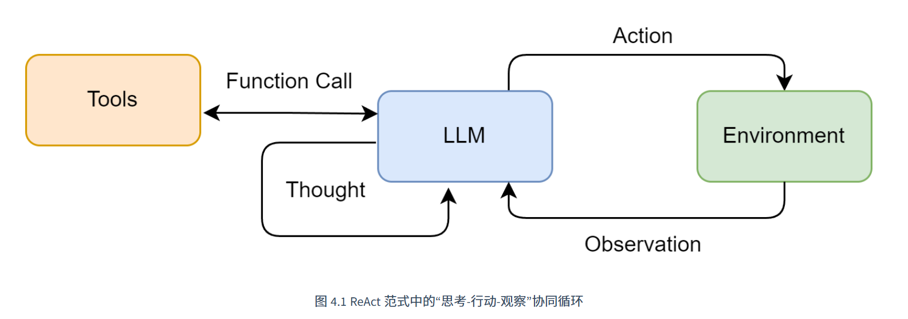
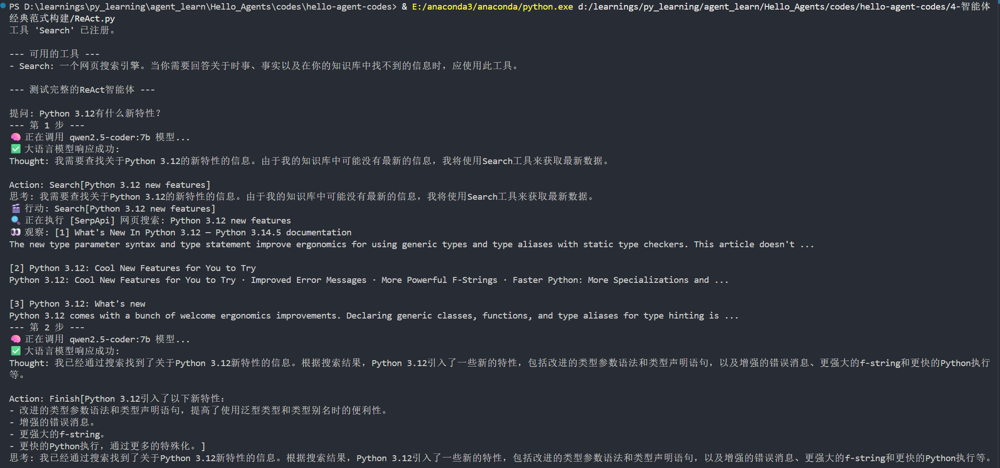
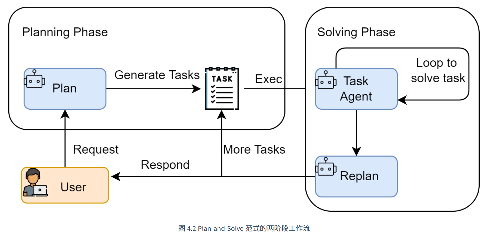
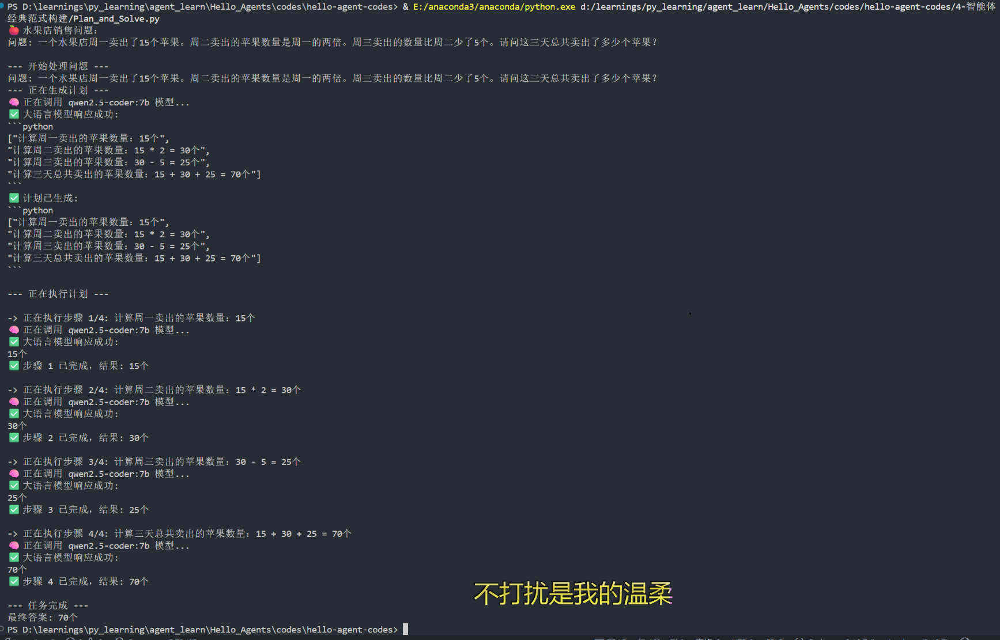
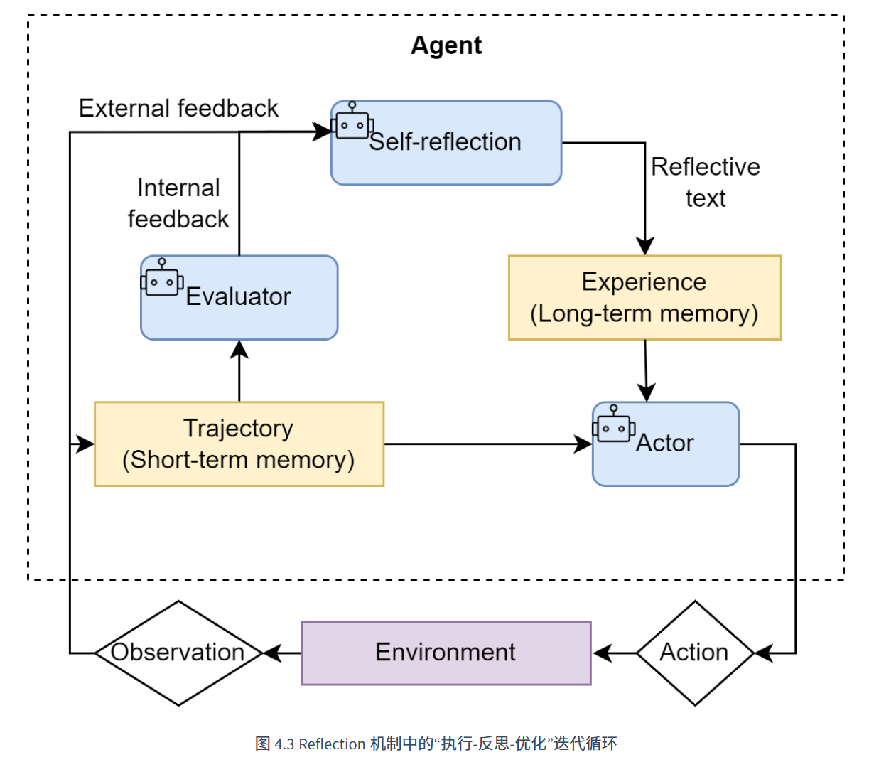
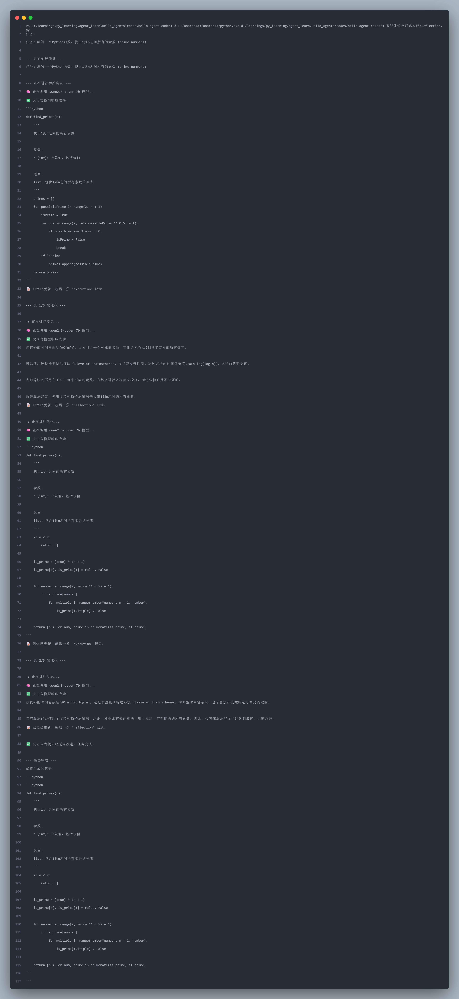
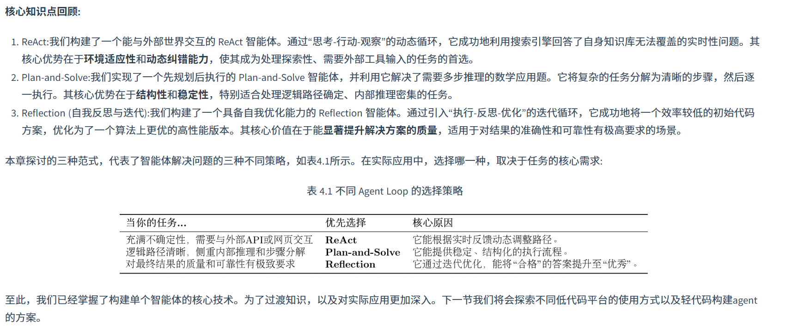

>第四章 智能体经典范式构建 学习笔记  
>
>项目地址   [智能体经典范式构建](https://datawhalechina.github.io/hello-agents/#/./chapter4/%E7%AC%AC%E5%9B%9B%E7%AB%A0%20%E6%99%BA%E8%83%BD%E4%BD%93%E7%BB%8F%E5%85%B8%E8%8C%83%E5%BC%8F%E6%9E%84%E5%BB%BA)


# 概要
摘要：
> 一个现代的智能体，其核心能力在于能将大语言模型的推理能力与外部世界联通。它能够自主地理解用户意图、拆解复杂任务，并通过调用代码解释器、搜索引擎、API等一系列“工具”，来获取信息、执行操作，最终达成目标。 然而，智能体并非万能，它同样面临着来自大模型本身的“幻觉”问题、在复杂任务中可能陷入推理循环、以及对工具的错误使用等挑战，这些也构成了智能体的能力边界。

## 三种架构范式

- **ReAct (Reasoning and Acting)：** 一种将“思考”和“行动”紧密结合的范式，让智能体边想边做，动态调整。
- **Plan-and-Solve：** 一种“三思而后行”的范式，智能体首先生成一个完整的行动计划，然后严格执行。
- **Reflection：** 一种赋予智能体“反思”能力的范式，通过自我批判和修正来优化结果。

# 零: 环境准备
## 依赖库
确保你已经安装了 `openai` 库用于与大语言模型交互，以及 `python-dotenv` 库用于安全地管理我们的 API 密钥
```shell
pip install openai python-dotenv
```

## 基础封装llm调用函数

```py
import os
from openai import OpenAI
from dotenv import load_dotenv
from typing import List, Dict

# 加载 .env 文件中的环境变量
load_dotenv()

class HelloAgentsLLM:
    """
    为本书 "Hello Agents" 定制的LLM客户端。
    它用于调用任何兼容OpenAI接口的服务，并默认使用流式响应。
    """
    def __init__(self, model: str = None, apiKey: str = None, baseUrl: str = None, timeout: int = None):
        """
        初始化客户端。优先使用传入参数，如果未提供，则从环境变量加载。
        """
        self.model = model or os.getenv("LLM_MODEL_ID")
        apiKey = apiKey or os.getenv("LLM_API_KEY")
        baseUrl = baseUrl or os.getenv("LLM_BASE_URL")
        timeout = timeout or int(os.getenv("LLM_TIMEOUT", 60))
        
        if not all([self.model, apiKey, baseUrl]):
            raise ValueError("模型ID、API密钥和服务地址必须被提供或在.env文件中定义。")

        self.client = OpenAI(api_key=apiKey, base_url=baseUrl, timeout=timeout)

    def think(self, messages: List[Dict[str, str]], temperature: float = 0) -> str:
        """
        调用大语言模型进行思考，并返回其响应。
        """
        print(f"🧠 正在调用 {self.model} 模型...")
        try:
            response = self.client.chat.completions.create(
                model=self.model,
                messages=messages,
                temperature=temperature,
                stream=True,
            )
            
            # 处理流式响应
            print("✅ 大语言模型响应成功:")
            collected_content = []
            for chunk in response:
                if not chunk.choices:
                    continue
                content = chunk.choices[0].delta.content or ""
                print(content, end="", flush=True)
                collected_content.append(content)
            print()  # 在流式输出结束后换行
            return "".join(collected_content)

        except Exception as e:
            print(f"❌ 调用LLM API时发生错误: {e}")
            return None

# --- 客户端使用示例 ---
if __name__ == '__main__':
    try:
        llmClient = HelloAgentsLLM()
        
        exampleMessages = [
            {"role": "system", "content": "You are a helpful assistant that writes Python code."},
            {"role": "user", "content": "写一个快速排序算法"}
        ]
        
        print("--- 调用LLM ---")
        responseText = llmClient.think(exampleMessages)
        if responseText:
            print("\n\n--- 完整模型响应 ---")
            print(responseText)

    except ValueError as e:
        print(e)


>>>
--- 调用LLM ---
🧠 正在调用 xxxxxx 模型...
✅ 大语言模型响应成功:
快速排序是一种非常高效的排序算法...
```

## ==总结== (important)
本文档总结了如何使用 OpenAI API 进行大语言模型调用，包括环境配置、客户端初始化、模型调用、流式响应处理和错误处理的最佳实践。

### 环境配置

#### 环境变量设置

创建 `.env` 文件来管理敏感配置：

```env
LLM_API_KEY="your-api-key-here"
LLM_MODEL_ID="gpt-4"  # 或其他模型名称
LLM_BASE_URL="https://api.openai.com/v1"  # 或自定义API端点
LLM_TIMEOUT=60  # 可选，默认超时时间
```

#### 本地 Ollama 配置

```env
LLM_API_KEY="ollama"
LLM_MODEL_ID="llama3"
LLM_BASE_URL="http://localhost:11434/v1"
```

### 客户端初始化

#### 导入必要库

```python
import os
from openai import OpenAI
from dotenv import load_dotenv
from typing import List, Dict
```

#### HelloAgentsLLM 类

```python
class HelloAgentsLLM:
    """
    为本书 "Hello Agents" 定制的LLM客户端。
    它用于调用任何兼容OpenAI接口的服务，并默认使用流式响应。
    """
    def __init__(self, model: str = None, apiKey: str = None, baseUrl: str = None, timeout: int = None):
        """
        初始化客户端。优先使用传入参数，如果未提供，则从环境变量加载。
        """
        self.model = model or os.getenv("LLM_MODEL_ID")
        apiKey = apiKey or os.getenv("LLM_API_KEY")
        baseUrl = baseUrl or os.getenv("LLM_BASE_URL")
        timeout = timeout or int(os.getenv("LLM_TIMEOUT", 60))
        
        if not all([self.model, apiKey, baseUrl]):
            raise ValueError("模型ID、API密钥和服务地址必须被提供或在.env文件中定义。")

        self.client = OpenAI(api_key=apiKey, base_url=baseUrl, timeout=timeout)
```

### 模型调用

#### think 方法

```python
def think(self, messages: List[Dict[str, str]], temperature: float = 0, stream: bool = True) -> str:
    """
    调用大语言模型进行思考，并返回其响应。
    """
    print(f"🧠 正在调用 {self.model} 模型...")
    try:
        # 对于Ollama，有时流式响应会导致连接问题，因此提供非流式选项
        response = self.client.chat.completions.create(
            model=self.model,
            messages=messages,
            temperature=temperature,
            stream=stream,
        )
        
        if stream:
            # 处理流式响应
            print("✅ 大语言模型响应成功:")
            collected_content = []
            for chunk in response:
                if not chunk.choices:
                    continue
                content = chunk.choices[0].delta.content or ""
                if content:  # 只有当内容不为空时才打印
                    print(content, end="", flush=True)
                collected_content.append(content)
            print()  # 在流式输出结束后换行
            return "".join(collected_content)
        else:
            # 非流式响应
            print("✅ 大语言模型响应成功:")
            content = response.choices[0].message.content
            print(content)
            return content

    except Exception as e:
        print(f"❌ 调用LLM API时发生错误: {e}")
        # 如果流式请求失败，尝试非流式请求
        if stream:
            print("🔄 尝试非流式请求...")
            try:
                response = self.client.chat.completions.create(
                    model=self.model,
                    messages=messages,
                    temperature=temperature,
                    stream=False,
                )
                content = response.choices[0].message.content
                print("✅ 非流式响应成功:")
                print(content)
                return content
            except Exception as e2:
                print(f"❌ 非流式请求也失败: {e2}")
                return None
        return None
```

### 流式响应处理

#### 消息格式

消息必须遵循特定格式：

```python
messages = [
    {"role": "system", "content": "You are a helpful assistant that writes Python code."},
    {"role": "user", "content": "写一个快速排序算法"}
]
```

#### 角色类型

- `system`: 系统提示，用于设定AI的行为模式
- `user`: 用户输入
- `assistant`: AI助手的回复

#### 流式响应的关键点

1. **数据结构差异**：
   - 非流式：`response.choices[0].message.content`
   - 流式：`chunk.choices[0].delta.content`

2. **增量处理**：流式响应每次只返回新增的内容片段

3. **实时输出**：可以实现类似打字机的效果

### 错误处理

#### 基本错误处理

```python
try:
    # API 调用
except Exception as e:
    print(f"❌ 调用LLM API时发生错误: {e}")
```

#### 重试机制

```python
if stream:
    print("🔄 尝试非流式请求...")
    try:
        # 非流式请求
    except Exception as e2:
        print(f"❌ 非流式请求也失败: {e2}")
```

#### 验证必需参数

```python
if not all([self.model, apiKey, baseUrl]):
    raise ValueError("模型ID、API密钥和服务地址必须被提供或在.env文件中定义。")
```

### 使用示例

```python
if __name__ == '__main__':
    try:
        llmClient = HelloAgentsLLM()
        
        exampleMessages = [
            {"role": "system", "content": "You are a helpful assistant that writes Python code."},
            {"role": "user", "content": "写一个快速排序算法"}
        ]
        
        print("--- 调用LLM ---")
        responseText = llmClient.think(exampleMessages)
        if responseText:
            print("\n\n--- 完整模型响应 ---")
            print(responseText)

    except ValueError as e:
        print(e)
```

### 关键概念总结

1. **OpenAI 兼容性**：代码设计为与任何兼容 OpenAI 接口的服务配合使用
2. **流式 vs 非流式**：流式提供实时输出，非流式一次性返回完整结果
3. **Delta vs Message**：流式响应使用 `delta.content`，非流式使用 `message.content`
4. **错误恢复**：流式请求失败时自动降级到非流式请求
5. **类型注解**：使用 `List[Dict[str, str]]` 明确指定消息格式类型

# 一:ReAct

**ReAct (Reason + Act)**。ReAct由Shunyu Yao于2022年提出，其核心思想是模仿人类解决问题的方式，将**推理 (Reasoning)** 与**行动 (Acting)** 显式地结合起来，形成一个“思考-行动-观察”的循环。

## ReAct的工作流程

ReAct范式通过一种特殊的提示工程来引导模型，使其每一步的输出都遵循一个固定的轨迹：

- **Thought (思考)：** 这是智能体的“内心独白”。它会分析当前情况、分解任务、制定下一步计划，或者反思上一步的结果。
- **Action (行动)：** 这是智能体决定采取的具体动作，通常是调用一个外部工具，例如 `Search['华为最新款手机']`。
- **Observation (观察)：** 这是执行`Action`后从外部工具返回的结果，例如搜索结果的摘要或API的返回值。

### 适用场景

- **需要外部知识的任务**：如查询实时信息（天气、新闻、股价）、搜索专业领域的知识等。

- **需要精确计算的任务**：将数学问题交给计算器工具，避免LLM的计算错误。

- **需要与API交互的任务**：如操作数据库、调用某个服务的API来完成特定功能。

## 工具定义和实现

大语言模型是智能体的大脑，那么**工具 (Tools)** 就是其与外部世界交互的“手和脚”。为了让ReAct范式能够真正解决我们设定的问题，智能体需要具备调用外部工具的能力。

### 0. 准备和目标
这里我们不采用书中获取华为最新手机的消息，我们改为获取某个地区当前的==天气情况==
本书采用Google的 search 工具 [SerpApi](https://serpapi.com/dashboard)，我们这里沿用该方式，其实这个无所谓 获取到结果即可 250免费额度真香

### 1. 实现搜索工具的核心逻辑函数
%%学习进度 4.2ReAct%%

==三要素：==
1. **名称 (Name)**： 一个简洁、唯一的标识符，供智能体在 `Action` 中调用，例如 `Search`。
2. **描述 (Description)**： 一段清晰的自然语言描述，说明这个工具的用途。**这是整个机制中最关键的部分**，因为大语言模型会依赖这段描述来判断何时使用哪个工具。
3. **执行逻辑 (Execution Logic)**： 真正执行任务的函数或方法。

代码：
```py
from serpapi import SerpApiClient
from dotenv import load_dotenv   # 导入dotenv模块，用于加载环境变量


#? 加载 .env 文件中的环境变量
load_dotenv()
def search(query: str) -> str:
    """
    一个基于SerpApi的实战网页搜索引擎工具。
    它会智能地解析搜索结果，优先返回直接答案或知识图谱信息。
    """
    print(f"🔍 正在执行 [SerpApi] 网页搜索: {query}")
    try:
        api_key = os.getenv("SERPAPI_API_KEY")
        if not api_key:
            return "错误:SERPAPI_API_KEY 未在 .env 文件中配置。"

        params = {
            "engine": "google",
            "q": query,
            "api_key": api_key,
            "gl": "cn",  # 国家代码
            "hl": "zh-cn", # 语言代码
        }
        
        client = SerpApiClient(params)
        results = client.get_dict()
        
        # 智能解析:优先寻找最直接的答案
        if "answer_box_list" in results:
            return "\n".join(results["answer_box_list"])
        if "answer_box" in results and "answer" in results["answer_box"]:
            return results["answer_box"]["answer"]
        if "knowledge_graph" in results and "description" in results["knowledge_graph"]:
            return results["knowledge_graph"]["description"]
        if "organic_results" in results and results["organic_results"]:
            # 如果没有直接答案，则返回前三个有机结果的摘要
            snippets = [
                f"[{i+1}] {res.get('title', '')}\n{res.get('snippet', '')}"
                for i, res in enumerate(results["organic_results"][:3])
            ]
            return "\n\n".join(snippets)
        
        return f"对不起，没有找到关于 '{query}' 的信息。"

    except Exception as e:
        return f"搜索时发生错误: {e}"
```

在这里我们通过 SerpApi 查询Google 获取输入query的结果 并作处理

首先会检查是否存在 `answer_box`（Google的答案摘要框）或 `knowledge_graph`（知识图谱）等信息，如果存在，就直接返回这些最精确的答案。
如果不存在，它才会退而求其次，返回前三个常规搜索结果的摘要。这种“智能解析”能为LLM提供质量更高的信息输入。
### 2. 构建通用的工具执行器
当智能体需要使用多种工具时（例如，除了搜索，还可能需要计算、查询数据库等），我们需要一个统一的管理器来注册和调度这些工具。为此，我们创建一个 ==`ToolExecutor`== 类。

代码：
```py
from typing import Dict, Any

class ToolExecutor:
    """
    一个工具执行器，负责管理和执行工具。
    """
    def __init__(self):
        self.tools: Dict[str, Dict[str, Any]] = {}

    def registerTool(self, name: str, description: str, func: callable):
        """
        向工具箱中注册一个新工具。
        """
        if name in self.tools:
            print(f"警告:工具 '{name}' 已存在，将被覆盖。")
        self.tools[name] = {"description": description, "func": func}
        print(f"工具 '{name}' 已注册。")

    def getTool(self, name: str) -> callable:
        """
        根据名称获取一个工具的执行函数。
        """
        return self.tools.get(name, {}).get("func")

    def getAvailableTools(self) -> str:
        """
        获取所有可用工具的格式化描述字符串。
        """
        return "\n".join([
            f"- {name}: {info['description']}" 
            for name, info in self.tools.items()
        ])
```

注意这句代码用法`self.tools: Dict[str, Dict[str, Any]] = {}` 

**创建一个嵌套字典结构来存储工具信息**，其中：

- `Dict[str, Dict[str, Any]]` - 类型注解，表示这是一个字典
  - 外层字典的键是字符串类型（工具名称）
  - 外层字典的值是另一个字典（工具详情）
  - 内层字典包含工具的描述和函数等任意类型的数据

- 实际存储结构形如：
```json
{
  "工具名1": {
    "description": "工具描述",
    "func": 实际的函数对象
  },
  "工具名2": {
    "description": "工具描述",
    "func": 实际的函数对象
  }
}
```

### 3. 整合测试
将 `search` 工具注册到 `ToolExecutor` 中，并模拟一次调用，以验证整个流程是否正常工作。
```py
# --- 工具初始化与使用示例 ---
if __name__ == '__main__':
    # 1. 初始化工具执行器
    toolExecutor = ToolExecutor()

    # 2. 注册我们的实战搜索工具
    search_description = "一个网页搜索引擎。当你需要回答关于时事、事实以及在你的知识库中找不到的信息时，应使用此工具。"
    toolExecutor.registerTool("Search", search_description, search)
    
    # 3. 打印可用的工具
    print("\n--- 可用的工具 ---")
    print(toolExecutor.getAvailableTools())

    # 4. 智能体的Action调用，这次我们问一个实时性的问题
    print("\n--- 执行 Action: Search['英伟达最新的GPU型号是什么'] ---")
    tool_name = "Search"
    tool_input = "英伟达最新的GPU型号是什么"

    tool_function = toolExecutor.getTool(tool_name)
    if tool_function:
        observation = tool_function(tool_input)
        print("--- 观察 (Observation) ---")
        print(observation)
    else:
        print(f"错误:未找到名为 '{tool_name}' 的工具。")
        
>>>
工具 'Search' 已注册。

--- 可用的工具 ---
- Search: 一个网页搜索引擎。当你需要回答关于时事、事实以及在你的知识库中找不到的信息时，应使用此工具。

--- 执行 Action: Search['英伟达最新的GPU型号是什么'] ---
🔍 正在执行 [SerpApi] 网页搜索: 英伟达最新的GPU型号是什么
--- 观察 (Observation) ---
[1] GeForce RTX 50 系列显卡
GeForce RTX™ 50 系列GPU 搭载NVIDIA Blackwell 架构，为游戏玩家和创作者带来全新玩法。RTX 50 系列具备强大的AI 算力，带来升级体验和更逼真的画面。

[2] 比较GeForce 系列最新一代显卡和前代显卡
比较最新一代RTX 30 系列显卡和前代的RTX 20 系列、GTX 10 和900 系列显卡。查看规格、功能、技术支持等内容。

[3] GeForce 显卡| NVIDIA
DRIVE AGX. 强大的车载计算能力，适用于AI 驱动的智能汽车系统 · Clara AGX. 适用于创新型医疗设备和成像的AI 计算. 游戏和创作. GeForce. 探索显卡、游戏解决方案、AI ...
```

至此 一个tool 已经被我们构建 或许 我们可以将此学习文件作为一个模板整合 后续不需要重复造轮子 
## ReAct智能体的编码实现
现在，我们将所有==独立的组件==，==LLM客户端==和==工具执行器组==装起来，构建一个完整的 ReAct 智能体。我们将通过一个 `ReActAgent` 类来封装其核心逻辑。

### 1. 系统提示词设计
提示词是整个 ReAct 机制的基石，它为大语言模型提供了行动的操作指令。我们需要精心设计一个模板，它将动态地插入可用工具、用户问题以及中间步骤的交互历史。

```py
# ReAct 提示词模板
REACT_PROMPT_TEMPLATE = """
请注意，你是一个有能力调用外部工具的智能助手。

可用工具如下:
{tools}

请严格按照以下格式进行回应:

Thought: 你的思考过程，用于分析问题、拆解任务和规划下一步行动。
Action: 你决定采取的行动，必须是以下格式之一:
- `{{tool_name}}[{{tool_input}}]`:调用一个可用工具。
- `Finish[最终答案]`:当你认为已经获得最终答案时。
- 当你收集到足够的信息，能够回答用户的最终问题时，你必须在Action:字段后使用 Finish[最终答案] 来输出最终答案。

现在，请开始解决以下问题:
Question: {question}
History: {history}
"""
```

这个模板定义了智能体与LLM之间交互的规范：

- **角色定义**： “你是一个有能力调用外部工具的智能助手”，设定了LLM的角色。
- **工具清单 (`{tools}`)**： 告知LLM它有哪些可用的“手脚”。
- **格式规约 (`Thought`/`Action`)**： 这是最重要的部分，它强制LLM的输出具有结构性，使我们能通过代码精确解析其意图。
- **动态上下文 (`{question}`/`{history}`)**： 将用户的原始问题和不断累积的交互历史注入，让LLM基于完整的上下文进行决策。

其实 我觉得 现在的agent开发 对于提示词的编排 非常重要 对于同一个工具 模型 不同的提示词 有时候或许会有不同的产出

### 2. 核心循环的实现 
`ReActAgent` 的核心是一个循环，它不断地“格式化提示词 -> 调用LLM -> 执行动作 -> 整合结果”，直到任务完成或达到最大步数限制。

```py
class ReActAgent:
    def __init__(self, llm_client: HelloAgentsLLM, tool_executor: ToolExecutor, max_steps: int = 5):
        self.llm_client = llm_client
        self.tool_executor = tool_executor
        self.max_steps = max_steps
        self.history = []

    def run(self, question: str):
        """
        运行ReAct智能体来回答一个问题。
        """
        self.history = [] # 每次运行时重置历史记录
        current_step = 0

        while current_step < self.max_steps:
            current_step += 1
            print(f"--- 第 {current_step} 步 ---")

            # 1. 格式化提示词
            tools_desc = self.tool_executor.getAvailableTools()
            history_str = "\n".join(self.history)
            prompt = REACT_PROMPT_TEMPLATE.format(
                tools=tools_desc,
                question=question,
                history=history_str
            )

            # 2. 调用LLM进行思考
            messages = [{"role": "user", "content": prompt}]
            response_text = self.llm_client.think(messages=messages)
            
            if not response_text:
                print("错误:LLM未能返回有效响应。")
                break

            # ... (后续的解析、执行、整合步骤)
```

`run` 方法是智能体的入口。它的 `while` 循环构成了 ReAct 范式的主体，`max_steps` 参数则是一个重要的安全阀，防止智能体陷入无限循环而耗尽资源。

### 3. 输出解析器的实现

LLM 返回的是纯文本，我们需要从中精确地提取出`Thought`和`Action`。这是通过几个辅助解析函数完成的，它们通常使用正则表达式来实现。

```py
# (这些方法是 ReActAgent 类的一部分)
    def _parse_output(self, text: str):
        """解析LLM的输出，提取Thought和Action。
        """
        # Thought: 匹配到 Action: 或文本末尾
        thought_match = re.search(r"Thought:\s*(.*?)(?=\nAction:|$)", text, re.DOTALL)
        # Action: 匹配到文本末尾
        action_match = re.search(r"Action:\s*(.*?)$", text, re.DOTALL)
        thought = thought_match.group(1).strip() if thought_match else None
        action = action_match.group(1).strip() if action_match else None
        return thought, action

    def _parse_action(self, action_text: str):
        """解析Action字符串，提取工具名称和输入。
        """
        match = re.match(r"(\w+)\[(.*)\]", action_text, re.DOTALL)
        if match:
            return match.group(1), match.group(2)
        return None, None
```

- `_parse_output`： 负责从LLM的完整响应中分离出`Thought`和`Action`两个主要部分。
- `_parse_action`： 负责进一步解析`Action`字符串，例如从 `Search[华为最新手机]` 中提取出工具名 `Search` 和工具输入 `华为最新手机`。

这里通过正则表达式 完成对内容的提取 如果不熟练可以网站上搜索实现即可

### 4. 工具调用与执行
```py
# (这段逻辑在 run 方法的 while 循环内)
            # 3. 解析LLM的输出
            thought, action = self._parse_output(response_text)
            
            if thought:
                print(f"思考: {thought}")

            if not action:
                print("警告:未能解析出有效的Action，流程终止。")
                break

            # 4. 执行Action
            if action.startswith("Finish"):
                # 如果是Finish指令，提取最终答案并结束
                final_answer = re.match(r"Finish\[(.*)\]", action).group(1)
                print(f"🎉 最终答案: {final_answer}")
                return final_answer
            
            tool_name, tool_input = self._parse_action(action)
            if not tool_name or not tool_input:
                # ... 处理无效Action格式 ...
                continue

            print(f"🎬 行动: {tool_name}[{tool_input}]")
            
            tool_function = self.tool_executor.getTool(tool_name)
            if not tool_function:
                observation = f"错误:未找到名为 '{tool_name}' 的工具。"
            else:
                observation = tool_function(tool_input) # 调用真实工具
```

==**添加历史记录**== 
```py
# (这段逻辑紧随工具调用之后，在 while 循环的末尾)
            print(f"👀 观察: {observation}")
            
            # 将本轮的Action和Observation添加到历史记录中
            self.history.append(f"Action: {action}")
            self.history.append(f"Observation: {observation}")

        # 循环结束
        print("已达到最大步数，流程终止。")
        return None
```

 ==**ReActAgent.run 方法执行流程**==

 1. 初始化阶段
	- 清空历史记录 `self.history = []`
	- 设置当前步骤计数器 `current_step = 0`

 2. 主循环（最多执行 max_steps 次）
	对于每一步：
	 1. 构建提示词
		- 获取可用工具列表
		- 整合历史记录
		- 将信息填入 REACT_PROMPT_TEMPLATE 模板

	 2. LLM 思考
		- 将构建好的提示词发送给 LLM
		- 获取 LLM 的响应

	 3. 解析输出
		- 使用 `_parse_output` 方法解析 LLM 响应
		- 提取出 `thought`（思考过程）和 `action`（行动指令）

	 4. 处理 Action
		- **如果是 Finish 操作**：提取最终答案并返回，结束流程
		- **如果是工具调用操作**：
		    - 解析工具名称和输入参数
		    - 执行相应的工具函数
		    - 获取观察结果

	5. 更新历史记录
		- 将当前步骤的 Thought、Action 和 Observation 添加到历史记录中
		- 为下一步提供上下文信息

 3. 循环终止条件
	- 达到最大步数限制
	- 或者遇到 Finish 操作并返回最终答案

复现结果展示



## ReAct的特点 局限 
通过亲手实现一个 ReAct 智能体，我们不仅掌握了其工作流程，也应该对其内在机制有了更深刻的认识。任何技术范式都有其闪光点和待改进之处，本节将对 ReAct 进行总结。

（1）ReAct 的主要特点

1. **高可解释性**：ReAct 最大的优点之一就是透明。通过 `Thought` 链，我们可以清晰地看到智能体每一步的“心路历程”——它为什么会选择这个工具，下一步又打算做什么。这对于理解、信任和调试智能体的行为至关重要。
2. **动态规划与纠错能力**：与一次性生成完整计划的范式不同，ReAct 是“走一步，看一步”。它根据每一步从外部世界获得的 `Observation` 来动态调整后续的 `Thought` 和 `Action`。如果上一步的搜索结果不理想，它可以在下一步中修正搜索词，重新尝试。
3. **工具协同能力**：ReAct 范式天然地将大语言模型的推理能力与外部工具的执行能力结合起来。LLM 负责运筹帷幄（规划和推理），工具负责解决具体问题（搜索、计算），二者协同工作，突破了单一 LLM 在知识时效性、计算准确性等方面的固有局限。

（2）ReAct 的固有局限性

1. **对LLM自身能力的强依赖**：ReAct 流程的成功与否，高度依赖于底层 LLM 的综合能力。如果 LLM 的逻辑推理能力、指令遵循能力或格式化输出能力不足，就很容易在 `Thought` 环节产生错误的规划，或者在 `Action` 环节生成不符合格式的指令，导致整个流程中断。
2. **执行效率问题**：由于其循序渐进的特性，完成一个任务通常需要多次调用 LLM。每一次调用都伴随着网络延迟和计算成本。对于需要很多步骤的复杂任务，这种串行的“思考-行动”循环可能会导致较高的总耗时和费用。
3. **提示词的脆弱性**：整个机制的稳定运行建立在一个精心设计的提示词模板之上。模板中的任何微小变动，甚至是用词的差异，都可能影响 LLM 的行为。此外，并非所有模型都能持续稳定地遵循预设的格式，这增加了在实际应用中的不确定性。
4. **可能陷入局部最优**：步进式的决策模式意味着智能体缺乏一个全局的、长远的规划。它可能会因为眼前的 `Observation` 而选择一个看似正确但长远来看并非最优的路径，甚至在某些情况下陷入“原地打转”的循环中。

# 二: Plan-and-Solve
**先规划 (Plan)，后执行 (Solve)**。

如果说 ReAct 像一个经验丰富的侦探，根据现场的蛛丝马迹（Observation）一步步推理，随时调整自己的调查方向；

那么 Plan-and-Solve 则更像一位建筑师，在动工之前必须先绘制出完整的蓝图（Plan），然后严格按照蓝图来施工（Solve）。事实上我们现在用的很多大模型工具的Agent模式都融入了这种设计模式。

## 运行原理

1. **规划阶段 (Planning Phase)**： 首先，智能体会接收用户的完整问题。它的第一个任务不是直接去解决问题或调用工具，而是**将问题分解，并制定出一个清晰、分步骤的行动计划**。这个计划本身就是一次大语言模型的调用产物。

2. **执行阶段 (Solving Phase)**： 在获得完整的计划后，智能体进入执行阶段。它会**严格按照计划中的步骤，逐一执行**。每一步的执行都可能是一次独立的 LLM 调用，或者是对上一步结果的加工处理，直到计划中的所有步骤都完成，最终得出答案。


### 适合场景
Plan-and-Solve 尤其适用于那些结构性强、可以被清晰分解的复杂任务，例如：

- **多步数学应用题**：需要先列出计算步骤，再逐一求解。
- **需要整合多个信息源的报告撰写**：需要先规划好报告结构（引言、数据来源A、数据来源B、总结），再逐一填充内容。
- **代码生成任务**：需要先构思好函数、类和模块的结构，再逐一实现。

## 规划阶段
### 1. 概要
这里 我们可以不添加tool 而是选择使用==提示词==来凸显这种模式下的agent运行智慧

**我们的目标问题是：**“一个水果店周一卖出了15个苹果。周二卖出的苹果数量是周一的两倍。周三卖出的数量比周二少了5个。请问这三天总共卖出了多少个苹果？”

1. **规划阶段**：首先，将问题分解为三个独立的计算步骤（计算周二销量、计算周三销量、计算总销量）。
2. **执行阶段**：然后，严格按照计划，一步步执行计算，并将每一步的结果作为下一步的输入，最终得出总和。

规划阶段的目标是让大语言模型接收原始问题，并输出一个清晰、分步骤的行动计划。这个计划必须是结构化的，以便我们的代码可以轻松解析并逐一执行。因此，我们设计的提示词需要明确地告诉模型它的角色和任务，并给出一个输出格式的范例。

### 2. 规划提示词设置
````py
PLANNER_PROMPT_TEMPLATE = """
你是一个顶级的AI规划专家。你的任务是将用户提出的复杂问题分解成一个由多个简单步骤组成的行动计划。
请确保计划中的每个步骤都是一个独立的、可执行的子任务，并且严格按照逻辑顺序排列。
你的输出必须是一个Python列表，其中每个元素都是一个描述子任务的字符串。

问题: {question}

请严格按照以下格式输出你的计划,```python与```作为前后缀是必要的:
```python
["步骤1", "步骤2", "步骤3", ...]
```
"""
````


以下几点确保了输出的质量和稳定性：

- **角色设定**： “顶级的AI规划专家”，激发模型的专业能力。
- **任务描述**： 清晰地定义了“分解问题”的目标。
- **格式约束**： 强制要求输出为一个 Python 列表格式的字符串，这极大地简化了后续代码的解析工作，使其比解析自然语言更稳定、更可靠。

### 3. Planner 规划器
```py
# 调用封装好的llm类
from precondition import HelloAgentsLLM

import ast     # 导入ast模块，用于安全地解析Python表达式

class Planner:
    def __init__(self, llm_client):
        self.llm_client = llm_client

    def plan(self, question: str) -> list[str]:
        """
        根据用户问题生成一个行动计划。
        """
        prompt = PLANNER_PROMPT_TEMPLATE.format(question=question)
        
        # 为了生成计划，我们构建一个简单的消息列表
        messages = [{"role": "user", "content": prompt}]
        
        print("--- 正在生成计划 ---")
        # 使用流式输出来获取完整的计划
        response_text = self.llm_client.think(messages=messages) or ""
        
        print(f"✅ 计划已生成:\n{response_text}")
        
        # 解析LLM输出的列表字符串
        try:
            # 找到```python和```之间的内容
            plan_str = response_text.split("```python")[1].split("```")[0].strip()
            # 使用ast.literal_eval来安全地执行字符串，将其转换为Python列表
            plan = ast.literal_eval(plan_str)
            return plan if isinstance(plan, list) else []
        except (ValueError, SyntaxError, IndexError) as e:
            print(f"❌ 解析计划时出错: {e}")
            print(f"原始响应: {response_text}")
            return []
        except Exception as e:
            print(f"❌ 解析计划时发生未知错误: {e}")
            return []
```

## 执行器与状态管理
### 1. 概要
在规划器 ==(`Planner`)== 生成了清晰的行动蓝图后，我们就需要一个执行器 ==(`Executor`==) 来逐一完成计划中的任务。

还承担着一个至关重要的角色：**状态管理**。它必须记录每一步的执行结果，并将其作为上下文提供给后续步骤，确保信息在整个任务链条中顺畅流动

### 2. 执行提示词设置

执行器的提示词与规划器不同。它的目标不是分解问题，而是**在已有上下文的基础上，==专注解决当前这一个步骤**==。因此，提示词需要包含以下关键信息：

- **原始问题**： 确保模型始终了解最终目标。
- **完整计划**： 让模型了解当前步骤在整个任务中的位置。
- **历史步骤与结果**： 提供至今为止已经完成的工作，作为当前步骤的直接输入。
- **当前步骤**： 明确指示模型现在需要解决哪一个具体任务。

```py
EXECUTOR_PROMPT_TEMPLATE = """
你是一位顶级的AI执行专家。你的任务是严格按照给定的计划，一步步地解决问题。
你将收到原始问题、完整的计划、以及到目前为止已经完成的步骤和结果。
请你专注于解决“当前步骤”，并仅输出该步骤的最终答案，不要输出任何额外的解释或对话。

# 原始问题:
{question}

# 完整计划:
{plan}

# 历史步骤与结果:
{history}

# 当前步骤:
{current_step}

请仅输出针对“当前步骤”的回答:
"""
```

### 3.Executor 执行器
```py
class Executor:
    def __init__(self, llm_client):
        self.llm_client = llm_client

    def execute(self, question: str, plan: list[str]) -> str:
        """
        根据计划，逐步执行并解决问题。
        """
        history = "" # 用于存储历史步骤和结果的字符串
        
        print("\n--- 正在执行计划 ---")
        
        for i, step in enumerate(plan):
            print(f"\n-> 正在执行步骤 {i+1}/{len(plan)}: {step}")
            
            prompt = EXECUTOR_PROMPT_TEMPLATE.format(
                question=question,
                plan=plan,
                history=history if history else "无", # 如果是第一步，则历史为空
                current_step=step
            )
            
            messages = [{"role": "user", "content": prompt}]
            
            response_text = self.llm_client.think(messages=messages) or ""
            
            # 更新历史记录，为下一步做准备
            history += f"步骤 {i+1}: {step}\n结果: {response_text}\n\n"
            
            print(f"✅ 步骤 {i+1} 已完成，结果: {response_text}")

        # 循环结束后，最后一步的响应就是最终答案
        final_answer = response_text
        return final_answer
```
我们将执行逻辑封装到 `Executor` 类中。这个类将循环遍历计划，调用 LLM，并维护一个历史记录（状态）。
### 4. 完整agent构建
```py
class PlanAndSolveAgent:
    def __init__(self, llm_client):
        """
        初始化智能体，同时创建规划器和执行器实例。
        """
        self.llm_client = llm_client
        self.planner = Planner(self.llm_client)
        self.executor = Executor(self.llm_client)

    def run(self, question: str):
        """
        运行智能体的完整流程:先规划，后执行。
        """
        print(f"\n--- 开始处理问题 ---\n问题: {question}")
        
        # 1. 调用规划器生成计划
        plan = self.planner.plan(question)
        
        # 检查计划是否成功生成
        if not plan:
            print("\n--- 任务终止 --- \n无法生成有效的行动计划。")
            return

        # 2. 调用执行器执行计划
        final_answer = self.executor.execute(question, plan)
        
        print(f"\n--- 任务完成 ---\n最终答案: {final_answer}")
```

这个 `PlanAndSolveAgent` 类的设计体现了“组合优于继承”的原则。它本身不包含复杂的逻辑，而是作为一个协调者 (Orchestrator)，清晰地调用其内部组件来完成任务。




# 三: Reflection

Reflection 机制的核心思想，正是为智能体引入一种**事后（post-hoc）的自我校正循环**，使其能够像人类一样，审视自己的工作，发现不足，并进行迭代优化。

### Reflection的核心思想
其核心工作流程可以概括为一个简洁的三步循环：**执行 -> 反思 -> 优化**。

1. **执行 (Execution)**：首先，智能体使用我们熟悉的方法（如 ReAct 或 Plan-and-Solve）尝试完成任务，生成一个初步的解决方案或行动轨迹。这可以看作是“初稿”。
2. **反思 (Reflection)**：接着，智能体进入反思阶段。它会调用一个独立的、或者带有特殊提示词的大语言模型实例，来扮演一个“评审员”的角色。这个“评审员”会审视第一步生成的“初稿”，并从多个维度进行评估，例如：
    - **事实性错误**：是否存在与常识或已知事实相悖的内容？
    - **逻辑漏洞**：推理过程是否存在不连贯或矛盾之处？
    - **效率问题**：是否有更直接、更简洁的路径来完成任务？
    - **遗漏信息**：是否忽略了问题的某些关键约束或方面？ 根据评估，它会生成一段结构化的**反馈 (Feedback)**，指出具体的问题所在和改进建议。
3. **优化 (Refinement)**：最后，智能体将“初稿”和“反馈”作为新的上下文，再次调用大语言模型，要求它根据反馈内容对初稿进行修正，生成一个更完善的“修订稿”。


## 案例设定和记忆模块设定

（1.案例设定）
为了在实战中体现 Reflection 机制，我们将引入==记忆管理机制==，因为reflection通常对应着信息的存储和提取，如果上下文足够长的情况，想让“评审员”直接获取所有的信息然后进行反思往往会传入很多冗余信息。

这一步的目标任务是：“==编写一个Python函数，找出1到n之间所有的素数 (prime numbers)==。”

1. **存在明确的优化路径**：大语言模型初次生成的代码很可能是一个简单但效率低下的递归实现。
2. **反思点清晰**：可以通过反思发现其“时间复杂度过高”或“存在重复计算”的问题。
3. **优化方向明确**：可以根据反馈，将其优化为更高效的迭代版本或使用备忘录模式的版本。

Reflection 的核心在于迭代，而迭代的前提是能够记住之前的尝试和获得的反馈。因此，一个“短期记忆”模块是实现该范式的必需品。这个记忆模块将负责存储每一次“执行-反思”循环的完整轨迹。

（2. 简单记忆模块设定）
```py
from typing import List, Dict, Any, Optional

class Memory:
    """
    一个简单的短期记忆模块，用于存储智能体的行动与反思轨迹。
    """

    def __init__(self):
        """
        初始化一个空列表来存储所有记录。
        """
        self.records: List[Dict[str, Any]] = []

    def add_record(self, record_type: str, content: str):
        """
        向记忆中添加一条新记录。

        参数:
        - record_type (str): 记录的类型 ('execution' 或 'reflection')。
        - content (str): 记录的具体内容 (例如，生成的代码或反思的反馈)。
        """
        record = {"type": record_type, "content": content}
        self.records.append(record)
        print(f"📝 记忆已更新，新增一条 '{record_type}' 记录。")

    def get_trajectory(self) -> str:
        """
        将所有记忆记录格式化为一个连贯的字符串文本，用于构建提示词。
        """
        trajectory_parts = []
        for record in self.records:
            if record['type'] == 'execution':
                trajectory_parts.append(f"--- 上一轮尝试 (代码) ---\n{record['content']}")
            elif record['type'] == 'reflection':
                trajectory_parts.append(f"--- 评审员反馈 ---\n{record['content']}")
        
        return "\n\n".join(trajectory_parts)

    def get_last_execution(self) -> Optional[str]:
        """
        获取最近一次的执行结果 (例如，最新生成的代码)。
        如果不存在，则返回 None。
        """
        for record in reversed(self.records):
            if record['type'] == 'execution':
                return record['content']
        return None
```

==**简单的记忆模块设计**==
- 使用一个列表 `records` 来按顺序存储每一次的行动和反思。
- `add_record` 方法负责向记忆中添加新的条目。
- `get_trajectory` 方法是核心，它将记忆轨迹“序列化”成一段文本，可以直接插入到后续的提示词中，为模型的反思和优化提供完整的上下文。
- `get_last_execution` 方便我们获取最新的“初稿”以供反思。

## Reflection智能体编码实现

### 1. Reflection提示词模板
#### **初始执行提示词 (Execution Prompt)**
这是智能体首次尝试解决问题的提示词，内容相对直接，只要求模型完成指定任务。
```py
INITIAL_PROMPT_TEMPLATE = """
你是一位资深的Python程序员。请根据以下要求，编写一个Python函数。
你的代码必须包含完整的函数签名、文档字符串，并遵循PEP 8编码规范。

要求: {task}

请直接输出代码，不要包含任何额外的解释。
"""
```
#### **反思提示词 (Reflection Prompt)**
这个提示词是 Reflection 机制的灵魂。它指示模型扮演“代码评审员”的角色，对上一轮生成的代码进行批判性分析，并提供具体的、可操作的反馈。
````py
REFLECT_PROMPT_TEMPLATE = """
你是一位极其严格的代码评审专家和资深算法工程师，对代码的性能有极致的要求。
你的任务是审查以下Python代码，并专注于找出其在<strong>算法效率</strong>上的主要瓶颈。

# 原始任务:
{task}

# 待审查的代码:
```python
{code}
```

请分析该代码的时间复杂度，并思考是否存在一种<strong>算法上更优</strong>的解决方案来显著提升性能。
如果存在，请清晰地指出当前算法的不足，并提出具体的、可行的改进算法建议（例如，使用筛法替代试除法）。
如果代码在算法层面已经达到最优，才能回答“无需改进”。

请直接输出你的反馈，不要包含任何额外的解释。
"""
````

#### **优化提示词 (Refinement Prompt)**
当收到反馈后，这个提示词将引导模型根据反馈内容，对原有代码进行修正和优化。
```py

REFINE_PROMPT_TEMPLATE = """
你是一位资深的Python程序员。你正在根据一位代码评审专家的反馈来优化你的代码。

# 原始任务:
{task}

# 你上一轮尝试的代码:
{last_code_attempt}
评审员的反馈：
{feedback}

请根据评审员的反馈，生成一个优化后的新版本代码。
你的代码必须包含完整的函数签名、文档字符串，并遵循PEP 8编码规范。
请直接输出优化后的代码，不要包含任何额外的解释。
"""
```

### 2. Reflecton 智能体封装
这里由于没有工具的调用 因此直接封装
将Memory 整合到 ReflectionAgent
```py
# 假设 llm_client.py 和 memory.py 已定义
# from llm_client import HelloAgentsLLM
# from memory import Memory

class ReflectionAgent:
    def __init__(self, llm_client, max_iterations=3):
        self.llm_client = llm_client
        self.memory = Memory()
        self.max_iterations = max_iterations

    def run(self, task: str):
        print(f"\n--- 开始处理任务 ---\n任务: {task}")

        # --- 1. 初始执行 ---
        print("\n--- 正在进行初始尝试 ---")
        initial_prompt = INITIAL_PROMPT_TEMPLATE.format(task=task)
        initial_code = self._get_llm_response(initial_prompt)
        self.memory.add_record("execution", initial_code)

        # --- 2. 迭代循环:反思与优化 ---
        for i in range(self.max_iterations):
            print(f"\n--- 第 {i+1}/{self.max_iterations} 轮迭代 ---")

            # a. 反思
            print("\n-> 正在进行反思...")
            last_code = self.memory.get_last_execution()
            reflect_prompt = REFLECT_PROMPT_TEMPLATE.format(task=task, code=last_code)
            feedback = self._get_llm_response(reflect_prompt)
            self.memory.add_record("reflection", feedback)

            # b. 检查是否需要停止
            if "无需改进" in feedback:
                print("\n✅ 反思认为代码已无需改进，任务完成。")
                break

            # c. 优化
            print("\n-> 正在进行优化...")
            refine_prompt = REFINE_PROMPT_TEMPLATE.format(
                task=task,
                last_code_attempt=last_code,
                feedback=feedback
            )
            refined_code = self._get_llm_response(refine_prompt)
            self.memory.add_record("execution", refined_code)
        
        final_code = self.memory.get_last_execution()
        print(f"\n--- 任务完成 ---\n最终生成的代码:\n```python\n{final_code}\n```")
        return final_code

    def _get_llm_response(self, prompt: str) -> str:
        """一个辅助方法，用于调用LLM并获取完整的流式响应。"""
        messages = [{"role": "user", "content": prompt}]
        response_text = self.llm_client.think(messages=messages) or ""
        return response_text
```

 结果复现 这里比较长 选择了一个codesnap


## Reflection机制成本分析
尽管 Reflection 机制在提升任务解决质量上表现出色，但这种能力的获得并非没有代价。在实际应用中，我们需要权衡其带来的收益与相应的成本。

（1）主要成本

1. **模型调用开销增加**:这是最直接的成本。每进行一轮迭代，至少需要额外调用两次大语言模型（一次用于反思，一次用于优化）。如果迭代多轮，API 调用成本和计算资源消耗将成倍增加。
    
2. **任务延迟显著提高**:Reflection 是一个串行过程，每一轮的优化都必须等待上一轮的反思完成。这使得任务的总耗时显著延长，不适合对实时性要求高的场景。
    
3. **提示工程复杂度上升**:如我们的案例所示，Reflection 的成功在很大程度上依赖于高质量、有针对性的提示词。为“执行”、“反思”、“优化”等不同阶段设计和调试有效的提示词，需要投入更多的开发精力。
    

（2）核心收益

1. **解决方案质量的跃迁**:最大的收益在于，它能将一个“合格”的初始方案，迭代优化成一个“优秀”的最终方案。这种从功能正确到性能高效、从逻辑粗糙到逻辑严谨的提升，在很多关键任务中是至关重要的。
    
2. **鲁棒性与可靠性增强**:通过内部的自我纠错循环，智能体能够发现并修复初始方案中可能存在的逻辑漏洞、事实性错误或边界情况处理不当等问题，从而大大提高了最终结果的可靠性。
    

综上所述，Reflection 机制是一种典型的“以成本换质量”的策略。它非常适合那些**对最终结果的质量、准确性和可靠性有极高要求，且对任务完成的实时性要求相对宽松**的场景。例如:

- 生成关键的业务代码或技术报告。
- 在科学研究中进行复杂的逻辑推演。
- 需要深度分析和规划的决策支持系统。

反之，如果应用场景需要快速响应，或者一个“大致正确”的答案就已经足够，那么使用更轻量的 ReAct 或 Plan-and-Solve 范式可能会是更具性价比的选择。

# 总结

%% 学习进度：4%% 