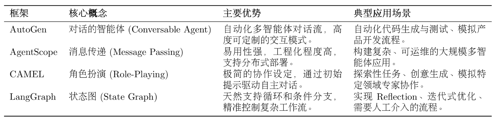
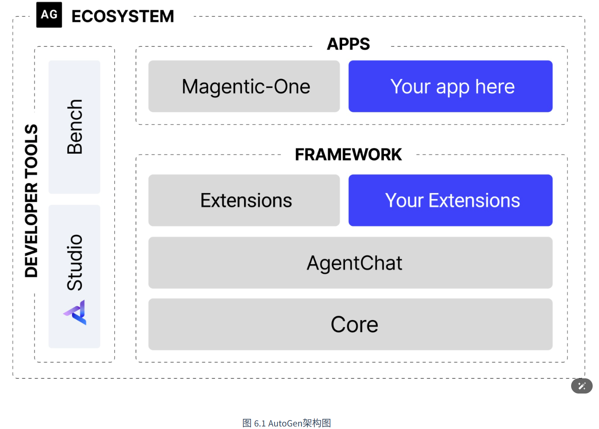
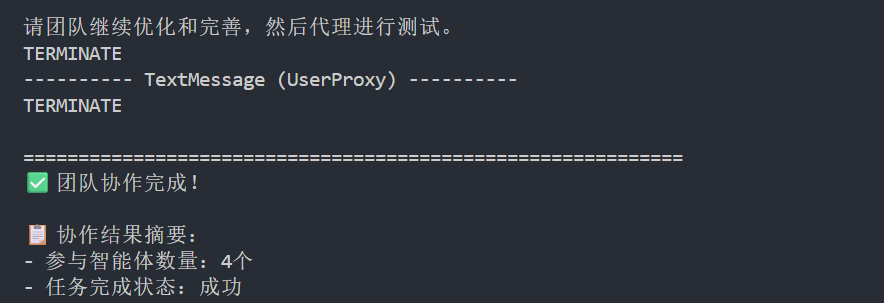
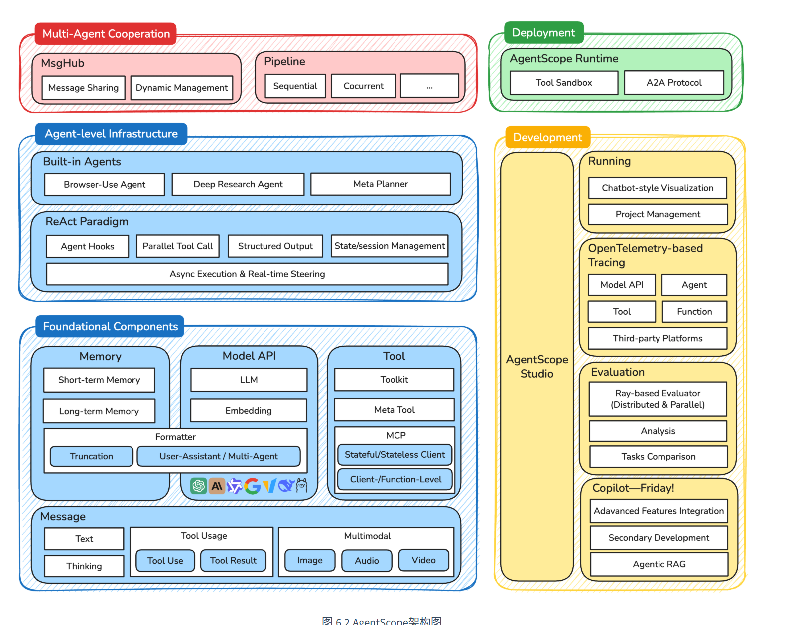
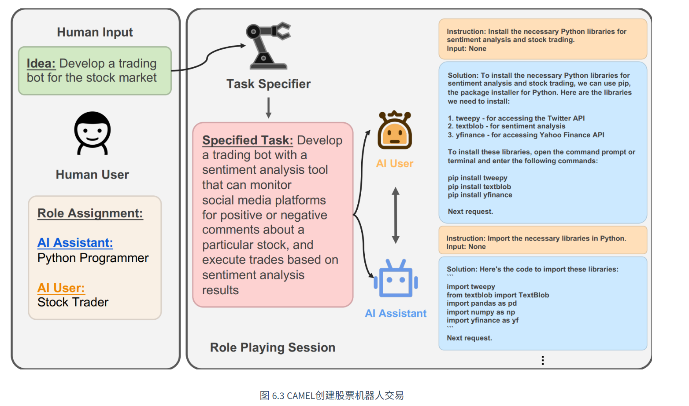
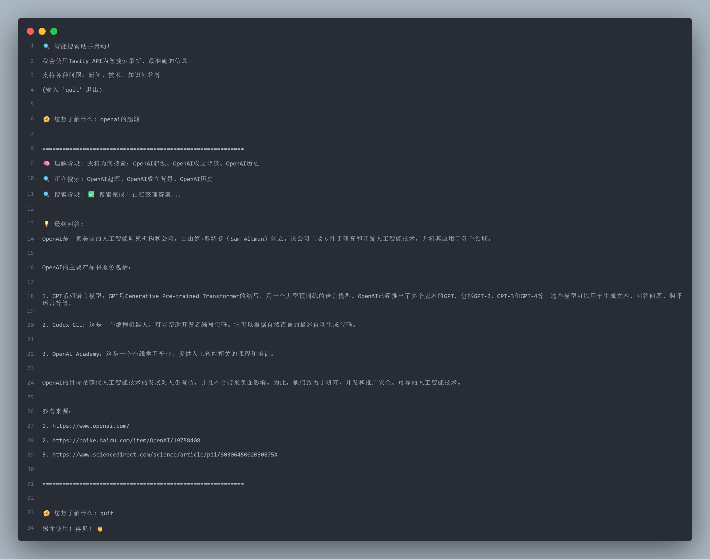

这里 四种框架 我们将一一探寻


# AutoGen
## 核心机制

### 框架结构

- **分层设计：** 框架被拆分为两个核心模块：
    - ==`autogen-core`：==作为框架的底层基础，封装了与语言模型交互、消息传递等核心功能。它的存在保证了框架的稳定性和未来扩展性。
    - ==`autogen-agentchat`==：构建于 `core` 之上，提供了用于开发对话式智能体应用的高级接口，简化了多智能体应用的开发流程。 这种分层策略使得各组件职责明确，降低了系统的耦合度。
- **异步优先：** 新架构全面转向异步编程 ==(`async/await`)==。在多智能体协作场景中，网络请求（如调用 LLM API）是主要耗时操作。异步模式允许系统在等待一个智能体响应时处理其他任务，从而避免了线程阻塞，显著提升了并发处理能力和系统资源的利用效率。

### 核心智能体组件
- **AssistantAgent（助理智能体）**  
    负责“思考与生成”。  
    它基于大语言模型（LLM）进行推理、规划、问答、代码生成等工作，通过不同的系统提示词还能扮演不同专家角色。
- **UserProxyAgent（用户代理智能体）**  
    负责“用户交互与执行行动”。  
    它一方面代表用户发起任务，另一方面还能执行代码、调用工具，并将执行结果反馈给 AssistantAgent，实现“思考”和“行动”的分离。

### 从 GroupChatManager 到 Team
当多个智能体需要协同完成任务时，AutoGen 提供了群聊（Team / GroupChat）机制来统一协调对话流程。

其中，**RoundRobinGroupChat（轮询群聊）** 是一种按固定顺序依次发言的协作模式，适用于流程明确的任务场景，例如：

1. 产品经理提出需求
2. 工程师编写代码
3. 审查员检查结果

其工作方式类似一个自动化“圆桌会议”：

- 开发者先定义参与的智能体及其角色
- 群聊系统按预设顺序轮流激活智能体
- 每个智能体基于当前上下文生成回复
- 新回复会加入对话历史，并传递给下一个智能体
- 整个流程持续运行，直到满足终止条件

## 设计软件开发团队
这里通过一个案例来学习如何使用AutoGen

### 目标
我们的目标是开发一个功能明确的 Web 应用：**实时显示比特币当前价格**。完整地覆盖了软件开发的典型环节：从需求分析、技术选型、编码实现到代码审查和最终测试。

### 智能体团队角色

四个职责分明的智能体角色：

- **ProductManager (产品经理):** 负责将用户的模糊需求转化为清晰、可执行的开发计划。
- **Engineer (工程师):** 依据开发计划，负责编写具体的应用程序代码。
- **CodeReviewer (代码审查员):** 负责审查工程师提交的代码，确保其质量、可读性和健壮性。
- **UserProxy (用户代理):** 代表最终用户，发起初始任务，并负责执行和验证最终交付的代码。

## 核心代码实现

### 准备
####  0.依赖准备
由于使用AutoGen框架 因此需要先下载好依赖等
Anaconda 命令行执行==`pip install -U "autogen-agentchat" "autogen-ext[openai]"`==

### 1.模型客户端
```py
from autogen_ext.models.openai import OpenAIChatCompletionClient # AutoGen框架

import os                        # 用于访问环境变量
from dotenv import load_dotenv   # 从环境变量中加载配置

load_dotenv()

#! 模型客户端配置
def create_openai_model_client():
    """创建并配置 OpenAI 模型客户端"""
    return OpenAIChatCompletionClient(
        model=os.getenv("LLM_MODEL_ID", "gpt-4o"),
        api_key=os.getenv("LLM_API_KEY"),
        base_url=os.getenv("LLM_BASE_URL", "https://api.openai.com/v1")
    )
```

这里支持从配置环境种读取 api模型
### 2. 智能体角色定义

定义智能体的核心在于编写高质量的系统消息 ==(System Message)。==
#### 产品经理 (ProductManager)
```py
from autogen_ext.agents import AssistantAgent         # 导入智能体角色

def create_product_manager(model_client):
    """创建产品经理智能体"""
    system_message = """你是一位经验丰富的产品经理，专门负责软件产品的需求分析和项目规划。

你的核心职责包括：
1. **需求分析**：深入理解用户需求，识别核心功能和边界条件
2. **技术规划**：基于需求制定清晰的技术实现路径
3. **风险评估**：识别潜在的技术风险和用户体验问题
4. **协调沟通**：与工程师和其他团队成员进行有效沟通

当接到开发任务时，请按以下结构进行分析：
1. 需求理解与分析
2. 功能模块划分
3. 技术选型建议
4. 实现优先级排序
5. 验收标准定义

请简洁明了地回应，并在分析完成后说"请工程师开始实现"。"""

    return AssistantAgent(
        name="ProductManager",
        model_client=model_client,
        system_message=system_message,
    )
```

#### 工程师 (Engineer)
```py
def create_engineer(model_client):
    """创建软件工程师智能体"""
    system_message = """你是一位资深的软件工程师，擅长 Python 开发和 Web 应用构建。

你的技术专长包括：
1. **Python 编程**：熟练掌握 Python 语法和最佳实践
2. **Web 开发**：精通 Streamlit、Flask、Django 等框架
3. **API 集成**：有丰富的第三方 API 集成经验
4. **错误处理**：注重代码的健壮性和异常处理

当收到开发任务时，请：
1. 仔细分析技术需求
2. 选择合适的技术方案
3. 编写完整的代码实现
4. 添加必要的注释和说明
5. 考虑边界情况和异常处理

请提供完整的可运行代码，并在完成后说"请代码审查员检查"。"""

    return AssistantAgent(
        name="Engineer",
        model_client=model_client,
        system_message=system_message,
    )
```

#### 代码审查员 (CodeReviewer)
```py
def create_code_reviewer(model_client):
    """创建代码审查员智能体"""
    system_message = """你是一位经验丰富的代码审查专家，专注于代码质量和最佳实践。

你的审查重点包括：
1. **代码质量**：检查代码的可读性、可维护性和性能
2. **安全性**：识别潜在的安全漏洞和风险点
3. **最佳实践**：确保代码遵循行业标准和最佳实践
4. **错误处理**：验证异常处理的完整性和合理性

审查流程：
1. 仔细阅读和理解代码逻辑
2. 检查代码规范和最佳实践
3. 识别潜在问题和改进点
4. 提供具体的修改建议
5. 评估代码的整体质量

请提供具体的审查意见，完成后说"代码审查完成，请用户代理测试"。"""

    return AssistantAgent(
        name="CodeReviewer",
        model_client=model_client,
        system_message=system_message,
    )
```

#### UserProxy (用户代理)
==`UserProxyAgent`== 是一个特殊的智能体，它不依赖 LLM 进行回复，而是作为用户在系统中的代理。它的 `description` 字段清晰地描述了其职责，尤其重要的是，

它负责在任务最终完成后发出 ==`TERMINATE`== 指令，以正常结束整个协作流程。

```py
from autogen_ext.agents import UserProxyAgent       # 用户代理智能体

def create_user_proxy():
    """创建用户代理智能体"""
    return UserProxyAgent(
        name="UserProxy",
        description="""用户代理，负责以下职责：
1. 代表用户提出开发需求
2. 执行最终的代码实现
3. 验证功能是否符合预期
4. 提供用户反馈和建议

完成测试后请回复 TERMINATE。""",
    )
```

### 3. 定义团队协作流程
软件开发的流程是相对固定的（需求->编码->审查->测试），因此 ==`RoundRobinGroupChat` (轮询群聊)== 是理想的选择

```py
from autogen_agentchat.teams import RoundRobinGroupChat
from autogen_agentchat.conditions import TextMentionTermination

# 定义团队聊天和协作规则
team_chat = RoundRobinGroupChat(
    participants=[
        product_manager,
        engineer,
        code_reviewer,
        user_proxy
    ],
    termination_condition=TextMentionTermination("TERMINATE"),
    max_turns=20,
)
```

- **参与者顺序:** ==`participants`== 列表的顺序决定了智能体发言的先后次序。
- **终止条件:** ==`termination_condition`== 是控制协作流程何时结束的关键。这里我们设定，当任何消息中包含关键词 "TERMINATE" 时，对话便结束。在我们的设计中，这个指令由 `UserProxy` 在完成最终测试后发出。
- **最大轮次:** `max_turns` 是一个安全阀，用于防止对话陷入无限循环，避免不必要的资源消耗。


### 4. 启动执行
```py

#! 异步运行软件开发团队
async def run_software_development_team():
    # ... 初始化客户端和智能体 ...
    
    # 定义任务描述
    task = """我们需要开发一个比特币价格显示应用，具体要求如下：
            核心功能：
            - 实时显示比特币当前价格（USD）
            - 显示24小时价格变化趋势（涨跌幅和涨跌额）
            - 提供价格刷新功能

            技术要求：
            - 使用 Streamlit 框架创建 Web 应用
            - 界面简洁美观，用户友好
            - 添加适当的错误处理和加载状态

            请团队协作完成这个任务，从需求分析到最终实现。"""
    
    # 异步执行团队协作，并流式输出对话过程
    result = await Console(team_chat.run_stream(task=task))
    return result

# 主程序入口
if __name__ == "__main__":
    try:
        # 运行异步协作流程
        result = asyncio.run(run_software_development_team())
        
        print(f"\n📋 协作结果摘要：")
        print(f"- 参与智能体数量：4个")
        print(f"- 任务完成状态：{'成功' if result else '需要进一步处理'}")
        
    except ValueError as e:
        print(f"❌ 配置错误：{e}")
        print("请检查 .env 文件中的配置是否正确")
    except Exception as e:
        print(f"❌ 运行错误：{e}")
        import traceback
        traceback.print_exc()
```

## 结果展示
请注意 如果使用本地ollama开发 这里的openai客户端需要特别配置**兼容本地和云端**，字段==**model_info**==

如果需要完整代码实现 请访问 [该仓库'AutoGen'查看](https://github.com/attached-r/hello-agents/blob/main/code/chapter6/AutoGenDemo/autogen_software_team.py)

```py
def create_openai_model_client():
    """创建 OpenAI 模型客户端用于测试"""
    model_name = os.getenv("LLM_MODEL_ID", "gpt-4o")
    api_key = os.getenv("LLM_API_KEY")
    base_url = os.getenv("LLM_BASE_URL", "https://api.openai.com/v1")
    
    # 创建客户端时，仅在必要时提供model_info
    client_params = {
        "model": model_name,
        "api_key": api_key,
        "base_url": base_url
    }

    # 仅当不是OpenAI官方API时才添加model_info
    if "api.openai.com" not in base_url:
        client_params["model_info"] = {
            "id": model_name,
            "object": "model",
            "created": 0,
            "owned_by": "local",
            "vision": False,
            "family": "ollama",
            "input_price_per_token": 0,
            "output_price_per_token": 0,
            "max_tokens": 4096,
            "vision": False,
            "function_calling": "auto",
            "json_output": True,

        }

    return OpenAIChatCompletionClient(**client_params)
```


在最终结果审核下输入 T==ERMINATE== 即可完成审核 


我将生成的结果放在了[该文件下](D:\learnings\py_learning\agent_learn\Hello_Agents\codes\hello-agent-codes\6-框架开发实战\autogen_output.md)

出乎意料的是生成结果完全可以作为一篇md格式文档 


## AutoGen 的优势与局限性

### （1）优势

#### 1. 对话式协作建模简单直观

AutoGen 使用“多智能体对话”来描述复杂任务，无需开发复杂状态机或流程控制逻辑，更贴近真实团队协作方式。

开发者只需关注：

- 谁来做（角色）
- 做什么（职责）

而不必过多处理底层流程细节。

---

#### 2. 智能体角色高度专业化

通过 System Message，可以为不同智能体赋予明确职责，例如：

- ProductManager 负责需求分析
- Engineer 负责代码实现
- CodeReviewer 负责质量审查

这种设计使智能体：

- 易复用
- 易维护
- 易扩展

---

#### 3. 协作流程清晰且支持人工监督

像 ==RoundRobinGroupChat== 这样的机制，可以让多个智能体按照固定流程协作，保证流程可预测。

同时，==UserProxyAgent== 支持：

- 人类发起任务
- 人类监督执行
- 人类最终验收

从而实现 Human-in-the-loop（人类在环）的安全控制模式。

---

### （2）局限性

#### 1. LLM 天然具有不确定性

即使流程固定，智能体的回复仍可能：

- 偏离目标
- 输出异常内容
- 引发错误分支
- 陷入循环对话

因此多智能体系统并不像传统程序那样完全可控。

---

#### 2. 调试难度较高

传统程序可以通过：

- 错误堆栈
- 日志
- 断点

快速定位问题。

但 AutoGen 的问题通常体现在：

- 长对话历史
- 多智能体交互
- 隐式上下文影响

这种“对话式调试”比传统软件调试更复杂。

%%6.3 AgentScope%%
# AgenScope
 %%好 让我继续深入AgentScope框架学习%%
注意在使用概况及前 请下载 ==`pip install agentscope`==
## 核心设计
AgentScope 的核心差异在于其**消息驱动的架构设计**和**工业级的工程实践**。如果说 AutoGen 更像是一个灵活的"对话工作室"，那么 AgentScope 就是一个完整的"智能体操作系统"，

AgentScope 选择了**组合式架构**和**消息驱动模式**。这种设计不仅增强了系统的模块化程度，也为其出色的并发性能和分布式能力奠定了基础。

### 分层架构体系


架构说明
- **基础组件层（Foundational Components）**  
    提供框架核心能力，包括消息管理（Message）、记忆管理（Memory）、模型调用（Model API）以及工具交互（Tool），为智能体运行提供统一基础。
- **智能体基础设施层（Agent-level Infrastructure）**  
    封装 ReAct、状态管理、并行工具调用等高级能力，并提供预构建智能体，支持异步执行与实时控制。
- **多智能体协作层（Multi-Agent Cooperation）**  
    通过 MsgHub 实现消息路由与状态管理，利用 Pipeline 编排顺序或并发工作流，支持复杂多智能体协作。
- **开发与部署层（Deployment & Development）**  
    提供生产级运行时环境与可视化开发工具链，方便智能体系统的开发、调试与部署。
- **整体特点**  
    AgentScope 兼具模块化、协作性与工程化优势，适合构建复杂 AI Agent 应用与多智能体系统。

### 消息驱动

AgentScope 的核心创新在于其==**消息驱动架构**==。在这个架构中，所有的智能体交互都被抽象为**消息**的发送和接收，而不是传统的函数调用。

```py
from agentscope.message import Msg

# 消息的标准结构
message = Msg(
    name="Alice",           # 发送者名称
    content="Hello, Bob!",  # 消息内容
    role="user",           # 角色类型
    metadata={             # 元数据信息
        "timestamp": "2024-01-15T10:30:00Z",
        "message_type": "text",
        "priority": "normal"
    }
)
```

将消息作为交互的基础单元，带来了几个关键优势：

- **异步解耦**: 消息的发送方和接收方在时间上解耦，无需相互等待，天然支持高并发场景。
- **位置透明**: 智能体无需关心另一个智能体是在本地进程还是在远程服务器上，消息系统会自动处理路由。
- **可观测性**: 每一条消息都可以被记录、追踪和分析，极大地简化了复杂系统的调试与监控。
- **可靠性**: 消息可以被持久化存储和重试，即使系统出现故障，也能保证交互的最终一致性，提升了系统的容错能力。
### 智能体生命管理

在 AgentScope 中，每个智能体都有明确的生命周期（初始化、运行、暂停、销毁等），并基于一个统一的基类 ==`AgentBase`== 来实现。开发者通常只需要关注其核心的 ==`reply`== 方法。

```py
from agentscope.agents import AgentBase

class CustomAgent(AgentBase):
    def __init__(self, name: str, **kwargs):
        super().__init__(name=name, **kwargs)
        # 智能体初始化逻辑
    
    def reply(self, x: Msg) -> Msg:
        # 智能体的核心响应逻辑
        response = self.model(x.content)
        return Msg(name=self.name, content=response, role="assistant")
    
    def observe(self, x: Msg) -> None:
        # 智能体的观察逻辑（可选）
        self.memory.add(x)
```

开发者只需在 `reply` 方法中定义智能体“思考和回应”的方式即可。
### MsgHub

- **消息驱动核心：MsgHub**  
    AgentScope 内置 MsgHub 作为消息中心，负责智能体之间的消息路由、分发与状态协调，是整个多智能体系统的通信中枢。
- **灵活的消息通信机制**  
    支持点对点、广播、组播等多种通信模式，可以灵活构建复杂的智能体交互网络与协作流程。
- **消息持久化能力**  
    支持将消息自动保存到 SQLite、MongoDB 等数据库中，保证长期任务的状态可恢复，提高系统可靠性。
- **原生分布式支持**  
    智能体可以部署在不同进程或服务器上，MsgHub 通过 RPC 自动处理跨节点通信，实现透明化分布式协作。
- **工程化优势明显**  
    依托消息驱动架构，AgentScope 在高并发、高可靠性、多智能体协同等复杂场景下，相比传统对话式框架更具扩展性与稳定性。
- **开发挑战**  
    由于采用异步消息驱动模式，开发者需要理解事件通信与异步编程范式，系统复杂度相对更高。
## 三国狼人杀游戏

该项目原代码较多 因此不做复现  因为简单的cv并不能带来学习效果，这里对其核心做分析

- **案例目标**  
    通过构建“三国狼人杀”游戏，深入展示 AgentScope 的消息驱动架构与多智能体协作能力。
- **融合文化与 AI 场景**  
    将刘备、关羽、诸葛亮等三国人物融入狼人杀，使智能体既参与策略博弈，又体现经典角色性格与行为特征。
- **多智能体实时交互**  
    游戏涉及狼人击杀、预言家查验、玩家推理、公开讨论等复杂实时通信场景，能够充分体现 MsgHub 的消息调度能力。
- **角色建模能力展示**  
    每个智能体不仅拥有“狼人杀身份”，还具备“三国人物设定”，体现 AgentScope 在多层次角色建模方面的优势。
- **消息驱动架构优势**  
    通过异步消息通信与协作机制，智能体之间可以高效完成信息共享、策略推演和动态决策。
- **实践意义**  
    该案例不仅适用于游戏场景，也能够映射到实际的多智能体协作系统，如团队决策、任务分工与复杂工作流编排。
### 架构设计与核心组件
将游戏逻辑划分为三个独立的层次，每个层次都映射了 AgentScope 的一个或多个核心组件：

- **游戏控制层 (Game Control Layer)**：由一个 `ThreeKingdomsWerewolfGame` 类作为游戏的主控制器，负责维护全局状态（如玩家存活列表、当前游戏阶段）、推进游戏流程（调用夜晚阶段、白天阶段）以及裁定胜负。
- **智能体交互层 (Agent Interaction Layer)**：完全由 `MsgHub` 驱动。所有智能体间的通信，无论是狼人间的秘密协商，还是白天的公开辩论，都通过消息中心进行路由和分发。
- **角色建模层 (Role Modeling Layer)**：每个玩家都是一个基于 `DialogAgent` 的实例。我们通过精心设计的系统提示词，为每个智能体注入了“游戏角色”和“三国人格”的双重身份。

### 消息驱动的游戏流程

**消息驱动**代替**状态机**来管理游戏流程。在传统实现中，游戏阶段的转换通常由一个中心化的状态机（State Machine）控制。而在 AgentScope 的范式下，游戏流程被自然地建模为一系列定义好的消息交互模式。

```py
async def werewolf_phase(self, round_num: int):
    """狼人阶段 - 展示消息驱动的协作模式"""
    if not self.werewolves:
        return None
        
    # 通过消息中心建立狼人专属通信频道
    async with MsgHub(
        self.werewolves,
        enable_auto_broadcast=True,
        announcement=await self.moderator.announce(
            f"狼人们，请讨论今晚的击杀目标。存活玩家：{format_player_list(self.alive_players)}"
        ),
    ) as werewolves_hub:
        # 讨论阶段：狼人通过消息交换策略
        for _ in range(MAX_DISCUSSION_ROUND):
            for wolf in self.werewolves:
                await wolf(structured_model=DiscussionModelCN)
        
        # 投票阶段：收集并统计狼人的击杀决策
        werewolves_hub.set_auto_broadcast(False)
        kill_votes = await fanout_pipeline(
            self.werewolves,
            msg=await self.moderator.announce("请选择击杀目标"),
            structured_model=WerewolfKillModelCN,
            enable_gather=False,
        )
```

游戏逻辑被清晰地表达为“在特定上下文中，以何种模式进行消息交换”，而不是一连串僵硬的状态转换。白天讨论（全员广播）、预言家查验（点对点请求）等阶段也都遵循同样的设计范式。

### 结构化输出约束游戏规则
```py
class DiscussionModelCN(BaseModel):
    """讨论阶段的输出格式"""
    reach_agreement: bool = Field(
        description="是否已达成一致意见",
        default=False
    )
    confidence_level: int = Field(
        description="对当前推理的信心程度(1-10)",
        ge=1, le=10,
        default=5
    )
    key_evidence: Optional[str] = Field(
        description="支持你观点的关键证据",
        default=None
    )

class WitchActionModelCN(BaseModel):
    """女巫行动的输出格式"""
    use_antidote: bool = Field(description="是否使用解药")
    use_poison: bool = Field(description="是否使用毒药")
    target_name: Optional[str] = Field(description="毒药目标玩家姓名")
```
### 角色建模的双重挑战
最有趣的技术挑战是如何让智能体同时扮演好两个层面的角色：**游戏功能角色**（狼人、预言家等）和**文化人格角色**（刘备、曹操等）。

```py
def get_role_prompt(role: str, character: str) -> str:
    """获取角色提示词 - 融合游戏规则与人物性格"""
    base_prompt = f"""你是{character}，在这场三国狼人杀游戏中扮演{role}。

重要规则：
1. 你只能通过对话和推理参与游戏
2. 不要尝试调用任何外部工具或函数
3. 严格按照要求的JSON格式回复

角色特点：
"""
    
    if role == "狼人":
        return base_prompt + f"""
- 你是狼人阵营，目标是消灭所有好人
- 夜晚可以与其他狼人协商击杀目标
- 白天要隐藏身份，误导好人
- 以{character}的性格说话和行动
"""
```

### 并发处理与容错机制
AgentScope 的异步架构在这个多智能体游戏中发挥了重要作用。游戏中经常出现需要**同时收集多个智能体决策**的场景，比如投票阶段：

```py
# 并行收集所有玩家的投票决策
vote_msgs = await fanout_pipeline(
    self.alive_players,
    await self.moderator.announce("请投票选择要淘汰的玩家"),
    structured_model=get_vote_model_cn(self.alive_players),
    enable_gather=False,
)
```


==`fanout_pipeline`== 允许我们并行地向所有智能体发送相同的消息，并异步收集它们的响应。这不仅提高了游戏的执行效率，更重要的是模拟了真实狼人杀游戏中"同时投票"的场景。同时，我们在关键环节加入了容错处理：
```py
try:
    response = await wolf(
        "请分析当前局势并表达你的观点。",
        structured_model=DiscussionModelCN
    )
except Exception as e:
    print(f"⚠️ {wolf.name} 讨论时出错: {e}")
    # 创建默认响应，确保游戏继续进行
    default_response = DiscussionModelCN(
        reach_agreement=False,
        confidence_level=5,
        key_evidence="暂时无法分析"
    )
```
## 优缺点
- **核心优势突出**  
    AgentScope 以消息驱动架构为核心，将复杂业务流程抽象为异步消息事件，使多智能体协作更加灵活高效。
- **并发与稳定性优势**  
    框架原生支持并发执行与异步通信，能够有效提升系统性能，并在单个智能体异常时保证整体流程稳定运行。
- **结构化输出增强可靠性**  
    通过结构化输出机制，可以将游戏规则或业务逻辑直接转化为代码约束，提高系统的可预测性与可控性。
- **适合复杂生产场景**  
    在高并发、高可靠性、多角色协同等复杂应用中，AgentScope 相比传统对话式框架更具工程化优势。
- **学习与开发成本较高**  
    消息驱动和分布式架构增加了系统复杂度，开发者需要掌握异步编程、消息通信等相关技术。
- **存在一定“过度工程化”风险**  
    对于简单对话或轻量级 Agent 应用，AgentScope 的架构可能过于复杂，不一定是最优选择。
- **生态仍在发展阶段**  
    作为较新的框架，其社区资源、生态工具与实践案例相比成熟框架仍有提升空间。
- **总体评价**  
    AgentScope 更适用于构建大规模、生产级、多智能体协作系统，而轻量场景则可考虑更简单的 Agent 框架。

# CAMEL
CAMEL最初的核心目标是探索如何在最少的人类干预下，让两个智能体通过“角色扮演”自主协作解决复杂任务。
## 自主决策
CAMEL 实现自主协作的基石是两大核心概念：==**角色扮演 (Role-Playing)**== 和 ==**引导性提示 (Inception Prompting)。**==

### 角色扮演
在其经典设计中，通常由两个具有互补能力的智能体进行合作：一个负责提出需求与规划任务，另一个负责执行与实现方案，从而模拟真实世界中的跨领域协作过程。

1. **AI User（AI 用户）**  
    负责提出需求、制定目标和拆解任务，更像是“需求方”或“决策者”。
2. **AI Assistant（AI 助理）**  
    负责执行具体任务、提供解决方案和完成实现工作，相当于“执行者”或“技术专家”。
3. **角色互补协作**  
    两个智能体拥有不同的专业背景与知识结构，通过对话协同解决复杂问题。
4. **案例示例：股票交易策略工具开发**
    - AI 用户：扮演资深股票交易员，熟悉市场和交易策略，但不懂编程。
    - AI 助理：扮演 Python 程序员，擅长代码实现，但不了解股票交易。
5. **核心价值**  
    CAMEL 将复杂任务转化为“跨领域专家对话”，通过角色分工实现需求分析、方案设计与技术实现的协同完成。
6. **特点总结**  
    这种基于角色扮演的多智能体协作模式，增强了任务分工能力、对话真实性以及复杂问题求解能力
### 引导性提示
- **引导性提示的作用**  
    CAMEL 通过“引导性提示（Inception Prompting）”确保多个智能体在无人监督下，依然能够保持角色一致并持续协作完成任务。
- **本质：结构化 System Prompt**  
    在对话开始前，系统会为每个智能体注入一段精心设计的初始指令，相当于智能体的“行动纲领”。
- **明确自身角色**  
    提示中会首先定义智能体的身份与职责，例如：“你是一位资深股票交易员”。
- **说明协作者身份**  
    智能体不仅知道自己是谁，还会知道合作对象的角色，例如：“你正在与一位 Python 程序员合作”。
- **定义共同目标**  
    系统会明确双方需要共同完成的任务，例如“开发一个股票交易策略分析工具”。
- **设定行为约束与沟通协议**  
    这是 CAMEL 的核心设计，包括：
    - 一次只提出一个明确步骤
    - 未完成当前任务前不扩展新需求
    - 按固定格式回复
    - 使用特殊标记（如 `<SOLUTION>`）表示任务结束
- **核心价值**  
    引导性提示通过角色约束与通信规则，使智能体之间的对话更加稳定、有序且目标明确，减少无效循环与任务偏离。
- **整体特点**  
    CAMEL 本质上是通过“角色扮演 + 引导性提示”构建自动化协作机制，让 AI 能够像真实团队一样进行跨领域合作。

## 案例:ai科普电子书
完成本案例之前 请下载安装 ==`pip install camel-ai`==

让一位 AI 心理学家与一位 AI 作者合作，共同创作一本关于"拖延症心理学"的短篇电子书

### 1. 任务设定

**场景设定**：创作一本面向普通读者的拖延症心理学科普电子书，要求既有科学严谨性，又具备良好的可读性。

**智能体角色**：

- **心理学家（Psychologist）**：具备深厚的心理学理论基础，熟悉认知行为科学、神经科学等相关领域，能够提供专业的学术见解和实证研究支持
- **作家（Writer）**：拥有优秀的写作技巧和叙述能力，善于将复杂的学术概念转化为生动易懂的文字，注重读者体验和内容的可读性
### 2. 定义协作任务
我们通过一个内容详实的字符串 ==`task_prompt`== 来定义这个任务


```py
from colorama import Fore
from camel.societies import RolePlaying
from camel.utils import print_text_animated
from camel.models import ModelFactory
from camel.types import ModelPlatformType
from dotenv import load_dotenv
import os

load_dotenv()
LLM_API_KEY = os.getenv("LLM_API_KEY")
LLM_BASE_URL = os.getenv("LLM_BASE_URL")
LLM_MODEL = os.getenv("LLM_MODEL")

#创建模型,在这里以Qwen为例,调用的百炼大模型平台API
model = ModelFactory.create(
    model_platform=ModelPlatformType.QWEN,
    model_type=LLM_MODEL,
    url=LLM_BASE_URL,
    api_key=LLM_API_KEY
)

# 定义协作任务
task_prompt = """
创作一本关于"拖延症心理学"的短篇电子书，目标读者是对心理学感兴趣的普通大众。
要求：
1. 内容科学严谨，基于实证研究
2. 语言通俗易懂，避免过多专业术语
3. 包含实用的改善建议和案例分析
4. 篇幅控制在8000-10000字
5. 结构清晰，包含引言、核心章节和总结
"""

print(Fore.YELLOW + f"协作任务:\n{task_prompt}\n")
```

`task_prompt` 是整个协作的“任务说明书”。它不仅是我们要完成的目标，也将在幕后被 CAMEL 用来生成“引导性提示”，确保两位智能体的对话始终围绕这个核心目标展开。

### 3. 初始化角色扮演“社会”
==**`RolePlaying`**== 会话实例。这是 CAMEL 的核心操作，它根据我们提供的角色和任务，快速构建一个双智能体协作“社会”。

```py
# 初始化角色扮演会话
# AI 作家作为 "user"，负责提出写作结构和要求
# AI 心理学家作为 "assistant"，负责提供专业知识和内容
role_play_session = RolePlaying(
    assistant_role_name="心理学家",
    user_role_name="作家",
    task_prompt=task_prompt,
    model=model,
    with_task_specify=False, # 在本例中，我们直接使用给定的task_prompt
)

print(Fore.CYAN + f"具体任务描述:\n{role_play_session.task_prompt}\n")
```

`RolePlaying` 是 CAMEL 提供的高级 API，它封装了复杂的提示工程。我们只需传入两个角色的名称和任务即可。在 CAMEL 的设计中，`user` 角色是对话的“推动者”和“需求方”，而 `assistant` 角色是“执行者”和“方案提供方”。因此，我们将负责规划结构的“作家”分配给 `user_role_name`，将负责提供专业知识的“心理学家”分配给 `assistant_role_name`。


### 4. 启动并运行自动化对话
```py
# 开始协作对话
chat_turn_limit, n = 30, 0
# 调用 init_chat() 来获得由 AI 生成的初始对话消息
input_msg = role_play_session.init_chat()

while n < chat_turn_limit:
    n += 1
    # step() 方法驱动一轮完整的对话，AI 用户和 AI 助理各发言一次
    assistant_response, user_response = role_play_session.step(input_msg)
    
    # 检查是否有消息返回，防止对话提前终止
    if assistant_response.msg is None or user_response.msg is None:
        break
    
    print_text_animated(Fore.BLUE + f"作家 (AI User):\n\n{user_response.msg.content}\n")
    print_text_animated(Fore.GREEN + f"心理学家 (AI Assistant):\n\n{assistant_response.msg.content}\n")
    
    # 检查任务完成标志
    if "<CAMEL_TASK_DONE>" in user_response.msg.content or "<CAMEL_TASK_DONE>" in assistant_response.msg.content:
        print(Fore.MAGENTA + "✅ 电子书创作完成！")
        break
    
    # 将助理的回复作为下一轮对话的输入
    input_msg = assistant_response.msg

print(Fore.YELLOW + f"总共进行了 {n} 轮协作对话")
```

- **while 循环是协作核心**  
    整个 while 循环负责驱动多智能体之间的自动化协作，是 CAMEL 对话流程的核心机制。
- **自动开启对话**  
    对话通过 `init_chat()` 方法基于任务目标和角色设定自动生成初始交流内容，无需人工设计开场。
- **step() 驱动交互流程**  
    每次循环调用 `step()`，都会完成一轮完整协作，例如：
    - 作家提出创作需求
    - 心理学家提供内容与建议
- **形成连续对话链**  
    上一轮智能体的输出会作为下一轮输入，使整个协作过程形成环环相扣的任务推进链条。
- **实现自主任务推进**  
    智能体能够在既定目标与规则下持续交流、逐步拆解任务，并自动推进问题求解过程。
- **自动终止机制**  
    对话会在以下条件之一满足时结束：
    - 达到预设最大对话轮次
    - 任一智能体输出任务完成标志 `<CAMEL_TASK_DONE>`
- **核心价值**  
    CAMEL 通过循环驱动与上下文传递，实现了多智能体之间持续、自主、可控的协作流程。

### 5. 协作流程
- **整体协作特点**  
    执行后得到的并不是简单问答，而是一个高度结构化、接近真实专家团队协作的自动化创作流程。
- **第一阶段：框架搭建与目标对齐（约 1–5 轮）**
    - “作家”负责提出电子书整体结构与章节规划
    - “心理学家”从专业角度补充关键理论与知识模块
    - 双方在早期完成目标统一与内容框架确认
- **第二阶段：核心内容生成与知识转译（约 6–20 轮）**  
    进入高效的“请求—响应”协作模式：
    - 心理学家：提供专业理论、实验研究与科学解释
    - 作家：将抽象学术概念转化为通俗案例、比喻和生活化表达
- **知识协同的核心价值**  
    两个智能体形成“专业知识 + 通俗表达”的互补协作，使内容兼具科学性与可读性。
- **第三阶段：迭代优化与质量保证（约 21–25 轮）**  
    当主体内容完成后，协作重点转向文本优化：
    - 作家：关注语言流畅性、逻辑结构和读者体验
    - 心理学家：负责事实核查与科学准确性验证
- **第四阶段：总结与收尾**  
    双方共同完成核心观点总结、实用建议整理以及全书回顾，形成完整清晰的结尾。
- **CAMEL 协作模式的体现**  
    整个流程展示了 CAMEL 多智能体协作的特点：
    - 自动任务推进
    - 角色分工明确
    - 持续上下文协作
    - 多轮迭代优化
由于该输出太长了这里放链接[结果](D:\learnings\py_learning\agent_learn\Hello_Agents\codes\hello-agent-codes\6-框架开发实战\CAMEL_output.md)
##  CAMEL 的优势与局限性分析

1. **设计理念优势：轻架构、重提示**  
    CAMEL 通过精心设计的引导性提示即可实现多智能体协作，无需复杂的系统调度逻辑，相比 AutoGen、AgentScope 等框架更轻量、更灵活。
    
2. **协作效果自然涌现**  
    基于角色扮演机制，智能体之间的协作行为往往是“自发形成”的，而不是硬编码工作流，提升了任务适应性与创造性。
    
3. **生态与能力快速扩展**  
    CAMEL 已从早期双智能体框架发展为较完整生态体系：
    
    - 支持多模态输入输出（文本、图像、音频）
        
    - 集成搜索、代码执行等工具能力
        
    - 兼容多种大模型（OpenAI、Anthropic、开源模型等）
        
    - 可与 LangChain、CrewAI、AutoGen 等框架协作
        


4. **主要局限：依赖提示工程**
    
    - 设计门槛高：需要深入理解任务与模型行为
        
    - 调试困难：问题可能来自角色、任务或规则多个层面
        
    - 稳定性不一：不同模型对同一提示的执行效果可能差异较大
        


5. **扩展性限制（多智能体场景）**
    
    - 缺乏复杂对话路由机制
        
    - 状态管理能力较弱
        
    - 多智能体冲突缺少统一仲裁机制
        

6. **适用边界清晰**
    
    - 更适合：创意协作、知识生成、深度对话任务
        
    - 不太适合：
        - 强流程控制任务（LangGraph 更合适）
            
        - 高并发分布式系统（AgentScope 更合适）
            
        - 多方复杂决策系统（AutoGen 更灵活）

7. **总体评价**  
    CAMEL 以“角色扮演驱动协作”为核心，将复杂系统问题转化为自然语言协作问题，是一种轻量、直观且富有创造力的多智能体范式，但在工程化调度与大规模系统能力方面仍存在一定局限。

CAMEL 或许可以用来做长篇小说写作 但需要解决上下文问题 我觉得 和AutoGen相比 更适合这种角色扮演驱动模式 


# LangGraph

LangGraph 将智能体的执行流程建模为一种**状态机（State Machine）**，并将其表示为**有向图（Directed Graph）**

它天然支持循环，使得构建能够进行迭代、反思和自我修正的复杂智能体工作流变得前所未有的直观和简单。

在进行项目之前 请下载
==`pip install -U langgraph`==
==`pip install langchain`==

看是那种模型 就下哪个
==`pip install langchain-ollama`==
==`pip install langchain-openai`==
## 结构梳理
### State 全局状态
**全局状态（State）**。整个图的执行过程都围绕一个共享的状态对象进行。这个状态通常被定义为一个 Python 的 `TypedDict`，它可以包含任何你需要追踪的信息，如对话历史、中间结果、迭代次数等。所有的节点都能读取和更新这个中心状态。

```py
from typing import TypedDict, List

# 定义全局状态的数据结构
class AgentState(TypedDict):
    messages: List[str]      # 对话历史
    current_task: str        # 当前任务
    final_answer: str        # 最终答案
    # ... 任何其他需要追踪的状态
```

### Nodes 节点
**节点（Nodes）**。每个节点都是一个接收当前状态作为输入、并返回一个更新后的状态作为输出的 Python 函数。节点是执行具体工作的单元。

```py
# 定义一个“规划者”节点函数
def planner_node(state: AgentState) -> AgentState:
    """根据当前任务制定计划，并更新状态。"""
    current_task = state["current_task"]
    # ... 调用LLM生成计划 ...
    plan = f"为任务 '{current_task}' 生成的计划..."
    
    # 将新消息追加到状态中
    state["messages"].append(plan)
    return state

# 定义一个“执行者”节点函数
def executor_node(state: AgentState) -> AgentState:
    """执行最新计划，并更新状态。"""
    latest_plan = state["messages"][-1]
    # ... 执行计划并获得结果 ...
    result = f"执行计划 '{latest_plan}' 的结果..."
    
    state["messages"].append(result)
    return state
```

### Edges
**边（Edges）**。边负责连接节点，定义工作流的方向。最简单的边是常规边，它指定了一个节点的输出总是流向另一个固定的节点。而 LangGraph 最强大的功能在于**条件边（Conditional Edges）**。它通过一个函数来判断当前的状态，然后动态地决定下一步应该跳转到哪个节点。这正是实现循环和复杂逻辑分支的关键。

```py
def should_continue(state: AgentState) -> str:
    """条件函数：根据状态决定下一步路由。"""
    # 假设如果消息少于3条，则需要继续规划
    if len(state["messages"]) < 3:
        # 返回的字符串需要与添加条件边时定义的键匹配
        return "continue_to_planner"
    else:
        state["final_answer"] = state["messages"][-1]
        return "end_workflow"
```
### 组装
```py
from langgraph.graph import StateGraph, END

# 初始化一个状态图，并绑定我们定义的状态结构
workflow = StateGraph(AgentState)

# 将节点函数添加到图中
workflow.add_node("planner", planner_node)
workflow.add_node("executor", executor_node)

# 设置图的入口点
workflow.set_entry_point("planner")

# 添加常规边，连接 planner 和 executor
workflow.add_edge("planner", "executor")

# 添加条件边，实现动态路由
workflow.add_conditional_edges(
    # 起始节点
    "executor",
    # 判断函数
    should_continue,
    # 路由映射：将判断函数的返回值映射到目标节点
    {
        "continue_to_planner": "planner", # 如果返回"continue_to_planner"，则跳回planner节点
        "end_workflow": END               # 如果返回"end_workflow"，则结束流程
    }
)

# 编译图，生成可执行的应用
app = workflow.compile()

# 运行图
inputs = {"current_task": "分析最近的AI行业新闻", "messages": []}
for event in app.stream(inputs):
    print(event)
```

## 三步问答助手

大概流程
1. **理解 (Understand)**：首先，分析用户的查询意图。
2. **搜索 (Search)**：然后，模拟搜索与意图相关的信息。
3. **回答 (Answer)**：最后，基于意图和搜索到的信息，生成最终答案。

>四个核心步骤：定义状态、创建节点、构建图、以及运行应用。

### 1. 定义全局状态

**这是一个共享的数据结构，它在图的每个节点之间传递，作为工作流的持久化上下文。** 每个节点都可以读取该结构中的数据，并对其进行更新。
```py
from typing import TypedDict, Annotated
from langgraph.graph.message import add_messages

class SearchState(TypedDict):
    messages: Annotated[list, add_messages]
    user_query: str      # 经过LLM理解后的用户需求总结
    search_query: str    # 优化后用于Tavily API的搜索查询
    search_results: str  # Tavily搜索返回的结果
    final_answer: str    # 最终生成的答案
    step: str            # 标记当前步骤
```

### 2. 定义工作流节点

在 LangGraph 中，每个节点都是一个执行具体任务的 Python 函数。这些函数接收当前的状态对象作为输入，并返回一个包含更新后字段的字典。

在开始定义节点之前，我们先完成项目的初始化设置，包括加载环境变量和实例化大语言模型

#### 准备

```py
import os
from dotenv import load_dotenv
from langchain_openai import ChatOpenAI
from langchain_core.messages import HumanMessage, AIMessage, SystemMessage
from tavily import TavilyClient

# 加载 .env 文件中的环境变量
load_dotenv()

# 初始化模型
# 我们将使用这个 llm 实例来驱动所有节点的智能
llm = ChatOpenAI(
    model=os.getenv("LLM_MODEL_ID", "gpt-4o-mini"),
    api_key=os.getenv("LLM_API_KEY"),
    base_url=os.getenv("LLM_BASE_URL", "https://api.openai.com/v1"),
    temperature=0.7
)
# 初始化Tavily客户端
tavily_client = TavilyClient(api_key=os.getenv("TAVILY_API_KEY"))
```

#### 1. 理解与查询节点
此节点的职责是理解用户意图，并为其生成一个最优化的搜索查询。

```py
def understand_query_node(state: SearchState) -> dict:
    """步骤1：理解用户查询并生成搜索关键词"""
    user_message = state["messages"][-1].content
    
    understand_prompt = f"""分析用户的查询："{user_message}"
请完成两个任务：
1. 简洁总结用户想要了解什么
2. 生成最适合搜索引擎的关键词（中英文均可，要精准）

格式：
理解：[用户需求总结]
搜索词：[最佳搜索关键词]"""

    response = llm.invoke([SystemMessage(content=understand_prompt)])
    response_text = response.content
    
    # 解析LLM的输出，提取搜索关键词
    search_query = user_message # 默认使用原始查询
    if "搜索词：" in response_text:
        search_query = response_text.split("搜索词：")[1].strip()
    
    return {
        "user_query": response_text,
        "search_query": search_query,
        "step": "understood",
        "messages": [AIMessage(content=f"我将为您搜索：{search_query}")]
    }
```

#### 2. 搜索节点
节点负责执行智能体的“工具使用”能力，它将调用 Tavily API 进行真实的互联网搜索，并具备基础的错误处理功能。
```py
def tavily_search_node(state: SearchState) -> dict:
    """步骤2：使用Tavily API进行真实搜索"""
    search_query = state["search_query"]
    try:
        print(f"🔍 正在搜索: {search_query}")
        response = tavily_client.search(
            query=search_query, search_depth="basic", max_results=5, include_answer=True
        )
        # ... (处理和格式化搜索结果) ...
        search_results = ... # 格式化后的结果字符串
        
        return {
            "search_results": search_results,
            "step": "searched",
            "messages": [AIMessage(content="✅ 搜索完成！正在整理答案...")]
        }
    except Exception as e:
        # ... (处理错误) ...
        return {
            "search_results": f"搜索失败：{e}",
            "step": "search_failed",
            "messages": [AIMessage(content="❌ 搜索遇到问题...")]
        }
```

`tavily_client.search` 发起真实的 API 调用。它被包裹在 `try...except` 块中，用于捕获可能的异常。如果搜索失败，它会更新 `step` 状态为 `"search_failed"`，这个状态将被下一个节点用来触发备用方案。

#### 3. 回答节点
```py
def generate_answer_node(state: SearchState) -> SearchState:
    """步骤3：基于搜索结果生成最终答案"""
    
    # 检查是否有搜索结果
    if state["step"] == "search_failed":
        # 如果搜索失败，基于LLM知识回答
        fallback_prompt = f"""搜索API暂时不可用，请基于您的知识回答用户的问题：

用户问题：{state['user_query']}

请提供一个有用的回答，并说明这是基于已有知识的回答。"""
        
        response = llm.invoke([SystemMessage(content=fallback_prompt)])
        
        return {
            "final_answer": response.content,
            "step": "completed",
            "messages": [AIMessage(content=response.content)]
        }
    
    # 基于搜索结果生成答案
    answer_prompt = f"""基于以下搜索结果为用户提供完整、准确的答案：

用户问题：{state['user_query']}

搜索结果：
{state['search_results']}

请要求：
1. 综合搜索结果，提供准确、有用的回答
2. 如果是技术问题，提供具体的解决方案或代码
3. 引用重要信息的来源
4. 回答要结构清晰、易于理解
5. 如果搜索结果不够完整，请说明并提供补充建议"""

    response = llm.invoke([SystemMessage(content=answer_prompt)])
    
    return {
        "final_answer": response.content,
        "step": "completed",
        "messages": [AIMessage(content=response.content)]
    }
```

节点通过检查 ==`state["step"]`== 的值来执行条件逻辑。如果搜索失败，它会利用 LLM 的内部知识回答并告知用户情况。如果搜索成功，它则会使用包含实时搜索结果的提示，来生成一个有时效性且有据可依的回答。


### 3. 构建图
```py
from langgraph.graph import StateGraph, START, END
from langgraph.checkpoint.memory import InMemorySaver

def create_search_assistant():
    workflow = StateGraph(SearchState)
    
    # 添加节点
    workflow.add_node("understand", understand_query_node)
    workflow.add_node("search", tavily_search_node)
    workflow.add_node("answer", generate_answer_node)
    
    # 设置线性流程
    workflow.add_edge(START, "understand")
    workflow.add_edge("understand", "search")
    workflow.add_edge("search", "answer")
    workflow.add_edge("answer", END)
    
    # 编译图
    memory = InMemorySaver()
    app = workflow.compile(checkpointer=memory)
    return app
```


然后就是编写主函数了



## 优势和局限

LangGraph 是一个以“图工作流”为核心的 Agent 框架，通过状态（State）、节点（Node）和边（Edge）来组织智能体执行流程。

其最大优势在于：

- 流程可控、可追踪，适合生产级应用

- 原生支持循环（Cycle），便于实现“反思—修正”机制

- 模块化强，易于接入工具、RAG 与多 Agent

- 易于实现 Human-in-the-loop 人机协作


但同时也存在一些局限：

- 前期样板代码较多，开发复杂度较高

- 更偏向固定流程控制，灵活性弱于自由对话式 Agent

- 调试需要理解整个 Graph 的状态流转


总体来说：

```text
LangGraph 更适合构建
“可控、可靠、工程化”的 Agent 系统
```

尤其适用于：

- AI 工作流

- RAG Agent

- SQL Agent

- 企业自动化系统

- Deep Research Agent

# 总结

|框架|核心思想|主要特点|优势|局限性|适用场景|
|---|---|---|---|---|---|
|AutoGen|以对话驱动协作|多智能体“群聊”协作|协作自然、开发直观、易构建复杂 Agent 团队|行为较难预测与调试|多 Agent 协作、代码生成、任务分工|
|AgentScope|工业级工程化架构|强调分布式、并发与稳定性|高并发、可扩展、适合生产部署|学习与工程复杂度较高|企业级多 Agent 系统、分布式 AI 服务|
|CAMEL|角色扮演 + 提示驱动|通过角色设定激发协作|轻量、代码少、自主性强|稳定性与可控性较弱|实验性 Agent、创意协作、研究场景|
|LangGraph|状态机 + 图工作流|用节点与边显式控制流程|高可控、支持循环、易反思修正|样板代码较多、灵活性偏低|RAG、SQL Agent、企业工作流、Deep Research|


|维度|偏“涌现式协作”|偏“显式控制”|
|---|---|---|
|代表框架|AutoGen、CAMEL|LangGraph|
|核心方式|定义角色与目标，让协作自然涌现|明确定义状态、节点与流程|
|优点|灵活、自然、接近人类协作|稳定、可靠、易调试|
|缺点|不可预测、难控制|开发复杂度更高|
|更适合|开放式协作与探索|企业级生产工作流|

%%至此完成对前期的探索 接下来将进行最为核心的部分 构建自己的agent框架%%
