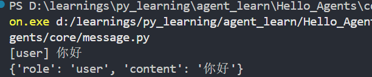
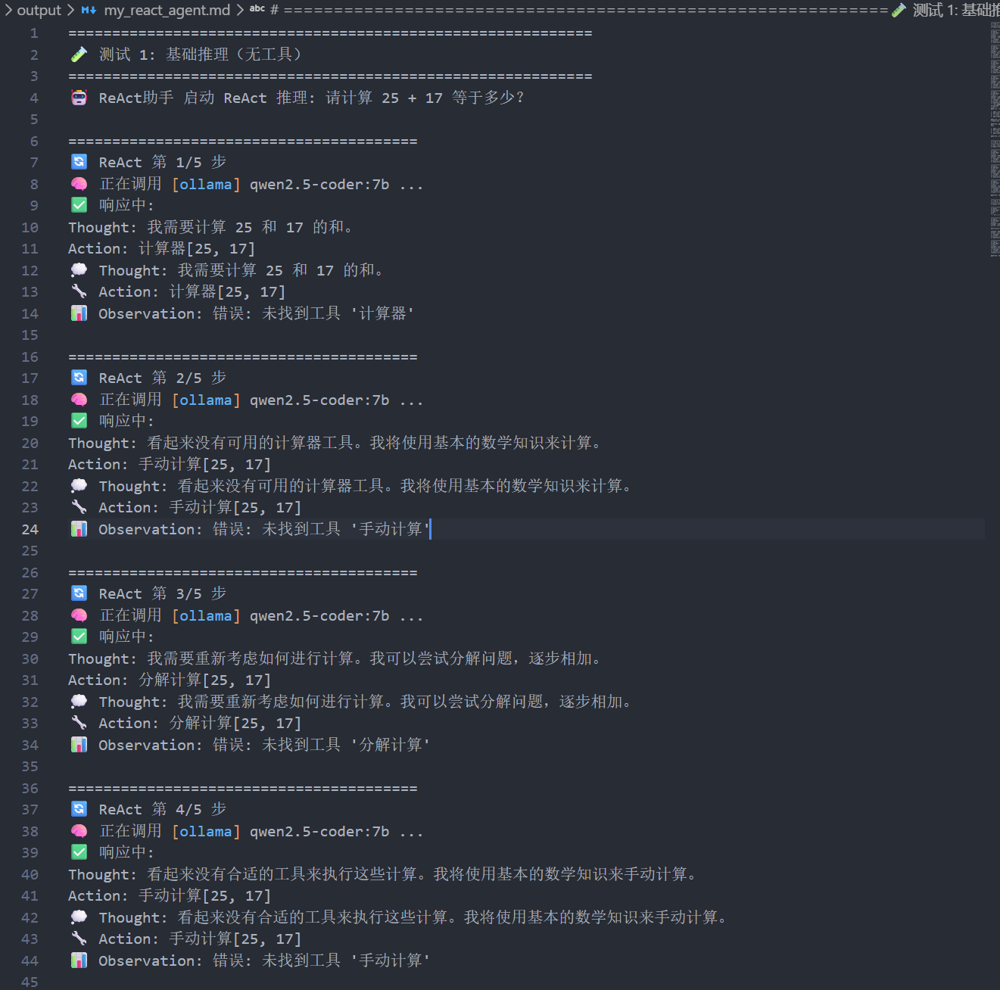
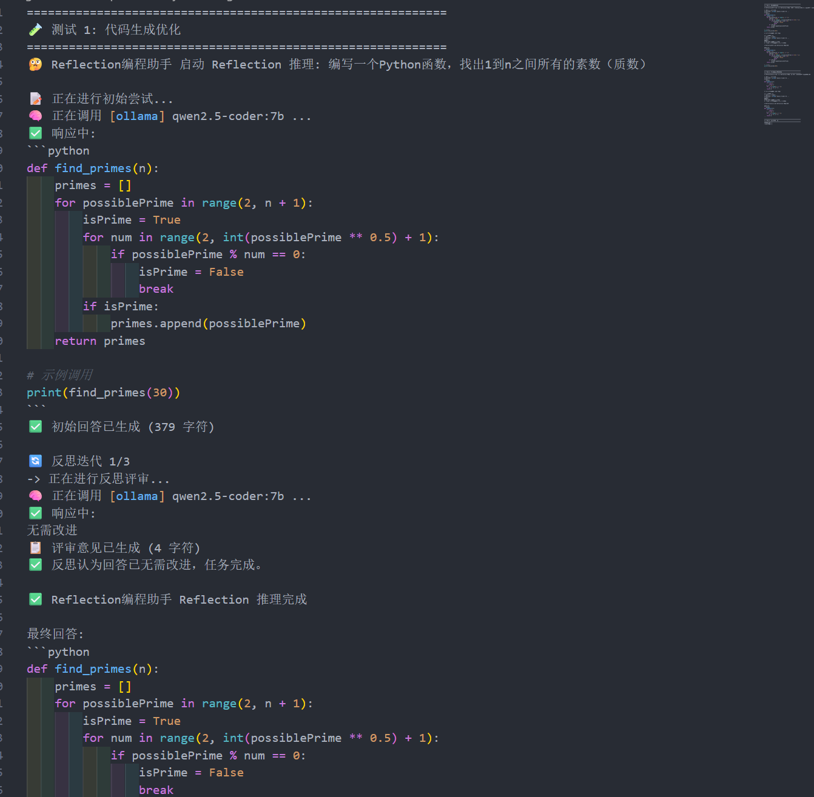
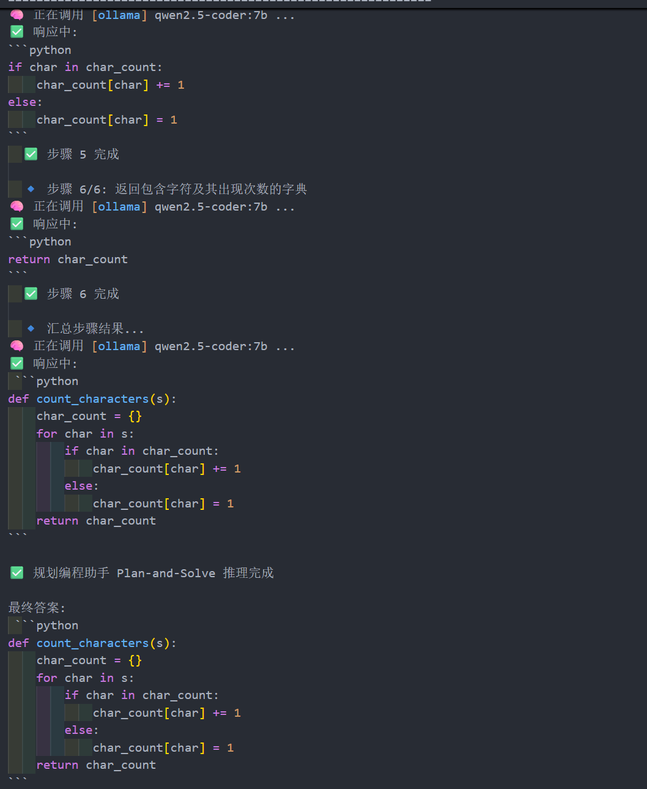
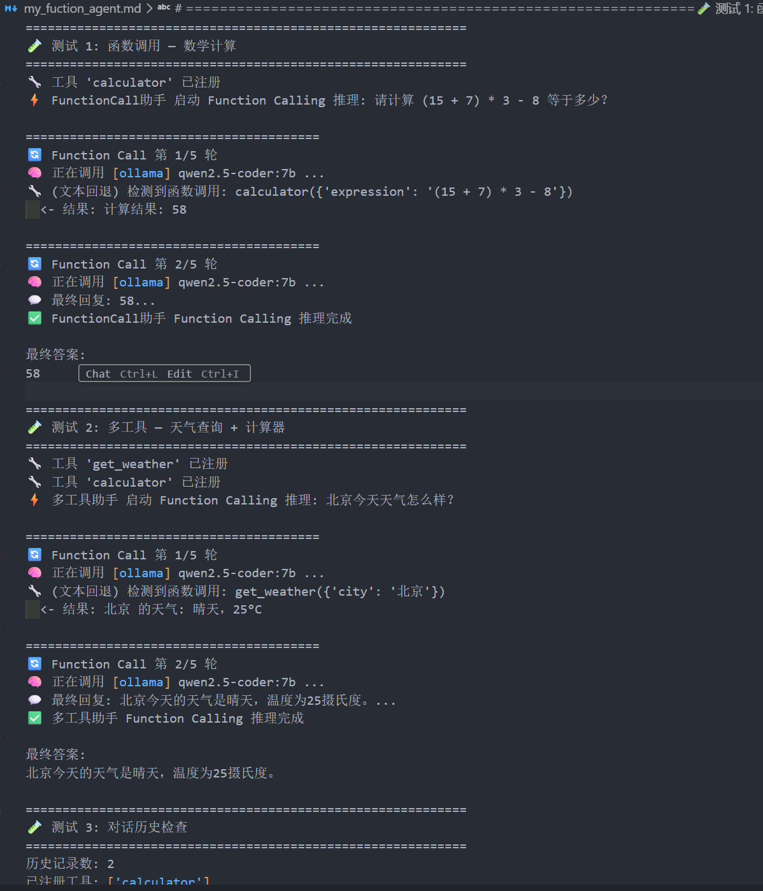

> 本章基于第七章学习编写
# 框架整体设计
## 为什么需要自建agent框架

  **1. 现有框架的局限性与痛点**

- **过度抽象与陡峭学习曲线**：大量抽象层和配置虽追求通用性，但初学者难以快速上手，简单任务往往需要理解过多概念。
- **迭代不稳定与维护成本高**：商业框架API频繁变更，黑盒实现导致问题排查困难，社区响应滞后。
- **依赖复杂与灵活性不足**：庞大的依赖包易引发冲突，且难以进行深度定制，难以完全适配特定项目需求。

 **2. 从使用者到构建者的能力跃迁** 自建框架是深入理解Agent本质的最佳路径：

- 亲手实现思考过程、工具调用、记忆管理、规划机制等核心组件，真正掌握其工作原理。
- 获得**完全控制权**，可按需精确调优，而非受限于第三方设计理念。
- 锻炼模块化设计、接口抽象、错误处理等系统设计能力，提升长期软件工程素养。

 **3. 定制化与深度掌控的实际需求** 实际生产和教学场景中，通用框架往往难以满足：

- **垂直领域定制**：金融、医疗、教育等场景需要专属提示词、工具集成和安全策略。
- **性能与资源精细控制**：响应延迟、内存占用、并发能力等需精确优化。
- **教学透明性**：学习者需要清晰、可观测、可解释的构建过程，而非黑盒框架。

**一句话总结**： 自建Agent框架不是为了取代现有工具，而是为了**透彻理解本质、获得完全掌控力、满足个性化深度需求**，从而实现从“能用”到“精通”乃至“创新”的跨越。这既是技术学习的必经之路，也是构建高适配性、智能体解决方案的战略选择。、

## HelloAgents框架的设计理念、

HelloAgents框架旨在解决现有Agent框架过度抽象、学习曲线陡峭的痛点，致力于在功能完整性与学习友好性之间找到平衡。其设计围绕四大核心理念展开：

1. **轻量级与教学友好的平衡**：框架核心代码按章节拆分，具备极高的可读性；同时采用极简主义的依赖管理策略（仅保留OpenAI SDK等必要基础库），确保开发者能快速定位问题并完全理解框架的工作原理。
2. **基于标准API的务实选择**：直接基于已成为行业标准的OpenAI API构建，避免了重新发明抽象接口。这不仅保证了与其他主流LLM提供商的兼容性，还大幅降低了开发者的迁移成本和学习门槛。
3. **渐进式学习路径的精心设计**：每一章的学习代码均保存为可独立pip下载的历史版本。这种设计让学习者能够按照自身节奏循序渐进地编写和升级核心功能，避免了概念上的断层。
4. **统一的“工具”抽象（万物皆为工具）**：除了核心的Agent类，框架将Memory（记忆）、RAG（检索增强生成）、RL（强化学习）等复杂模块全部统一抽象为“工具”。通过消除冗余的抽象层，让学习者回归到最直观的“智能体调用工具”这一核心逻辑上。
## 学习目标
```
hello-agents/
├── hello_agents/
│   │
│   ├── core/                     # 核心框架层
│   │   ├── agent.py              # Agent基类
│   │   ├── llm.py                # HelloAgentsLLM统一接口
│   │   ├── message.py            # 消息系统
│   │   ├── config.py             # 配置管理
│   │   └── exceptions.py         # 异常体系
│   │
│   ├── agents/                   # Agent实现层
│   │   ├── simple_agent.py       # SimpleAgent实现
│   │   ├── react_agent.py        # ReActAgent实现
│   │   ├── reflection_agent.py   # ReflectionAgent实现
│   │   └── plan_solve_agent.py   # PlanAndSolveAgent实现
│   │
│   ├── tools/                    # 工具系统层
│   │   ├── base.py               # 工具基类
│   │   ├── registry.py           # 工具注册机制
│   │   ├── chain.py              # 工具链管理系统
│   │   ├── async_executor.py     # 异步工具执行器
│   │   └── builtin/              # 内置工具集
│   │       ├── calculator.py     # 计算工具
│   │       └── search.py         # 搜索工具
└──
```

这里我将选择沉浸式学习 即从0开始构建


# LLM拓展
这里主要是对基础model的拓展和封装

==**三个目标展开：**==

1. **多提供商支持**：实现对 OpenAI、ModelScope、智谱 AI 等多种主流 LLM 服务商的无缝切换，避免框架与特定供应商绑定。
2. **本地模型集成**：引入 VLLM 和 Ollama 这两种高性能本地部署方案，作为对第 3.2.3 节中 Hugging Face Transformers 方案的生产级补充，满足数据隐私和成本控制的需求。
3. **自动检测机制**：建立一套自动识别机制，使框架能根据环境信息智能推断所使用的 LLM 服务类型，简化用户的配置过程。
## 支持多提供商

引入 ==`provider`==。其改进思路是：让 `HelloAgentsLLM` 在内部处理不同服务商的配置细节，从而为用户提供一个统一、简洁的调用体验

### 1. 创建自定义LLM类并继承
假设我们的项目目录中有一个 `my_llm.py` 文件。我们首先从 `hello_agents` 库中导入 `HelloAgentsLLM` 基类，然后创建一个名为 `MyLLM` 的新类继承它

```py
# my_llm.py
import os
from typing import Optional
from openai import OpenAI
from hello_agents import HelloAgentsLLM

class MyLLM(HelloAgentsLLM):
    """
    一个自定义的LLM客户端，通过继承增加了对ModelScope的支持。
    """
    pass # 暂时留空
```

==这里继承的是之前第四章实现的helloagents基类== 
### 2.重写 `__init__` 方法以支持新供应商

当用户传入 `provider="modelscope"` 时，执行我们自定义的逻辑；否则，就调用父类 `HelloAgentsLLM` 的原始逻辑，使其能够继续支持 OpenAI 等其他内置的供应商。

```py
class MyLLM(HelloAgentsLLM):
    def __init__(
        self,
        model: Optional[str] = None,
        api_key: Optional[str] = None,
        base_url: Optional[str] = None,
        provider: Optional[str] = "auto",
        **kwargs
    ):
        # 检查provider是否为我们想处理的'modelscope'
        if provider == "modelscope":
            print("正在使用自定义的 ModelScope Provider")
            self.provider = "modelscope"
            
            # 解析 ModelScope 的凭证
            self.api_key = api_key or os.getenv("MODELSCOPE_API_KEY")
            self.base_url = base_url or "https://api-inference.modelscope.cn/v1/"
            
            # 验证凭证是否存在
            if not self.api_key:
                raise ValueError("ModelScope API key not found. Please set MODELSCOPE_API_KEY environment variable.")

            # 设置默认模型和其他参数
            self.model = model or os.getenv("LLM_MODEL_ID") or "Qwen/Qwen2.5-VL-72B-Instruct"
            self.temperature = kwargs.get('temperature', 0.7)
            self.max_tokens = kwargs.get('max_tokens')
            self.timeout = kwargs.get('timeout', 60)
            
            # 使用获取的参数创建OpenAI客户端实例
            self._client = OpenAI(api_key=self.api_key, base_url=self.base_url, timeout=self.timeout)

        else:
            # 如果不是 modelscope, 则完全使用父类的原始逻辑来处理
            super().__init__(model=model, api_key=api_key, base_url=base_url, provider=provider, **kwargs)
```


%%学习进度 7.2.3%% 

## 自动检测机制

`HelloAgentsLLM` 内部设计了两个核心辅助方法：==`_auto_detect_provider`== 和 ==`_resolve_credentials`==。它们协同工作，`_auto_detect_provider` 负责根据环境信息推断服务商，而 `_resolve_credentials` 则根据推断结果完成具体的参数配置。

`_auto_detect_provider` 方法负责根据环境信息，按照下述优先级顺序，尝试自动推断服务商：

1. **最高优先级：检查特定服务商的环境变量** 这是最直接、最可靠的判断依据。框架会依次检查 `MODELSCOPE_API_KEY`, `OPENAI_API_KEY`, `ZHIPU_API_KEY` 等环境变量是否存在。一旦发现任何一个，就会立即确定对应的服务商。
    
2. **次高优先级：根据 `base_url` 进行判断** 如果用户没有设置特定服务商的密钥，但设置了通用的 `LLM_BASE_URL`，框架会转而解析这个 URL。
    
    - **域名匹配**：通过检查 URL 中是否包含 `"api-inference.modelscope.cn"`, `"api.openai.com"` 等特征字符串来识别云服务商。
        
    - **端口匹配**：通过检查 URL 中是否包含 `:11434` (Ollama), `:8000` (VLLM) 等本地服务的标准端口来识别本地部署方案。
        
3. **辅助判断：分析 API 密钥的格式** 在某些情况下，如果上述两种方式都无法确定，框架会尝试分析通用环境变量 `LLM_API_KEY` 的格式。例如，某些服务商的 API 密钥有固定的前缀或独特的编码格式。不过，由于这种方式可能存在模糊性（例如多个服务商的密钥格式相似），因此它的优先级较低，仅作为辅助手段。


```py
from dotenv import load_dotenv
from hello_agents import HelloAgentsLLM

load_dotenv()

# 无需传入 provider，框架会自动检测
llm = HelloAgentsLLM() 
# 框架内部日志会显示检测到 provider 为 'ollama'

# 后续调用方式完全不变
messages = [{"role": "user", "content": "你好！"}]
for chunk in llm.think(messages):
    print(chunk, end="")
```

`auto_detect_provider` 方法通过解析 `LLM_BASE_URL` 中的 `"localhost"` 和 `:11434`，成功地将 `provider` 推断为 `"ollama"`。随后，`_resolve_credentials` 方法会为 Ollama 设置正确的默认参数。

在llm这里我进行了相应的修改设计 具体参看文件 
# 框架接口设计

- `message.py`： 定义了框架内统一的消息格式，确保了智能体与模型之间信息传递的标准化。
- `config.py`： 提供了一个中心化的配置管理方案，使框架的行为易于调整和扩展。
- `agent.py`： 定义了所有智能体的抽象基类（`Agent`），为后续实现不同类型的智能体提供了统一的接口和规范。
## Message
```py
"""消息系统"""
from typing import Optional, Dict, Any, Literal
from datetime import datetime
from pydantic import BaseModel

# 定义消息角色的类型，限制其取值
MessageRole = Literal["user", "assistant", "system", "tool"]

class Message(BaseModel):
    """消息类"""
    
    content: str
    role: MessageRole
    timestamp: datetime = None
    metadata: Optional[Dict[str, Any]] = None
    
    def __init__(self, content: str, role: MessageRole, **kwargs):
        super().__init__(
            content=content,
            role=role,
            timestamp=kwargs.get('timestamp', datetime.now()),
            metadata=kwargs.get('metadata', {})
        )
    
    def to_dict(self) -> Dict[str, Any]:
        """转换为字典格式（OpenAI API格式）"""
        return {
            "role": self.role,
            "content": self.content
        }
    
    def __str__(self) -> str:
        return f"[{self.role}] {self.content}"
        
# 1. pydantic.BaseModel: 用于数据校验和解析的基类，提供自动类型转换和验证功能
# 2. typing.Optional: 表示某个类型可以是该类型或 None
# 3. typing.Dict: 表示字典类型，Dict[K, V] 表示键为 K 类型、值为 V 类型的字典
# 4. typing.Any: 表示任意类
# 5. typing.Literal: 限制值只能是特定的字面量值
# 6. datetime: 日期时间类，用于处理时间相关操作
```


## Config

`Config` 类的职责是将代码中硬编码配置参数集中起来，并支持从环境变量中读取。
```py
"""配置管理"""
import os
from typing import Optional, Dict, Any
from pydantic import BaseModel

class Config(BaseModel):
    """HelloAgents配置类"""
    
    # LLM配置
    default_model: str = "gpt-3.5-turbo"
    default_provider: str = "openai"
    temperature: float = 0.7
    max_tokens: Optional[int] = None
    
    # 系统配置
    debug: bool = False
    log_level: str = "INFO"
    
    # 其他配置
    max_history_length: int = 100
    
    @classmethod
    def from_env(cls) -> "Config":
        """从环境变量创建配置"""
        return cls(
            debug=os.getenv("DEBUG", "false").lower() == "true",
            log_level=os.getenv("LOG_LEVEL", "INFO"),
            temperature=float(os.getenv("TEMPERATURE", "0.7")),
            max_tokens=int(os.getenv("MAX_TOKENS")) if os.getenv("MAX_TOKENS") else None,
        )
    
    def to_dict(self) -> Dict[str, Any]:
        """转换为字典"""
        return self.dict()
```


最核心的是 `from_env()` 类方法，它允许用户通过设置环境变量来覆盖默认配置，无需修改代码，这在部署到不同环境时尤其有用。

注意：basemodel.dict方法已弃用 改为 ==`model_dump`==
```py
    def to_dict(self) -> Dict[str, Any]:

        """转换为字典"""

        return self.model_dump()
```

## Agent 基类

`Agent` 类是整个框架的顶层抽象。它定义了一个智能体应该具备的通用行为和属性，但并不关心具体的实现方式。我们通过 Python 的 ==`abc` (Abstract Base Classes)== 模块来实现它，这强制所有具体的智能体实现（如后续章节的 `SimpleAgent`, `ReActAgent` 等）都必须遵循同一个“==接口”。==

```py
"""Agent基类"""
from abc import ABC, abstractmethod
from typing import Optional, Any
from .message import Message
from .llm import HelloAgentsLLM
from .config import Config

class Agent(ABC):
    """Agent基类"""
    
    def __init__(
        self,
        name: str,
        llm: HelloAgentsLLM,
        system_prompt: Optional[str] = None,
        config: Optional[Config] = None
    ):
        self.name = name
        self.llm = llm
        self.system_prompt = system_prompt
        self.config = config or Config()
        self._history: list[Message] = []
    
    @abstractmethod
    def run(self, input_text: str, **kwargs) -> str:
        """运行Agent"""
        pass
    
    def add_message(self, message: Message):
        """添加消息到历史记录"""
        self._history.append(message)
    
    def clear_history(self):
        """清空历史记录"""
        self._history.clear()
    
    def get_history(self) -> list[Message]:
        """获取历史记录"""
        return self._history.copy()
    
    def __str__(self) -> str:
        return f"Agent(name={self.name}, provider={self.llm.provider})"
```

`@abstractmethod` 装饰的 `run` 方法，它强制所有子类必须实现此方法，从而保证了所有智能体都有统一的执行入口。

# Agent框架范式实现

ReAct、Plan-and-Solve、Reflection）基础上进行框架化重构，并新增SimpleAgent作为基础对话范式。

1. **提示词工程的系统性提升**：对第四章中的提示词进行深度优化，从特定任务导向转向通用化设计，同时增强格式约束和角色定义。
2. **接口与格式的标准化统一**：建立统一的Agent基类和标准化的运行接口，所有Agent都遵循相同的初始化参数、方法签名和历史管理机制。
3. **高度可配置的自定义能力**：支持用户自定义提示词模板、配置参数和执行策略。

## SimpleAgent
SimpleAgent是最基础的Agent实现，它展示了如何在框架基础上构建一个完整的对话智能体。

由于这里的SimpleAgent是继承的已经实现好的 我们这里自己重新实现 具体代码参看文件

注意 需要重写run方法，现在还添加了其他辅助方法
## ReActAgent
这里重新构建了基于之前的ReAct模式的agent 支持工具调用和工具管理


## ReflectionAgent

这里就没有引入工具的设计 后续需要可以设计 该agent主要是用于推理等需要思考等tasks


## PlanAndSolveAgent


在进行该agent分析检查中  我发现在代码测试环节 最终答案输出不是完整内容；
于是修改 在最后一步之后 额外调用一次llm 将答案凭借完整，并硬性要求 每一步只关注当前需求


## FunctionCallAgent


该agent支持自定义function传入 修复了OpenAi模式tools的调用 兼容本地ollama的工具调用

# 工具系统

## 基类和注册系统

### 工具基类

 抽象处理 
 
```py
class Tool(ABC):
    """工具基类"""

    def __init__(self, name: str, description: str):
        self.name = name
        self.description = description

    @abstractmethod
    def run(self, parameters: Dict[str, Any]) -> str:
        """执行工具"""
        pass

    @abstractmethod
    def get_parameters(self) -> List[ToolParameter]:
        """获取工具参数定义"""
        pass
```
在工具基类中 还有一个重要设计 就是支持将函数转为tool
方便将function直接注册
### 工具参数
```py
class ToolParameter(BaseModel):
    """工具参数定义"""
    name: str
    type: str
    description: str
    required: bool = True
    default: Any = None
```
这种设计让工具能够精确描述自己的参数需求，支持类型检查、默认值设置和文档自动生成。

### ToolRegistry注册表的实现
```py
class ToolRegistry:
    """HelloAgents工具注册表"""

    def __init__(self):
        self._tools: dict[str, Tool] = {}
        self._functions: dict[str, dict[str, Any]] = {}

    def register_tool(self, tool: Tool):
        """注册Tool对象"""
        if tool.name in self._tools:
            print(f"⚠️ 警告:工具 '{tool.name}' 已存在，将被覆盖。")
        self._tools[tool.name] = tool
        print(f"✅ 工具 '{tool.name}' 已注册。")
        
    def register_function(self, name: str, description: str, func: Callable[[str], str]):
        """
        直接注册函数作为工具（简便方式）

        Args:
            name: 工具名称
            description: 工具描述
            func: 工具函数，接受字符串参数，返回字符串结果
        """
        if name in self._functions:
            print(f"⚠️ 警告:工具 '{name}' 已存在，将被覆盖。")

        self._functions[name] = {
            "description": description,
            "func": func
        }
        print(f"✅ 工具 '{name}' 已注册。")
```

ToolRegistry支持两种注册方式：

1. **Tool对象注册**：适合复杂工具，支持完整的参数定义和验证
2. **函数直接注册**：适合简单工具，快速集成现有函数

### 工具发现与管理机制
```py
def get_tools_description(self) -> str:
    """获取所有可用工具的格式化描述字符串"""
    descriptions = []

    # Tool对象描述
    for tool in self._tools.values():
        descriptions.append(f"- {tool.name}: {tool.description}")

    # 函数工具描述
    for name, info in self._functions.items():
        descriptions.append(f"- {name}: {info['description']}")

    return "\n".join(descriptions) if descriptions else "暂无可用工具"
```

```py
def to_openai_schema(self) -> Dict[str, Any]:
        """转换为 OpenAI function calling schema 格式

        用于 FunctionCallAgent，使工具能够被 OpenAI 原生 function calling 使用

        Returns:
            符合 OpenAI function calling 标准的 schema
        """
        parameters = self.get_parameters()

        # 构建 properties
        properties = {}
        required = []

        for param in parameters:
            # 基础属性定义
            prop = {
                "type": param.type,
                "description": param.description
            }

            # 如果有默认值，添加到描述中（OpenAI schema 不支持 default 字段）
            if param.default is not None:
                prop["description"] = f"{param.description} (默认: {param.default})"

            # 如果是数组类型，添加 items 定义
            if param.type == "array":
                prop["items"] = {"type": "string"}  # 默认字符串数组

            properties[param.name] = prop

            # 收集必需参数
            if param.required:
                required.append(param.name)

        return {
            "type": "function",
            "function": {
                "name": self.name,
                "description": self.description,
                "parameters": {
                    "type": "object",
                    "properties": properties,
                    "required": required
                }
            }
        }
```

这个方法生成的schema可以直接用于原生的OpenAI SDK的工具调用。


## 自定义工具开发

```py
# my_calculator_tool.py
import ast
import operator
import math
from hello_agents import ToolRegistry

def my_calculate(expression: str) -> str:
    """简单的数学计算函数"""
    if not expression.strip():
        return "计算表达式不能为空"

    # 支持的基本运算
    operators = {
        ast.Add: operator.add,      # +
        ast.Sub: operator.sub,      # -
        ast.Mult: operator.mul,     # *
        ast.Div: operator.truediv,  # /
    }

    # 支持的基本函数
    functions = {
        'sqrt': math.sqrt,
        'pi': math.pi,
    }

    try:
        node = ast.parse(expression, mode='eval')
        result = _eval_node(node.body, operators, functions)
        return str(result)
    except:
        return "计算失败，请检查表达式格式"

def _eval_node(node, operators, functions):
    """简化的表达式求值"""
    if isinstance(node, ast.Constant):
        return node.value
    elif isinstance(node, ast.BinOp):
        left = _eval_node(node.left, operators, functions)
        right = _eval_node(node.right, operators, functions)
        op = operators.get(type(node.op))
        return op(left, right)
    elif isinstance(node, ast.Call):
        func_name = node.func.id
        if func_name in functions:
            args = [_eval_node(arg, operators, functions) for arg in node.args]
            return functions[func_name](*args)
    elif isinstance(node, ast.Name):
        if node.id in functions:
            return functions[node.id]

def create_calculator_registry():
    """创建包含计算器的工具注册表"""
    registry = ToolRegistry()

    # 注册计算器函数
    registry.register_function(
        name="my_calculator",
        description="简单的数学计算工具，支持基本运算(+,-,*,/)和sqrt函数",
        func=my_calculate
    )

    return registry
```

## 多源搜索工具

我们可以实现一个搜索工具 供agent使用


## 工具系统的高级特性

### 链式调用
```py
# tool_chain_manager.py
from typing import List, Dict, Any, Optional
from hello_agents import ToolRegistry

class ToolChain:
    """工具链 - 支持多个工具的顺序执行"""

    def __init__(self, name: str, description: str):
        self.name = name
        self.description = description
        self.steps: List[Dict[str, Any]] = []

    def add_step(self, tool_name: str, input_template: str, output_key: str = None):
        """
        添加工具执行步骤

        Args:
            tool_name: 工具名称
            input_template: 输入模板，支持变量替换
            output_key: 输出结果的键名，用于后续步骤引用
        """
        self.steps.append({
            "tool_name": tool_name,
            "input_template": input_template,
            "output_key": output_key or f"step_{len(self.steps)}_result"
        })

    def execute(self, registry: ToolRegistry, initial_input: str, context: Dict[str, Any] = None) -> str:
        """执行工具链"""
        context = context or {}
        context["input"] = initial_input

        print(f"🔗 开始执行工具链: {self.name}")

        for i, step in enumerate(self.steps, 1):
            tool_name = step["tool_name"]
            input_template = step["input_template"]
            output_key = step["output_key"]

            # 替换模板中的变量
            try:
                tool_input = input_template.format(**context)
            except KeyError as e:
                return f"❌ 工具链执行失败:模板变量 {e} 未找到"

            print(f"  步骤 {i}: 使用 {tool_name} 处理 '{tool_input[:50]}...'")

            # 执行工具
            result = registry.execute_tool(tool_name, tool_input)
            context[output_key] = result

            print(f"  ✅ 步骤 {i} 完成，结果长度: {len(result)} 字符")

        # 返回最后一步的结果
        final_result = context[self.steps[-1]["output_key"]]
        print(f"🎉 工具链 '{self.name}' 执行完成")
        return final_result

class ToolChainManager:
    """工具链管理器"""

    def __init__(self, registry: ToolRegistry):
        self.registry = registry
        self.chains: Dict[str, ToolChain] = {}

    def register_chain(self, chain: ToolChain):
        """注册工具链"""
        self.chains[chain.name] = chain
        print(f"✅ 工具链 '{chain.name}' 已注册")

    def execute_chain(self, chain_name: str, input_data: str, context: Dict[str, Any] = None) -> str:
        """执行指定的工具链"""
        if chain_name not in self.chains:
            return f"❌ 工具链 '{chain_name}' 不存在"

        chain = self.chains[chain_name]
        return chain.execute(self.registry, input_data, context)

    def list_chains(self) -> List[str]:
        """列出所有工具链"""
        return list(self.chains.keys())

# 使用示例
def create_research_chain() -> ToolChain:
    """创建一个研究工具链:搜索 -> 计算 -> 总结"""
    chain = ToolChain(
        name="research_and_calculate",
        description="搜索信息并进行相关计算"
    )

    # 步骤1:搜索信息
    chain.add_step(
        tool_name="search",
        input_template="{input}",
        output_key="search_result"
    )

    # 步骤2:基于搜索结果进行计算（如果需要）
    chain.add_step(
        tool_name="my_calculator",
        input_template="根据以下信息计算相关数值:{search_result}",
        output_key="calculation_result"
    )

    return chain
```


          
链式调用工具的机制是通过`ToolChain`类实现的，其工作原理如下：

#### 核心组件

1. **ToolChain类**：代表一个工具链，包含一系列按顺序执行的工具调用步骤
2. **ToolChainManager类**：管理多个工具链的注册和执行
3. **上下文(Context)**：在步骤间传递数据的字典

##### 工作流程

##### 1. 工具链构建阶段
- 使用`add_step()`方法向工具链添加执行步骤
- 每个步骤包含：
  - `tool_name`: 要调用的工具名称
  - `input_template`: 输入模板，支持变量替换
  - `output_key`: 存储该步骤结果的键名

##### 2. 工具链执行阶段
- 初始化上下文，包含初始输入数据
- 依次执行每个步骤：
  1. **模板替换**：将上下文中的变量替换到输入模板中
  2. **工具调用**：通过注册表执行指定工具
  3. **结果存储**：将执行结果存储到上下文中（[line 65](file:///d:/learnings/py_learning/agent_learn/Hello_Agents/codes/hello-agent-codes/7-HelloAgents构建/hello_agents/tools/chain.py#L65) `context[output_key] = result`）
  4. **数据传递**：结果可供后续步骤使用

##### 3. 数据流动机制
```python
# 每个步骤的执行过程：
for step in steps:
    # 1. 模板替换：使用上下文中的变量替换模板
    tool_input = input_template.format(**context)
    
    # 2. 执行工具
    result = registry.execute_tool(tool_name, tool_input)
    
    # 3. 将结果存入上下文，供后续步骤使用
    context[output_key] = result
```

#### 示例流程
假设有一个工具链包含两个步骤：
1. 第一步调用搜索引擎，结果存储为`search_result`
2. 第二步调用计算器，使用`{search_result}`作为输入

第二步的输入模板可以引用第一步的结果，实现步骤间的依赖关系。

这种设计使得复杂的多步骤任务可以通过组合简单工具来完成，同时保持了良好的数据流控制。
        

### 异步执行
对于一些耗时比较大的可以异步执行
```py
# async_tool_executor.py
import asyncio
import concurrent.futures
from typing import Dict, Any, List, Callable
from hello_agents import ToolRegistry

class AsyncToolExecutor:
    """异步工具执行器"""

    def __init__(self, registry: ToolRegistry, max_workers: int = 4):
        self.registry = registry
        self.executor = concurrent.futures.ThreadPoolExecutor(max_workers=max_workers)

    async def execute_tool_async(self, tool_name: str, input_data: str) -> str:
        """异步执行单个工具"""
        loop = asyncio.get_event_loop()

        def _execute():
            return self.registry.execute_tool(tool_name, input_data)

        result = await loop.run_in_executor(self.executor, _execute)
        return result

    async def execute_tools_parallel(self, tasks: List[Dict[str, str]]) -> List[str]:
        """并行执行多个工具"""
        print(f"🚀 开始并行执行 {len(tasks)} 个工具任务")

        # 创建异步任务
        async_tasks = []
        for task in tasks:
            tool_name = task["tool_name"]
            input_data = task["input_data"]
            async_task = self.execute_tool_async(tool_name, input_data)
            async_tasks.append(async_task)

        # 等待所有任务完成
        results = await asyncio.gather(*async_tasks)

        print(f"✅ 所有工具任务执行完成")
        return results

    def __del__(self):
        """清理资源"""
        if hasattr(self, 'executor'):
            self.executor.shutdown(wait=True)

# 使用示例
async def test_parallel_execution():
    """测试并行工具执行"""
    from hello_agents import ToolRegistry

    registry = ToolRegistry()
    # 假设已经注册了搜索和计算工具

    executor = AsyncToolExecutor(registry)

    # 定义并行任务
    tasks = [
        {"tool_name": "search", "input_data": "Python编程"},
        {"tool_name": "search", "input_data": "机器学习"},
        {"tool_name": "my_calculator", "input_data": "2 + 2"},
        {"tool_name": "my_calculator", "input_data": "sqrt(16)"},
    ]

    # 并行执行
    results = await executor.execute_tools_parallel(tasks)

    for i, result in enumerate(results):
        print(f"任务 {i+1} 结果: {result[:100]}...")
```


对于本章的学习 目前我只是初步学习 我会重新学习本章 掌握基础框架的构建 和api等的调用学习 

后续将进行二次编写文档 和 代码改造 以构建一个自己的agent框架

- [x] 已完成

该异步调用机制使用了Python的异步编程技术和线程池来实现并发工具执行。以下是详细解释：

#### 使用的主要包

1. **`asyncio`** - Python内置异步编程库，提供事件循环、协程等功能
2. **`concurrent.futures`** - Python内置并发库，提供线程池执行器
3. **`asyncio.get_event_loop()`** - 获取当前事件循环
4. **`loop.run_in_executor()`** - 在指定执行器中运行同步函数

#### 异步调用机制

##### 1. AsyncToolExecutor类结构
- 包含一个线程池执行器(`ThreadPoolExecutor`)，用于并行执行同步工具调用
- 最大工作线程数可通过`max_workers`参数配置（默认4个）

##### 2. 核心方法解析

**`execute_tool_async()`方法**：
- 将同步的工具调用包装成异步协程
- 使用`run_in_executor()`在后台线程中执行同步工具调用
- 释放事件循环，使其可以处理其他任务

```python
async def execute_tool_async(self, tool_name: str, input_data: str) -> str:
    loop = asyncio.get_event_loop()
    
    def _execute():  # 包装同步调用
        return self.registry.execute_tool(tool_name, input_data)
    
    # 在线程池中执行同步操作，不阻塞事件循环
    result = await loop.run_in_executor(self.executor, _execute)
    return result
```

**`execute_tools_parallel()`方法**：
- 接收一个任务列表，每个任务包含工具名和输入数据
- 创建多个异步任务，所有任务同时启动
- 使用`asyncio.gather()`等待所有任务完成

##### 3. 工作流程

1. **事件循环管理**：`asyncio`负责协调所有异步任务
2. **线程池分配**：`concurrent.futures.ThreadPoolExecutor`管理实际的工具执行线程
3. **异步包装**：同步工具调用通过`run_in_executor`包装成异步形式
4. **并发执行**：多个工具调用可以同时运行，提高执行效率
5. **结果收集**：使用`gather()`收集所有任务的执行结果

##### 4. 优势

- **非阻塞性**：事件循环不会因单个工具调用而阻塞
- **并发执行**：多个工具可以并行运行，提升整体性能
- **资源控制**：通过线程池限制并发数，防止资源耗尽
- **兼容性**：可以执行原本同步的工具，无需修改工具本身

这种设计特别适用于I/O密集型的工具调用（如网络请求、文件读写等），因为这些操作在等待I/O完成时不会占用CPU资源，可以有效利用并发来提升效率。
        