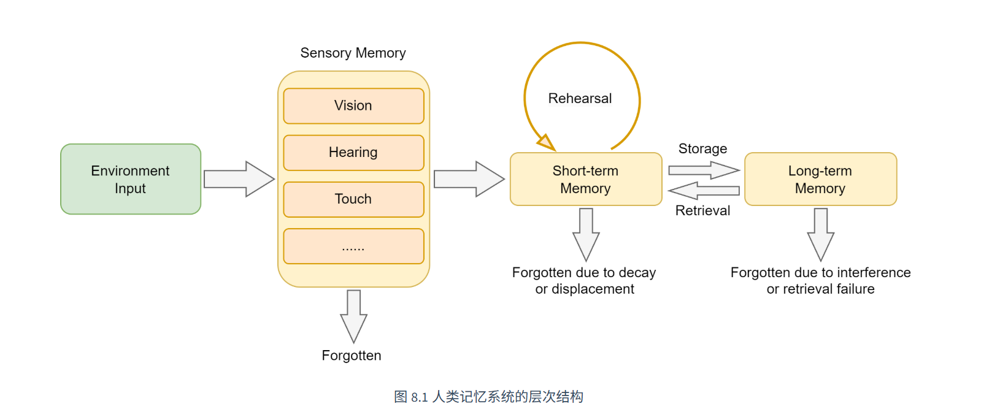
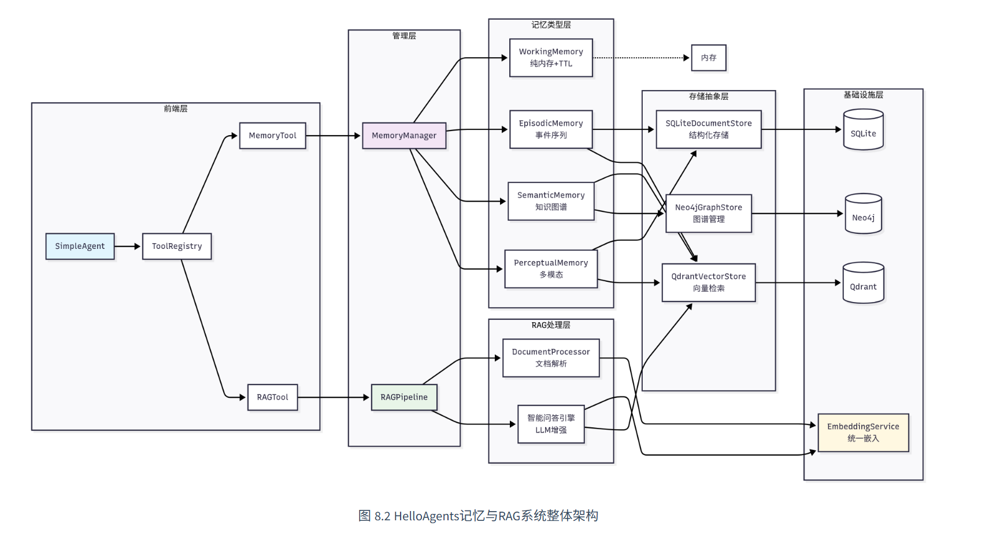
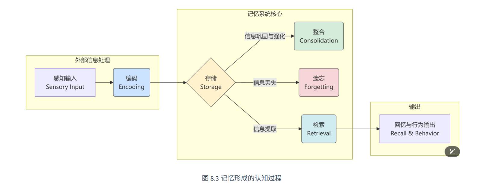
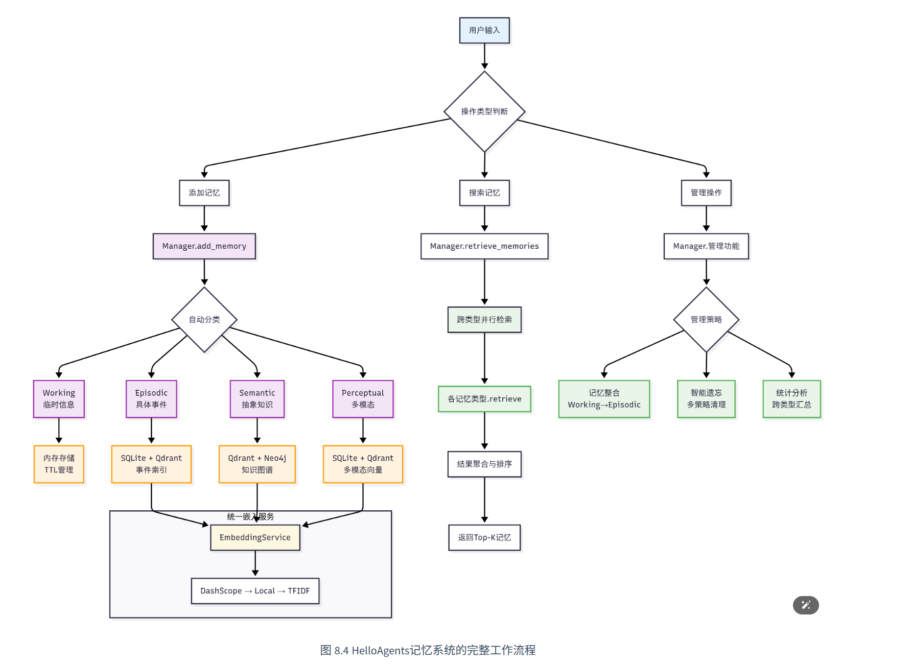

> 本章对应 第八章的内容

本章将在第七章构建的框架基础上，为HelloAgents增加两个核心能力：**记忆系统（Memory System）** 和**检索增强生成（Retrieval-Augmented Generation, RAG）**。我们将采用"框架扩展 + 知识科普"的方式，在构建过程中深入理解Memory和RAG的理论基础，最终实现一个具有完整记忆和知识检索能力的智能体系统。


# 认知到记忆

## 人类记忆系统

人类记忆系统框架图


认知心理学的研究，人类记忆可以分为以下几个层次：

1. **感觉记忆（Sensory Memory）**：持续时间极短（0.5-3秒），容量巨大，负责暂时保存感官接收到的所有信息
2. **工作记忆（Working Memory）**：持续时间短（15-30秒），容量有限（7±2个项目），负责当前任务的信息处理
3. **长期记忆（Long-term Memory）**：持续时间长（可达终生），容量几乎无限，进一步分为：
    - **程序性记忆**：技能和习惯（如骑自行车）
    - **陈述性记忆**：可以用语言表达的知识，又分为：
        - **语义记忆**：一般知识和概念（如"巴黎是法国首都"）
        - **情景记忆**：个人经历和事件（如"昨天的会议内容"）

## 智能体为什么需要记忆和RAG

>一个真正智能的智能体也需要具备记忆能力。对于基于LLM的智能体而言，通常面临两个根本性局限：**对话状态的遗忘**和**内置知识的局限**。

### 无状态对话导致的遗忘

当前的大语言模型虽然强大，但设计上是==**无状态的**==。这意味着，每一次用户请求（或API调用）都是一次独立的、无关联的计算。模型本身不会自动“记住”上一次对话的内容。这带来了几个问题：

1. **上下文丢失**：在长对话中，早期的重要信息可能会因为上下文窗口限制而丢失
2. **个性化缺失**：Agent无法记住用户的偏好、习惯或特定需求
3. **学习能力受限**：无法从过往的成功或失败经验中学习改进
4. **一致性问题**：在多轮对话中可能出现前后矛盾的回答

举例说明
```py
# 第七章的Agent使用方式
from hello_agents import SimpleAgent, HelloAgentsLLM

agent = SimpleAgent(name="学习助手", llm=HelloAgentsLLM())

# 第一次对话
response1 = agent.run("我叫张三，正在学习Python，目前掌握了基础语法")
print(response1)  # "很好！Python基础语法是编程的重要基础..."
 
# 第二次对话（新的会话）
response2 = agent.run("你还记得我的学习进度吗？")
print(response2)  # "抱歉，我不知道您的学习进度..."
```

为此要解决无状态问题 就要引入记忆系统

### 模型内置知识的局限性

LLM 的另一个核心局限在于其==知识是**静态的、有限的**==。这些知识完全来自于它的训练数据，并因此带来一系列问题：

1. **知识时效性**：大模型的训练数据有时间截止点，无法获取最新信息
2. **专业领域知识**：通用模型在特定领域的深度知识可能不足
3. **事实准确性**：通过检索验证，减少模型的幻觉问题
4. **可解释性**：提供信息来源，增强回答的可信度

为了克服这一局限，RAG技术应运而生。它的核心思想是在模型生成回答之前，先从一个外部知识库（如文档、数据库、API）中检索出最相关的信息，并将这些信息作为上下文一同提供给模型。


## 记忆和RAG设计

我们将记忆和RAG设计为两个独立的工具：==`memory_tool`==负责存储和维护对话过程中的交互信息，`rag_tool`==则负责从用户提供的知识库中检索相关信息作为上下文==，并可将重要的检索结果自动存储到记忆系统中。


记忆系统采取四层架构
```
HelloAgents记忆系统
├── 基础设施层 (Infrastructure Layer)
│   ├── MemoryManager - 记忆管理器（统一调度和协调）
│   ├── MemoryItem - 记忆数据结构（标准化记忆项）
│   ├── MemoryConfig - 配置管理（系统参数设置）
│   └── BaseMemory - 记忆基类（通用接口定义）
├── 记忆类型层 (Memory Types Layer)
│   ├── WorkingMemory - 工作记忆（临时信息，TTL管理）
│   ├── EpisodicMemory - 情景记忆（具体事件，时间序列）
│   ├── SemanticMemory - 语义记忆（抽象知识，图谱关系）
│   └── PerceptualMemory - 感知记忆（多模态数据）
├── 存储后端层 (Storage Backend Layer)
│   ├── QdrantVectorStore - 向量存储（高性能语义检索）
│   ├── Neo4jGraphStore - 图存储（知识图谱管理）
│   └── SQLiteDocumentStore - 文档存储（结构化持久化）
└── 嵌入服务层 (Embedding Service Layer)
    ├── DashScopeEmbedding - 通义千问嵌入（云端API）
    ├── LocalTransformerEmbedding - 本地嵌入（离线部署）
    └── TFIDFEmbedding - TFIDF嵌入（轻量级兜底）
```


RAG系统专注于外部系统获取
```
HelloAgents RAG系统
├── 文档处理层 (Document Processing Layer)
│   ├── DocumentProcessor - 文档处理器（多格式解析）
│   ├── Document - 文档对象（元数据管理）
│   └── Pipeline - RAG管道（端到端处理）
├── 嵌入表示层 (Embedding Layer)
│   └── 统一嵌入接口 - 复用记忆系统的嵌入服务
├── 向量存储层 (Vector Storage Layer)
│   └── QdrantVectorStore - 向量数据库（命名空间隔离）
└── 智能问答层 (Intelligent Q&A Layer)
    ├── 多策略检索 - 向量检索 + MQE + HyDE
    ├── 上下文构建 - 智能片段合并与截断
    └── LLM增强生成 - 基于上下文的准确问答
```

## 准备

需要在`.env`配置==图数据库==，==向量数据库==，==LLM以及Embedding==方案的API。在教程中向量数据库采用Qdrant，图数据库采用Neo4J，Embedding首选百炼平台，若没有API可切换为本地部署模型方案。

### Qdrant
%% 该数据库 是向量数据库 由于我没学习过 需要暂时去学习一手 花3-4天左右差不多 ，那么今天学校内容到此为止 贪多嚼不烂%%

###  Neo4j
%%现在学习Neon4j图数据库 和Qdrant一样需要花费几天时间 %%

现在准备好客户端连接等


# 记忆系统

## 记忆系统的工作流程


根据认知科学的研究，人类记忆的形成经历以下几个阶段：

1. **编码（Encoding）**：将感知到的信息转换为可存储的形式
2. **存储（Storage）**：将编码后的信息保存在记忆系统中
3. **检索（Retrieval）**：根据需要从记忆中提取相关信息
4. **整合（Consolidation）**：将短期记忆转化为长期记忆
5. **遗忘（Forgetting）**：删除不重要或过时的信息


为 HelloAgents 设计了一套完整的记忆系统。其核心思想是模仿人类大脑处理不同类型信息的方式，将记忆划分为多个专门的模块，并建立一套智能化的管理机制。



将记忆分成 四层
1. **工作记忆（Working Memory）**
    - 用于存储当前对话的上下文信息，相当于智能体的“短期记忆”。
        
    - 强调高速访问与快速响应，因此容量通常较小（如默认50条）。
        
    - 生命周期仅限于单次会话，会话结束后自动清理。
        
    - 主要作用是保证当前任务和对话能够连续、连贯地进行。
        
2. **情景记忆（Episodic Memory）**
    - 用于长期保存具体的交互事件和历史经历。
        
    - 包含丰富的上下文信息，可按时间顺序或主题进行检索。
        
    - 支持智能体对过往经验进行回顾、复盘与学习。
        
    - 类似人类对“经历过什么事情”的记忆。
        
3. **语义记忆（Semantic Memory）**
    - 用于存储抽象知识、概念、规则以及长期信息。
        
    - 例如用户偏好、长期指令、领域知识等。
        
    - 具有较高的持久性和稳定性。
        
    - 是智能体形成知识体系和进行推理的重要基础。
        
4. **感知记忆（Perceptual Memory）**
    - 专门处理图像、音频等多模态信息。
        
    - 支持跨模态检索与信息关联。
        
    - 生命周期会根据内容重要性和存储空间动态调整。
        
    - 主要用于增强智能体在多媒体场景下的感知与理解能力。
        
5. **整体总结**
    - 工作记忆：负责当前上下文。
        
    - 情景记忆：负责历史经历。
        
    - 语义记忆：负责抽象知识。
        
    - 感知记忆：负责多模态感知。
        
    - 四类记忆共同构成智能体完整的长期记忆体系，使其具备连续对话、经验学习、知识推理和多模态交互能力。


## 体验记忆功能

也就说 我们将会实现这样的功能
```py
from hello_agents import SimpleAgent, HelloAgentsLLM, ToolRegistry
from hello_agents.tools import MemoryTool

# 创建具有记忆能力的Agent
llm = HelloAgentsLLM()
agent = SimpleAgent(name="记忆助手", llm=llm)

# 创建记忆工具
memory_tool = MemoryTool(user_id="user123")
tool_registry = ToolRegistry()
tool_registry.register_tool(memory_tool)
agent.tool_registry = tool_registry
 
# 体验记忆功能
print("=== 添加多个记忆 ===")

# 添加第一个记忆
result1 = memory_tool.execute("add", content="用户张三是一名Python开发者，专注于机器学习和数据分析", memory_type="semantic", importance=0.8)
print(f"记忆1: {result1}")

# 添加第二个记忆
result2 = memory_tool.execute("add", content="李四是前端工程师，擅长React和Vue.js开发", memory_type="semantic", importance=0.7)
print(f"记忆2: {result2}")

# 添加第三个记忆
result3 = memory_tool.execute("add", content="王五是产品经理，负责用户体验设计和需求分析", memory_type="semantic", importance=0.6)
print(f"记忆3: {result3}")

print("\n=== 搜索特定记忆 ===")
# 搜索前端相关的记忆
print("🔍 搜索 '前端工程师':")
result = memory_tool.execute("search", query="前端工程师", limit=3)
print(result)

print("\n=== 记忆摘要 ===")
result = memory_tool.execute("summary")
print(result)
```


由于教材写的很简陋 我就自己从零梳理 

# 记忆系统和 RAG 设计

  

> 基于 HelloAgents 框架的记忆与检索子系统完整设计文档。

---
## 一、整体架构
```

┌─────────────────────────────────────────────────────────────────────┐

│                        Agent (智能体)                                 │

│  ┌──────────────┬───────────────┬───────────────┬──────────────┐   │

│  │ MemoryManager │   RAGTool    │  MemoryTool   │  其他工具...  │   │

│  └──────┬───────┴───────┬───────┴───────┬───────┴──────────────┘   │

│         │               │               │                          │

│         ▼               ▼               ▼                          │

│  ┌─────────────────────────────────────────────────────────────┐   │

│  │                    记忆系统 (Memory)                          │   │

│  │  ┌──────────┐ ┌──────────┐ ┌──────────┐ ┌──────────────┐   │   │

│  │  │ 工作记忆  │ │ 情景记忆  │ │ 语义记忆  │ │  感知记忆    │   │   │

│  │  │ Working   │ │ Episodic │ │ Semantic │ │ Perceptual   │   │   │

│  │  │ (内存TTL) │ │ (SQL/My) │ │ (Neo4j)  │ │  (预留)      │   │   │

│  │  └──────────┘ └──────────┘ └──────────┘ └──────────────┘   │   │

│  └─────────────────────────────────────────────────────────────┘   │

│                           │                                         │

│                           ▼                                         │

│  ┌─────────────────────────────────────────────────────────────┐   │

│  │                    存储后端                                   │   │

│  │  ┌──────────────┐ ┌──────────────┐ ┌──────────────────┐    │   │

│  │  │ DocumentStore│ │QdrantVector  │ │ Neo4jStore      │    │   │

│  │  │ (SQLite/My)  │ │ (向量检索)    │ │ (知识图谱，预留)  │    │   │

│  │  └──────────────┘ └──────────────┘ └──────────────────┘    │   │

│  └─────────────────────────────────────────────────────────────┘   │

│                           │                                         │

│                           ▼                                         │

│  ┌─────────────────────────────────────────────────────────────┐   │

│  │                    RAG 系统                                   │   │

│  │  ┌──────────────┐ ┌──────────────┐ ┌──────────────────┐    │   │

│  │  │ Document     │ │ RAGPipeline  │ │   Qdrant 知识库  │    │   │

│  │  │ Processor    │ │ (检索+生成)   │ │   (向量存储)     │    │   │

│  │  └──────────────┘ └──────────────┘ └──────────────────┘    │   │

│  └─────────────────────────────────────────────────────────────┘   │

└─────────────────────────────────────────────────────────────────────┘

```


### 设计原则

1. **分层隔离**：每种记忆类型继承 `BaseMemory` 抽象基类，独立实现，互不干扰。

2. **统一接口**：`MemoryItem` 标准化所有记忆的数据结构，`MemoryManager` 统一调度。

3. **可插拔存储**：存储后端通过抽象接口切换（SQLite ↔ MySQL，本地 Qdrant ↔ 云端 Qdrant）。

4. **遗忘机制**：重要性遗忘 + 时间遗忘 + 容量遗忘，防止记忆无限膨胀。

5. **RAG 可扩展**：MQE（多查询扩展）和 HyDE（假设文档嵌入）作为可选增强。


---


## 二、核心数据结构

### MemoryItem — 一条记忆的标准结构


```python

class MemoryItem(BaseModel):

    id: str = ""                 # UUID hex[:12]，自动生成

    content: str                 # 记忆内容

    memory_type: str = "working" # working / episodic / semantic / perceptual

    user_id: str = ""            # 所属用户

    session_id: str = ""         # 所属会话

    importance: float = 0.5     # 重要性 [0, 1]

    timestamp: datetime = None   # 创建时间，自动设为 now()

    metadata: dict = {}          # 扩展元数据

```

  

### MemoryConfig — 记忆系统配置


```python

class MemoryConfig(BaseModel):

    # 工作记忆

    working_ttl_minutes: int = 60    # TTL 过期时间

    working_capacity: int = 50       # 容量上限

  

    # 情景记忆

    episodic_db_path: str = "memory.db"   # 数据库路径

    episodic_db_type: str = "sqlite"      # sqlite / mysql

  

    # 语义记忆 / 感知记忆（预留）

    semantic_enabled: bool = False

    perceptual_enabled: bool = False

  

    # 嵌入

    embedding_model: str = "tfidf"

    embedding_dim: int = 768

  

    # 整合与遗忘

    consolidation_importance_threshold: float = 0.7

    forget_importance_threshold: float = 0.2

    forget_max_age_days: int = 30

```
 

---
  
## 三、四种记忆类型

### 1. 工作记忆 (WorkingMemory)


| 属性  | 说明                                  |
| --- | ----------------------------------- |
| 存储  | 纯内存 `list[MemoryItem]`              |
| TTL | 配置 `working_ttl_minutes`，到期自动过期     |
| 容量  | 配置 `working_capacity`，超限淘汰最早项（FIFO） |
| 检索  | TF-IDF 语义相似度 × 0.7 + 时间衰减 × 0.3     |
| 场景  | 当前对话上下文、短期临时信息                      |
 
  

**运行机制**：

- `add()` 每次操作前调用 `_expire()` 清理过期项

- `search()` 先过期再打分排序

- `forget_by_capacity()` 当记忆超过阈值时移除最早项

  

### 2. 情景记忆 (EpisodicMemory)

  

| 属性  | 说明                                   |
| --- | ------------------------------------ |
| 存储  | DocumentStore（SQLite / MySQL）        |
| 检索  | 语义相似度 × 0.5 + 时间近因 × 0.3 + 重要性 × 0.2 |
| 场景  | 历史事件记录、用户行为日志、长期经验                   |

  

**检索评分公式**：

```

score = cosine_similarity × 0.5

      + recency × 0.3          # 1 / (1 + age_days)

      + importance × 0.2

```

  

**遗忘策略**：

- `forget_by_age(max_age_days=30)`：删除超过指定天数的记忆

- `forget_by_importance(threshold=0.2)`：删除重要性低于阈值的记忆

  

### 3. 语义记忆 (SemanticMemory)

| 属性  | 说明                                       |
| --- | ---------------------------------------- |
| 存储  | Qdrant 向量数据库 + Neo4j 图数据库 + 内存缓存兜底        |
| 检索  | 混合策略：向量检索 × 0.7 + 图检索 × 0.3，乘以重要性权重     |
| 场景  | 抽象概念关联、知识图谱推理、实体关系发现                     |

**运行机制**：
- `add()` 提取文本中的实体和关系（正则匹配 `X 是一种 Y` 等句式），分别存入 Neo4j 节点/边和 Qdrant 向量库
- `search()` 并行执行向量检索和图检索，结果合并排序
- 无 Neo4j/Qdrant 后端时自动降级到纯内存模式
- 实体提取采用正则回退策略：先匹配定义句式，失败则提取所有中文双字词

**检索评分公式**：
```
base_relevance = vector_score × 0.7 + graph_score × 0.3
importance_weight = 0.8 + importance × 0.4
score = base_relevance × importance_weight
```

**图搜索流程**：
```
用户查询 → 模糊匹配实体名称 (CONTAINS)
        → 直接关联记忆 (similarity=0.9)
        → 展开实体关系 (similarity=0.6)
        → 合并去重返回
```

**依赖**：`pip install neo4j qdrant-client`

### 4. 感知记忆 (PerceptualMemory)

| 属性  | 说明                                       |
| --- | ---------------------------------------- |
| 存储  | 按模态分离的 Qdrant 集合（perceptual_text / image / audio） |
| 检索  | 向量相似度 × 0.8 + 时间近因性 × 0.2，乘以重要性权重     |
| 场景  | 图像描述、音频记录、跨模态检索                         |

**运行机制**：
- 按模态（text / image / audio）创建独立的 Qdrant 集合，避免维度不匹配
- `add()` 根据 `item.metadata["modality"]` 路由到对应集合
- `search()` 支持 `target_modality`（目标模态）和 `query_modality`（查询模态）参数，实现同模态和跨模态检索
- 时间近因性采用指数衰减模型模拟遗忘曲线
- 无 Qdrant 后端时自动降级到内存关键词匹配

**检索评分公式**：
```
base_relevance = vector_score × 0.8 + recency_score × 0.2
importance_weight = 0.8 + importance × 0.4
score = base_relevance × importance_weight
```

**时间衰减模型**：
```
recency_score = exp(-0.1 × age_hours / 24)
```
- 24 小时内保持高分，之后逐渐衰减
- 最低保持 0.1 的基础分数

**简化编码策略**（当前实现）：
- 全部模态走文本嵌入（`BaseEmbedding.embed()`）
- 未来可接入 CLIP（图像）和 CLAP（音频）专用编码器

---

  

## 四、记忆管理器 (MemoryManager)

  

统一入口，Agent 通过它操作所有记忆类型。

  

```

Agent → MemoryManager.save(content, memory_type, ...)

      → MemoryManager.search(query, limit, ...)

      → MemoryManager.forget(strategy, ...)

      → MemoryManager.consolidate(threshold)

      → MemoryManager.summary()

```

  

### 核心操作

  

| 方法                            | 功能                                                          |
| ----------------------------- | ----------------------------------------------------------- |
| `save()`                      | 写入指定类型的记忆                                                   |
| `search()`                    | 跨类型或按类型检索                                                   |
| `get() / update() / delete()` | CRUD                                                        |
| `forget(strategy)`            | 三种遗忘策略：`importance_based` / `time_based` / `capacity_based` |
| `consolidate()`               | 将高重要性（>0.7）的工作记忆提升为情景记忆                                     |
| `summary()`                   | 生成当前记忆状态文本摘要                                                |
| `stats()`                     | 返回各类型统计（启用状态、数量）                                            |

  

### 整合机制 (Consolidation)

  

```

工作记忆中的高重要性项 (importance ≥ 0.7)

                    ↓

         复制到情景记忆持久化存储

                    ↓

                 从工作记忆删除

```

  

这模拟人类大脑的"睡眠整合"机制：短期重要的经历转化为长期记忆。

  

---

  

## 五、存储后端

  

### 1. DocumentStore — 结构化文档存储

  

支持双后端自动切换，统一接口。

  

| 特性  | SQLite 模式                   | MySQL 模式                   |
| --- | --------------------------- | -------------------------- |
| 依赖  | 内置 `sqlite3`                | `pip install pymysql`      |
| 配置  | `episodic_db_type="sqlite"` | `episodic_db_type="mysql"` |
| 连接  | 本地文件                        | 远程服务器                      |
| 适用  | 本地开发、单机部署                   | 生产环境、多实例共享                 |

  

**自动检测优先级**：构造参数 > 环境变量 (`DB_TYPE`, `DB_HOST`, `DB_PORT`, `DB_USER`, `DB_PASSWORD`, `DB_DATABASE`) > 默认值

  

**建表 DDL**：

```sql

CREATE TABLE IF NOT EXISTS memories (

    id VARCHAR(32) PRIMARY KEY,

    content TEXT NOT NULL,

    memory_type VARCHAR(32) NOT NULL DEFAULT 'working',

    user_id VARCHAR(128) DEFAULT '',

    session_id VARCHAR(128) DEFAULT '',

    importance FLOAT DEFAULT 0.5,

    timestamp VARCHAR(32) NOT NULL,

    metadata TEXT DEFAULT '{}'

);

```

  

**关键设计**：

- 所有 SQL 使用 `%s` 占位符，SQLite 和 pymysql 均可兼容

- `_execute()` / `_fetch_one()` / `_fetch_all()` 抽象后端差异

- sqlite3.Row 统一转为 dict 后再处理

  

### 2. QdrantVectorStore — 向量存储

  

支持本地和云端两种模式。

  

| 模式  | 连接方式                              | 适用场景 |
| --- | --------------------------------- | ---- |
| 本地  | `host:port` (默认 `localhost:6333`) | 开发测试 |
| 云端  | `url + api_key`                   | 生产部署 |

  

**自动检测**：若 `QDRANT_CLUSTER_ENDPOINT` 环境变量存在 → 云端模式

  

**支持的向量距离度量**：

- `cosine`（默认）— 余弦相似度

- `dot` — 点积

- `euclid` — 欧几里得距离

  

**API**：

```

集合管理: create_collection / delete_collection / list_collections

数据写入: upsert / add_memory_item

语义搜索: search(query, limit, score_threshold, payload_filter)

批量遍历: scroll

删除操作: delete / delete_by_filter

```

  

### 3. Neo4jStore — 预留

  

预期存储知识图谱，支持语义推理。当前为桩代码。

  

---

  

## 六、RAG 系统

  

### RAG 管道流程图

  

```

用户查询

  │

  ├─ [可选] MQE 多查询扩展 ──→ 生成多个子查询

  │

  ├─ [可选] HyDE 假设文档  ──→ 生成假设性回答文档

  │

  ├─ Qdrant 向量检索 ──→ 获取候选文档块

  │

  ├─ 重排序 (Rerank) ──→ 语义分×0.6 + 时间近因×0.2 + 标题层级×0.2

  │

  ├─ 构建上下文 ──→ 拼接为 LLM 可读格式

  │

  └─ LLM 生成回答

```

  

### DocumentProcessor — 文档处理器

  

**支持格式**：

  

| 格式                                        | 处理方式           |
| ----------------------------------------- | -------------- |
| `.txt` / `.md`                            | 直接读取 UTF-8 文本  |
| `.pdf` / `.docx` / `.xlsx` / `.html` / 图片 | MarkItDown 库转换 |

  

**分块策略**（三层递进）：

  

```

1. 按标题分割

   regex: ^#{1,6}\s+     → 按 Markdown 标题层级切分

2. 长内容拆分

   超过 max_chunk_size (默认 1000 字符) 按段落拆分

   段落再超限则按字符截断

3. 短块合并

   低于 min_chunk_size (默认 200 字符) 的相邻块合并

```

  

**DocumentChunk 结构**：

```python

@dataclass

class DocumentChunk:

    content: str           # 分块内容

    source: str            # 来源文件

    chunk_index: int       # 块序号

    heading: str = ""      # 所在标题

    heading_level: int = 0 # 标题层级 1-6

    metadata: dict = None  # 扩展元数据

    chunk_id: str = ""     # MD5(content+source+index)

```

  

### RAGPipeline — 端到端管道

  

**初始化参数**：

```python

RAGPipeline(

    llm=llm,                    # LLM 实例，用于生成回答

    embedding=embedding,         # 嵌入模型（默认 TF-IDF）

    collection_name="knowledge_base",  # Qdrant 集合名

    top_k=5,                    # 默认返回数

    score_threshold=0.0,        # 最低相似度阈值

    qdrant_url=None,            # Qdrant 云端 URL

    qdrant_api_key=None,        # Qdrant 云端 API Key

)

```

  

**核心流程**：

  

1. **MQE (Multi-Query Expansion)** — 可选

   - LLM 将用户问题改写为多个语义等价的子问题

   - 每个子问题独立检索，结果合并去重

   - 提高召回率

  

2. **HyDE (Hypothetical Document Embeddings)** — 可选

   - LLM 先生成一个"假设性回答"作为虚拟文档

   - 用虚拟文档的向量去检索相似真实文档

   - 缩小查询与文档之间的语义鸿沟

  

3. **向量检索**

   - 所有查询（原文 + MQE 扩展 + HyDE 文档）分别检索

   - 按内容前 100 字符去重

  

4. **重排序 (Rerank)**

   ```

   final_score = score × 0.6 + recency_bonus × 0.2 + heading_bonus × 0.2

   ```

   - `recency_bonus = 1 / (1 + age_days × 0.1)` — 时间近因加分

   - `heading_bonus = 0.3` 有标题的文档块加分

  

5. **生成回答**

   - 构建 prompt：检索资料 + 用户问题

   - LLM 以 temperature=0.3 生成准确回答

   - 资料不足时如实说明

  

### RAGQueryResult — 检索结果

  

```python

result = RAGQueryResult(

    query="用户问题",

    chunks=[{"content", "score", "source", "heading", ...}],

    answer="LLM 生成的回答",

    expanded_queries=["子问题1", "子问题2", ...],

)

result.context  # 格式化的上下文字符串

result.to_dict()  # 序列化

```

  

---

  

## 七、TF-IDF 嵌入

  

自研轻量级 TF-IDF 实现（无 sklearn 依赖），适合中文 + 英文混合场景。

  

```python

class TFIDFEmbedding(BaseEmbedding):

    max_features: int = 5000   # 最大词汇量

  

    def _tokenize(self, text: str) -> list[str]:

        # 中文：按字符切分

        # 英文：按字母数字 token 切分

        # 保留中文单字 + 英文单词 + 数字

  

    def fit(self, texts: list[str]):

        # 构建词汇表

        # 计算 IDF = log(N / df) + 1

        # 保留 top max_features 高频词

  

    def embed(self, text: str) -> list[float]:

        # 计算 TF-IDF 向量

        # L2 归一化

```

  

**支持的其他嵌入**：

- `PlaceholderEmbedding` — 返回空列表，用于无需嵌入的场景

- `create_embedding("tfidf")` 工厂方法

- 可扩展接入 OpenAI / DashScope 等外部嵌入 API

  

---

  

## 八、Agent 工具接口

  

### MemoryTool — 记忆操作

  

Agent 通过 Tool 接口操作记忆，支持 9 个动作：

  

| Action | 功能 |
|--------|------|
| `add` | 添加记忆 |
| `search` | 检索记忆 |
| `summary` | 记忆摘要 |
| `stats` | 统计信息 |
| `update` | 更新记忆 |
| `remove` | 删除记忆 |
| `forget` | 执行遗忘 |
| `consolidate` | 执行整合 |
| `clear_all` | 清空所有 |

  

### RAGTool — 知识库操作

  

| Action | 功能 |
|--------|------|
| `query` | RAG 问答（支持 use_mqe / use_hyde）|
| `ingest` | 导入文件到知识库 |
| `ingest_text` | 直接导入文本 |
| `list` | 列出知识库 |
| `create` | 创建知识库 |
| `delete` | 删除知识库 |

  

---

  

## 九、环境变量配置

  

### 记忆系统

  

```bash

# 数据库类型

DB_TYPE=mysql                         # sqlite / mysql

DB_HOST=localhost

DB_PORT=3306

DB_USER=root

DB_PASSWORD=your_password

DB_DATABASE=hello_agents

  

# 表前缀（可选，多租户场景）

DB_TABLE_PREFIX=                      # 默认空

```

  

### Qdrant 向量检索

  

```bash

# 云端模式（生产推荐）

QDRANT_CLUSTER_ENDPOINT=https://xxx.cloud.qdrant.io

QDRANT_API_KEY=your_api_key

  

# 本地模式（开发）

# QDRANT_CLUSTER_ENDPOINT 不设置时自动使用 localhost:6333

  

# 通用

QDRANT_COLLECTION=hello_agents_vectors

QDRANT_VECTOR_SIZE=384

QDRANT_DISTANCE=cosine

QDRANT_TIMEOUT=30

```

  

### 嵌入模型

  

```bash

EMBED_MODEL_TYPE=local                # local / dashscope / openai

EMBED_MODEL_NAME=

EMBED_API_KEY=

EMBED_BASE_URL=

```

  

---

  

## 十、项目结构

  

```

hello_agents/memory/

├── __init__.py                       # 导出核心类型

├── base.py                           # MemoryItem, MemoryConfig, BaseMemory

├── manager.py                        # MemoryManager 统一入口

├── embedding.py                      # TF-IDF / 外部嵌入

├── types/

│   ├── __init__.py

│   ├── working.py                    # 工作记忆（内存 + TTL）

│   ├── episodic.py                   # 情景记忆（DocumentStore）

│   ├── semantic.py                   # 语义记忆（预留）

│   └── perceptual.py                 # 感知记忆（预留）

├── storage/

│   ├── __init__.py

│   ├── document_store.py             # DocumentStore（MySQL / SQLite）

│   ├── qdrant_store.py               # Qdrant 向量存储（本地/云端）

│   └── neo4j_store.py                # Neo4j 图存储（预留）

└── rag/

    ├── __init__.py

    ├── document.py                   # DocumentProcessor（MarkItDown + 分块）

    └── pipeline.py                   # RAGPipeline（MQE + HyDE + Rerank）

  

hello_agents/tools/builtin/

├── memory_tool.py                    # MemoryTool（9 个动作）

└── rag_tool.py                       # RAGTool（6 个动作）

```

  

---

  

## 十一、设计决策记录

  

| 决策 | 选择 | 理由 |
|------|------|------|
| 嵌入模型 | TF-IDF（内置）| 零依赖、本地运行、适合冷启动；可后续替换为语义模型 |
| 情景记忆后端 | DocumentStore（SQL/MySQL）| 结构化查询灵活，支持生产和开发双模式 |
| 向量存储 | Qdrant | 云原生、高性能、支持过滤和分页 |
| RAG 增强 | MQE + HyDE（可选）| 对简单查询不损耗性能，复杂查询可显著提升召回 |
| 参数占位符 | `%s` 统一 | SQLite 和 pymysql 均可原生支持，无需条件判断 |
| 记忆 ID | UUID hex[:12] | 轻量、无中心化依赖、低碰撞概率 |
| 评分融合 | 加权线性组合 | 简单可解释，权重可调 |

  

---

  

## 十二、依赖清单

  

```bash

# 核心依赖（零额外安装即可运行基础功能）

# sqlite3 — Python 内置

  

# 情景记忆生产模式

pip install pymysql                    # MySQL 支持

  

# RAG 系统

pip install qdrant-client              # Qdrant 向量检索

pip install markitdown                  # 多格式文档解析（PDF/Word/Excel/HTML）

  

# 语义记忆（未来）

pip install neo4j                      # Neo4j 图数据库驱动

```

  

---

  