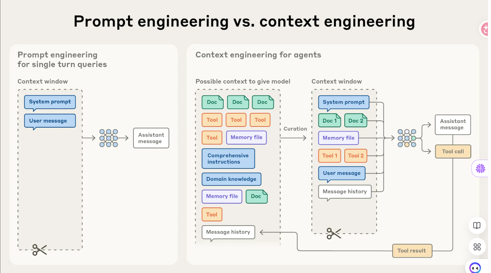
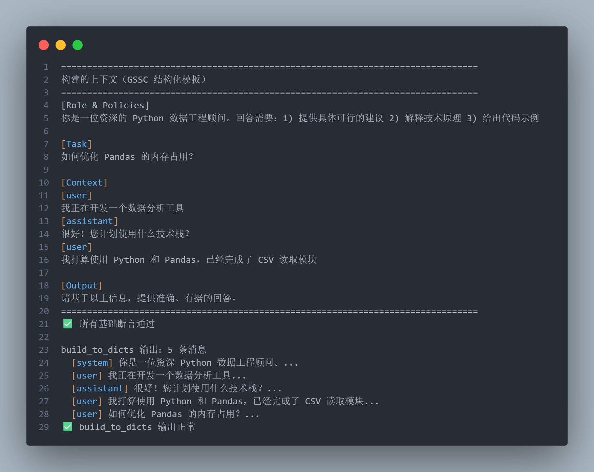
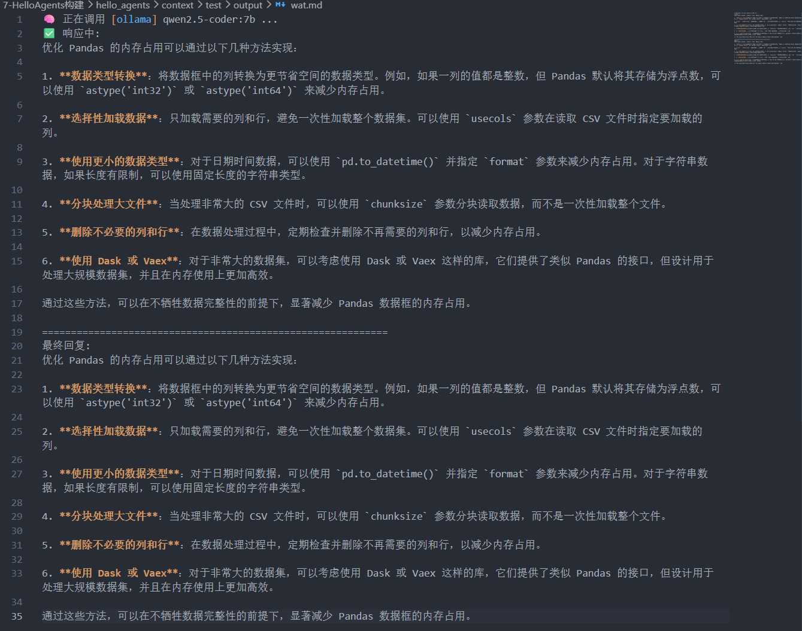
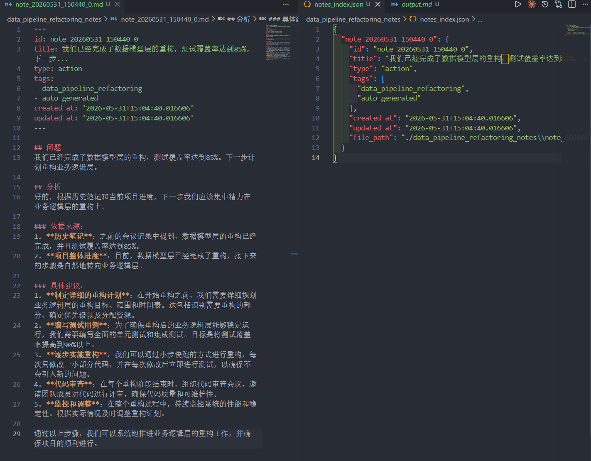
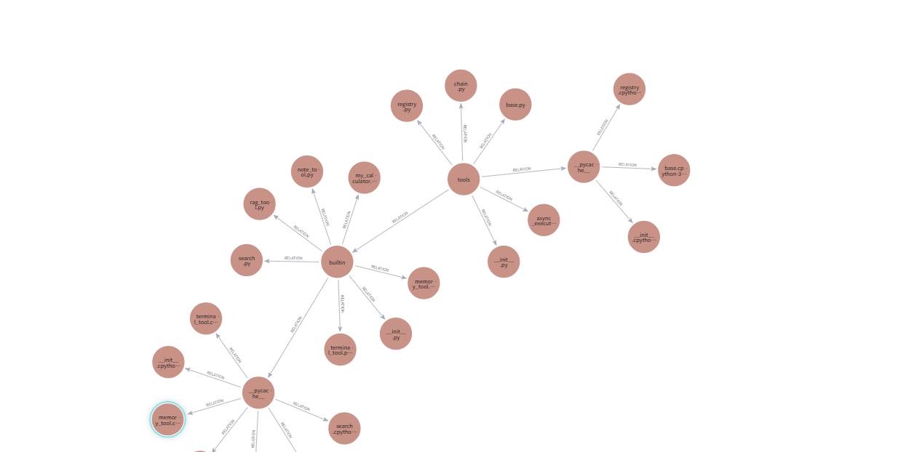

> 本章对应第九章内容


上下文工程（Context Engineering）。它关注的是“在每一次模型调用前，如何以可复用、可度量、可演进的方式，拼装并优化输入上下文”，从而提升正确性、鲁棒性与效率

本章主要介绍上下文工程的核心概念与实践，并在HelloAgents框架中新增了上下文构建器和两个配套工具：

- **ContextBuilder** (`hello_agents/context/builder.py`)：上下文构建器，实现 GSSC (Gather-Select-Structure-Compress) 流水线，提供统一的上下文管理接口
- **NoteTool** (`hello_agents/tools/builtin/note_tool.py`)：结构化笔记工具，支持智能体进行持久化记忆管理
- **TerminalTool** (`hello_agents/tools/builtin/terminal_tool.py`)：终端工具，支持智能体进行文件系统操作和即时上下文检索
# 什么是上下文工程

所谓“上下文”，是指在对大语言模型（LLM）进行采样时所包含的那组 tokens。在任何一次调用时，都要审视 LLM 可见的整体状态，并预判这种状态可能诱发的行为。



==**上下文 VS 提示词**==
上下文工程（Context Engineering）可以看作是提示工程（Prompt Engineering）的升级版。

提示工程主要研究“如何写好提示词”，重点在于系统提示、指令结构、Few-shot 示例等，目标是让 LLM 在单轮任务中输出更好的结果。早期的大模型应用，大多停留在这一层面。

而上下文工程关注的不只是提示本身，而是**推理阶段整个上下文窗口中的信息管理**。它研究的是：

> 在有限的 token 窗口内，如何组织、筛选和维护“最有价值的信息集合”。

这个“信息集合”不仅包括提示词，还包括：

- 系统指令
- 对话历史
- 工具调用结果
- 外部知识数据
- MCP（Model Context Protocol）
- 长期/短期记忆
- 智能体运行过程中的中间状态

随着智能体系统的发展，模型不再只是一次性回答问题，而是会持续、多轮地推理与执行任务。智能体在运行过程中会不断产生新的信息，因此上下文会持续膨胀。

于是，核心问题从：

> “如何写提示”

逐渐演变为：

> “哪些信息应该进入上下文窗口？”

因此，上下文工程的本质，就是在不断扩张的信息空间中，动态提炼和维护当前推理最相关的内容，以保证智能体长期运行时仍能保持准确性、连贯性与效率。

# 为什么上下文工程重要

尽管 LLM 的上下文窗口越来越大，但模型并不会因为“信息更多”就始终表现更好。研究发现，随着上下文 tokens 持续增加，模型对信息的准确回忆与长程推理能力会逐渐下降，这种现象被称为“==上下文腐蚀（Context Rot）”==

其本质原因在于：  
LLM 的注意力资源是有限的。Transformer 架构中，每个 token 都需要与其他 token 建立关联，理论复杂度接近 n2n^2n2。当上下文变长时，模型的注意力会被不断分散，导致关键内容难以聚焦，类似人类工作记忆超载后的“走神”。

此外，模型训练时更常见的是短文本，因此它天然更擅长处理中短上下文；即使通过长上下文扩展技术（如位置编码插值）支持更长序列，也会牺牲部分位置理解与检索精度。

因此，长上下文**并不是“越长越好”**，而是一种有限且边际收益递减的资源。模型在长上下文下不会突然失效，但其信息检索与推理精度会逐渐衰减。

也正因如此，上下文工程变得至关重要：  
核心目标不再是“尽可能塞入更多信息”，而是从庞杂信息中筛选、压缩并维护当前推理最相关的内容，以最大化有限注意力预算的利用效率。

## 有效上下文

在“有限注意力预算”下，上下文工程的核心目标是：

> 用尽可能少、但信息密度最高的 tokens，最大化模型获得正确结果的概率。

为实现这一目标，通常需要重点优化以下三个部分：

---
### 1. 系统提示（System Prompt）

系统提示应清晰、具体、层级合理，避免两个极端：

- **过度硬编码**：写大量复杂 if-else 规则，提示脆弱且难维护；
    
- **过于空泛**：只有抽象目标，没有明确行为与输出约束。


**最佳实践是：**

- 使用 XML / Markdown 分区组织内容；
    
- 区分角色、任务、工具说明、输出格式等模块；
    
- 追求“最小必要信息集”——既不过载，也不缺关键信号。


实践上，通常先从简洁提示开始，再根据失败案例逐步补充规则与示例。

### 2. 工具（Tools）

工具本质上是智能体与外部世界交互的接口契约。优秀工具应具备：

- 职责单一、边界清晰；
    
- 参数描述明确；
    
- 对错误具备鲁棒性；
    
- 返回的信息简洁、token 友好。

常见问题是“工具集膨胀”：  
多个工具功能重叠、语义模糊，导致模型连“该调用哪个工具”都难以判断。

因此，比起工具越多越好，更重要的是构建：

> 最小可行工具集（MVTS）

即：**只保留真正必要、职责明确的工具，从而提升长期稳定性与可维护性**。


### 3. 示例（Few-shot）

Few-shot 示例是塑造模型行为最有效的方法之一。

相比大量抽象说明：

> 高质量示例往往更能直接传达期望行为。

但示例并非越多越好，不应把所有边界情况全部塞入上下文。更好的策略是：

- 精选少量典型案例；
    
- 保证场景多样性；
    
- 直接体现正确行为模式。

本质上，Few-shot 的作用是让模型“观察行为”，而不仅是“阅读规则”。

---

因此，优秀的上下文工程，本质是在有限上下文窗口中：

- 精炼提示，
    
- 控制工具复杂度，
    
- 提供高信号示例，

从而让模型把有限注意力集中在真正关键的信息上。

## 上下文检索 与 智能体式搜索

智能体（Agent）本质上是：

> 能在循环中自主调用工具的 LLM。

相比传统 RAG 一次性加载全部数据，现代智能体更强调 **JIT（Just-in-time）** 上下文：  
只保存文件路径、URL、查询等轻量引用，在运行时按需动态获取信息。

这种方式更接近人类工作模式——不是记住所有内容，而是在需要时通过搜索、文件系统、笔记等外部索引获取信息。

其核心优势包括：

- 减少上下文窗口压力；
    
- 避免上下文腐蚀；
    
- 支持渐进式理解；
    
- 让模型始终聚焦当前任务所需的信息子集。

同时，目录结构、文件名、时间戳等元数据，也能帮助模型推断模块用途、复杂度与时效性。

但 JIT 模式也更依赖良好的工具设计。如果工具边界混乱，智能体可能误用工具、陷入无效探索或遗漏关键信息。

因此，实践中通常采用**混合策略**：

- 预加载少量高价值上下文（如 README、项目规范）；
    
- 再通过 grep、glob、搜索等工具按需检索具体内容。
    

现代上下文工程的核心，已经从：

> “一次性塞入更多信息”

转向：

> “在正确时间获取正确信息”。


## 长任务下的上下文工程

长时程任务（如大型代码迁移、长期研究）要求智能体在超出上下文窗口后，依然保持连贯性与目标一致。仅靠扩大上下文窗口无法彻底解决上下文污染与注意力退化，因此需要专门的上下文工程策略。

核心方法主要有三种：
### 1. 压缩整合（Compaction）

当上下文接近上限时，将历史对话高保真总结，再用摘要开启新窗口。

保留：
- 架构决策
    
- 未完成任务
    
- 关键实现细节

丢弃：

- 重复工具输出
    
- 无关噪声

本质上是让上下文“接力”。


### 2. 结构化笔记（Structured Note-taking）

即智能体记忆。

智能体会将关键状态写入外部持久化存储（如 TODO、NOTES.md、向量记忆），后续按需检索。

这样可以：

- 低成本维持长期状态；
    
- 跨多轮上下文保持进度与一致性；
    
- 避免所有信息长期占用上下文窗口。

### 3. 子代理架构（Sub-agent Architecture）

主代理负责规划与整合，多个子代理在独立上下文中分别探索、调用工具，最后只返回精炼摘要。

优势：

- 实现关注点分离；
    
- 避免主上下文被搜索细节污染；
    
- 支持并行探索复杂任务。

尤其适合大型研究与复杂分析。

---

三种方法的适用场景：

- 压缩整合：适合长对话连续任务；
    
- 结构化笔记：适合迭代式开发与长期项目；
    
- 子代理架构：适合复杂研究与并行探索。

因此，即使模型能力持续增强：

> 如何在长时间交互中维持连贯性、聚焦与长期记忆，

仍然是智能体系统最核心的工程挑战之一。


# 实践 ContextBuilder

ContextBuilder 的设计理念是"简单高效"，去除不必要的复杂性，统一以**"相关性+新近性"**的分数进行选择，

## 设计动机和目标

**ContextBuilder 的核心目标是构建一个统一、稳定且高效的上下文管理机制，为 Agent 提供标准化的上下文组装能力。**

主要体现在四个方面：

1. **统一入口**  
    将上下文处理流程抽象为“获取（Gather）→ 选择（Select）→ 结构化（Structure）→ 压缩（Compress）”的标准流水线，避免在不同 Agent 中重复实现相似逻辑，提高代码复用性和开发效率。
    
2. **稳定形态**  
    采用固定结构的上下文模板输出，统一组织为 **Role & Policies、Task、State、Evidence、Context、Output** 六个分区，使上下文格式一致，便于调试、评估以及 A/B 测试。
    
3. **预算守护**  
    在 Token 预算受限的情况下，优先保留高价值信息，并通过压缩策略处理超长上下文，确保系统在复杂场景下仍能保持稳定运行和较好的推理效果。
    
4. **最小规则**  
    避免引入复杂的来源、优先级等分类体系，以相关性和时间新近性为核心依据进行信息筛选，在控制系统复杂度的同时满足大多数应用场景需求。
    

**总体而言，ContextBuilder 的价值在于：通过标准化流水线、固定上下文结构和预算控制机制，实现 Agent 上下文的高效组织、稳定输出与可维护管理。**

## 核心数据结构
 
### ContextPacket 候选信息包

```py
from dataclasses import dataclass
from typing import Optional, Dict, Any
from datetime import datetime

@dataclass
class ContextPacket:
    """候选信息包

    Attributes:
        content: 信息内容
        timestamp: 时间戳
        token_count: Token 数量
        relevance_score: 相关性分数(0.0-1.0)
        metadata: 可选的元数据
    """
    content: str
    timestamp: datetime
    token_count: int
    relevance_score: float = 0.5
    metadata: Optional[Dict[str, Any]] = None

    def __post_init__(self):
        """初始化后处理"""
        if self.metadata is None:
            self.metadata = {}
        # 确保相关性分数在有效范围内
        self.relevance_score = max(0.0, min(1.0, self.relevance_score))
```

`ContextPacket` 是系统中信息的基本单元。每个候选信息都会被封装为一个 ContextPacket，包含内容、时间戳、token 数量和相关性分数等核心属性。这种统一的数据结构简化了后续的选择和排序逻辑。
### ContextConfig 管理配置
```py
@dataclass
class ContextConfig:
    """上下文构建配置

    Attributes:
        max_tokens: 最大 token 数量
        reserve_ratio: 为系统指令预留的比例(0.0-1.0)
        min_relevance: 最低相关性阈值
        enable_compression: 是否启用压缩
        recency_weight: 新近性权重(0.0-1.0)
        relevance_weight: 相关性权重(0.0-1.0)
    """
    max_tokens: int = 3000
    reserve_ratio: float = 0.2
    min_relevance: float = 0.1
    enable_compression: bool = True
    recency_weight: float = 0.3
    relevance_weight: float = 0.7

    def __post_init__(self):
        """验证配置参数"""
        assert 0.0 <= self.reserve_ratio <= 1.0, "reserve_ratio 必须在 [0, 1] 范围内"
        assert 0.0 <= self.min_relevance <= 1.0, "min_relevance 必须在 [0, 1] 范围内"
        assert abs(self.recency_weight + self.relevance_weight - 1.0) < 1e-6, \
            "recency_weight + relevance_weight 必须等于 1.0"
```

特别值得注意的是 `reserve_ratio` 参数，它确保系统指令等关键信息始终有足够的空间，不会被其他信息挤占。

## CSSC 流水线

GSSC==(Gather-Select-Structure-Compress)==流水线

### 1. Gather 信息汇集

第一阶段是从多个来源汇集候选信息。这个阶段的关键在于容错性和灵活性

```py
def _gather(
    self,
    user_query: str,
    conversation_history: Optional[List[Message]] = None,
    system_instructions: Optional[str] = None,
    custom_packets: Optional[List[ContextPacket]] = None
) -> List[ContextPacket]:
    """汇集所有候选信息

    Args:
        user_query: 用户查询
        conversation_history: 对话历史
        system_instructions: 系统指令
        custom_packets: 自定义信息包

    Returns:
        List[ContextPacket]: 候选信息列表
    """
    packets = []

    # 1. 添加系统指令(最高优先级,不参与评分)
    if system_instructions:
        packets.append(ContextPacket(
            content=system_instructions,
            timestamp=datetime.now(),
            token_count=self._count_tokens(system_instructions),
            relevance_score=1.0,  # 系统指令始终保留
            metadata={"type": "system_instruction", "priority": "high"}
        ))

    # 2. 从记忆系统检索相关记忆
    if self.memory_tool:
        try:
            memory_results = self.memory_tool.run({
                "action": "search",
                "query": user_query,
                "limit": 10,
                "min_importance": 0.3
            })
            # 解析记忆结果并转换为 ContextPacket
            memory_packets = self._parse_memory_results(memory_results, user_query)
            packets.extend(memory_packets)
        except Exception as e:
            print(f"[WARNING] 记忆检索失败: {e}")

    # 3. 从 RAG 系统检索相关知识
    if self.rag_tool:
        try:
            rag_results = self.rag_tool.run({
                "action": "search",
                "query": user_query,
                "limit": 5,
                "min_score": 0.3
            })
            # 解析 RAG 结果并转换为 ContextPacket
            rag_packets = self._parse_rag_results(rag_results, user_query)
            packets.extend(rag_packets)
        except Exception as e:
            print(f"[WARNING] RAG 检索失败: {e}")

    # 4. 添加对话历史(仅保留最近的 N 条)
    if conversation_history:
        recent_history = conversation_history[-5:]  # 默认保留最近 5 条
        for msg in recent_history:
            packets.append(ContextPacket(
                content=f"{msg.role}: {msg.content}",
                timestamp=msg.timestamp if hasattr(msg, 'timestamp') else datetime.now(),
                token_count=self._count_tokens(msg.content),
                relevance_score=0.6,  # 历史消息的基础相关性
                metadata={"type": "conversation_history", "role": msg.role}
            ))

    # 5. 添加自定义信息包
    if custom_packets:
        packets.extend(custom_packets)

    print(f"[ContextBuilder] 汇集了 {len(packets)} 个候选信息包")
    return packets
```
- **容错机制**：每个外部数据源的调用都被 try-except 包裹，确保单个源的失败不会影响整体流程
- **优先级处理**：系统指令被标记为高优先级，确保始终被保留
- **历史限制**：对话历史只保留最近的几条，避免上下文窗口被历史信息占据

==在调用记忆和rag层面 我选择了底层 memory和pipline 而不是工具类的调用 这不是给llm用的 是地层使用==

### 2. Select：智能信息选择
```py
def _select(
    self,
    packets: List[ContextPacket],
    user_query: str,
    available_tokens: int
) -> List[ContextPacket]:
    """选择最相关的信息包

    Args:
        packets: 候选信息包列表
        user_query: 用户查询(用于计算相关性)
        available_tokens: 可用的 token 数量

    Returns:
        List[ContextPacket]: 选中的信息包列表
    """
    # 1. 分离系统指令和其他信息
    system_packets = [p for p in packets if p.metadata.get("type") == "system_instruction"]
    other_packets = [p for p in packets if p.metadata.get("type") != "system_instruction"]

    # 2. 计算系统指令占用的 token
    system_tokens = sum(p.token_count for p in system_packets)
    remaining_tokens = available_tokens - system_tokens

    if remaining_tokens <= 0:
        print("[WARNING] 系统指令已占满所有 token 预算")
        return system_packets

    # 3. 为其他信息计算综合分数
    scored_packets = []
    for packet in other_packets:
        # 计算相关性分数(如果尚未计算)
        if packet.relevance_score == 0.5:  # 默认值,需要重新计算
            relevance = self._calculate_relevance(packet.content, user_query)
            packet.relevance_score = relevance

        # 计算新近性分数
        recency = self._calculate_recency(packet.timestamp)

        # 综合分数 = 相关性权重 × 相关性 + 新近性权重 × 新近性
        combined_score = (
            self.config.relevance_weight * packet.relevance_score +
            self.config.recency_weight * recency
        )

        # 过滤低于最小相关性阈值的信息
        if packet.relevance_score >= self.config.min_relevance:
            scored_packets.append((combined_score, packet))

    # 4. 按分数降序排序
    scored_packets.sort(key=lambda x: x[0], reverse=True)

    # 5. 贪心选择:按分数从高到低填充,直到达到 token 上限
    selected = system_packets.copy()
    current_tokens = system_tokens

    for score, packet in scored_packets:
        if current_tokens + packet.token_count <= available_tokens:
            selected.append(packet)
            current_tokens += packet.token_count
        else:
            # Token 预算已满,停止选择
            break

    print(f"[ContextBuilder] 选择了 {len(selected)} 个信息包,共 {current_tokens} tokens")
    return selected

def _calculate_relevance(self, content: str, query: str) -> float:
    """计算内容与查询的相关性

    使用简单的关键词重叠算法。在生产环境中,可以替换为向量相似度计算。

    Args:
        content: 内容文本
        query: 查询文本

    Returns:
        float: 相关性分数(0.0-1.0)
    """
    # 分词(简单实现,可以使用更复杂的分词器)
    content_words = set(content.lower().split())
    query_words = set(query.lower().split())

    if not query_words:
        return 0.0

    # Jaccard 相似度
    intersection = content_words & query_words
    union = content_words | query_words

    return len(intersection) / len(union) if union else 0.0

def _calculate_recency(self, timestamp: datetime) -> float:
    """计算时间近因性分数

    使用指数衰减模型,24小时内保持高分,之后逐渐衰减。

    Args:
        timestamp: 信息的时间戳

    Returns:
        float: 新近性分数(0.0-1.0)
    """
    import math

    age_hours = (datetime.now() - timestamp).total_seconds() / 3600

    # 指数衰减:24小时内保持高分,之后逐渐衰减
    decay_factor = 0.1  # 衰减系数
    recency_score = math.exp(-decay_factor * age_hours / 24)

    return max(0.1, min(1.0, recency_score))  # 限制在 [0.1, 1.0] 范围内
```

选择阶段的核心算法体现了几个重要的工程考量：

- **评分机制**：采用相关性和新近性的加权组合，权重可配置
- **贪心算法**：按分数从高到低填充，确保在有限预算内选择最有价值的信息
- **过滤机制**：通过 `min_relevance` 参数过滤低质量信息

### 3. Structure：结构化输出

```py
def _structure(self, selected_packets: List[ContextPacket], user_query: str) -> str:
    """将选中的信息包组织成结构化的上下文模板

    Args:
        selected_packets: 选中的信息包列表
        user_query: 用户查询

    Returns:
        str: 结构化的上下文字符串
    """
    # 按类型分组
    system_instructions = []
    evidence = []
    context = []

    for packet in selected_packets:
        packet_type = packet.metadata.get("type", "general")

        if packet_type == "system_instruction":
            system_instructions.append(packet.content)
        elif packet_type in ["rag_result", "knowledge"]:
            evidence.append(packet.content)
        else:
            context.append(packet.content)

    # 构建结构化模板
    sections = []

    # [Role & Policies]
    if system_instructions:
        sections.append("[Role & Policies]\n" + "\n".join(system_instructions))

    # [Task]
    sections.append(f"[Task]\n{user_query}")

    # [Evidence]
    if evidence:
        sections.append("[Evidence]\n" + "\n---\n".join(evidence))

    # [Context]
    if context:
        sections.append("[Context]\n" + "\n".join(context))

    # [Output]
    sections.append("[Output]\n请基于以上信息,提供准确、有据的回答。")

    return "\n\n".join(sections)
```

结构化阶段将散乱的信息包组织成清晰的分区，这种设计有几个优势：

- **可读性**：清晰的分区让人类和模型都更容易理解上下文结构
- **可调试性**：问题定位更容易，可以快速识别哪个区域的信息有问题
- **可扩展性**：添加新的信息源只需要创建新的分区

### 4. Compress：兜底压缩

第四阶段是对超限上下文进行压缩处理。

```py
def _compress(self, context: str, max_tokens: int) -> str:
    """压缩超限的上下文

    Args:
        context: 原始上下文
        max_tokens: 最大 token 限制

    Returns:
        str: 压缩后的上下文
    """
    current_tokens = self._count_tokens(context)

    if current_tokens <= max_tokens:
        return context  # 无需压缩

    print(f"[ContextBuilder] 上下文超限({current_tokens} > {max_tokens}),执行压缩")

    # 分区压缩:保持结构完整性
    sections = context.split("\n\n")
    compressed_sections = []
    current_total = 0

    for section in sections:
        section_tokens = self._count_tokens(section)

        if current_total + section_tokens <= max_tokens:
            # 完整保留
            compressed_sections.append(section)
            current_total += section_tokens
        else:
            # 部分保留
            remaining_tokens = max_tokens - current_total
            if remaining_tokens > 50:  # 至少保留 50 tokens
                # 简单截断(生产环境中可以使用 LLM 摘要)
                truncated = self._truncate_text(section, remaining_tokens)
                compressed_sections.append(truncated + "\n[... 内容已压缩 ...]")
            break

    compressed_context = "\n\n".join(compressed_sections)
    final_tokens = self._count_tokens(compressed_context)
    print(f"[ContextBuilder] 压缩完成: {current_tokens} -> {final_tokens} tokens")

    return compressed_context

def _truncate_text(self, text: str, max_tokens: int) -> str:
    """截断文本到指定 token 数量

    Args:
        text: 原始文本
        max_tokens: 最大 token 数量

    Returns:
        str: 截断后的文本
    """
    # 简单实现:按字符比例估算
    # 生产环境中应该使用精确的 tokenizer
    char_per_token = len(text) / self._count_tokens(text) if self._count_tokens(text) > 0 else 4
    max_chars = int(max_tokens * char_per_token)

    return text[:max_chars]

def _count_tokens(self, text: str) -> int:
    """估算文本的 token 数量

    Args:
        text: 文本内容

    Returns:
        int: token 数量
    """
    # 简单估算:中文 1 字符 ≈ 1 token,英文 1 单词 ≈ 1.3 tokens
    # 生产环境中应该使用实际的 tokenizer
    chinese_chars = sum(1 for ch in text if '\u4e00' <= ch <= '\u9fff')
    english_words = len([w for w in text.split() if w])

    return int(chinese_chars + english_words * 1.3)
```

## 完整使用示例

### 基础使用

如何在项目中使用ContextBuilder


```py
"""
简易测试：验证 ContextBuilder GSSC 流水线的基础功能

只测试核心上下文构建（不用 memory / RAG），验证：
  1. gather 能汇集系统指令 + 对话历史
  2. select 能正确评分和过滤
  3. structure 能输出格式化的模板
  4. build() 一次调用跑完整个流水线
"""

import os
import sys
from datetime import datetime

# ── 路径引导：自动向上搜索 hello_agents 包 ────────────
_BASE = os.path.abspath(__file__)
while not os.path.isdir(os.path.join(os.path.dirname(_BASE), 'hello_agents')):
    _BASE = os.path.dirname(_BASE)
    if os.path.dirname(_BASE) == _BASE:
        break
_PROJECT_ROOT = os.path.dirname(_BASE)
if _PROJECT_ROOT not in sys.path:
    sys.path.insert(0, _PROJECT_ROOT)

from hello_agents.context import ContextBuilder, ContextConfig
from hello_agents.core.message import Message


# ── 1. 配置 ──────────────────────────────────────────────────────────────
config = ContextConfig(
    max_tokens=3000,
    reserve_ratio=0.2,
    min_relevance=0.1,
    enable_compression=True,
    recency_weight=0.3,
    relevance_weight=0.7,
)

builder = ContextBuilder(config=config)  # 不传 memory/rag，只测核心流水线

# ── 2. 对话历史 ─────────────────────────────────────────────────────────
now = datetime.now()
conversation_history = [
    Message(
        content="我正在开发一个数据分析工具",
        role="user",
        timestamp=now,
    ),
    Message(
        content="很好！您计划使用什么技术栈？",
        role="assistant",
        timestamp=now,
    ),
    Message(
        content="我打算使用 Python 和 Pandas，已经完成了 CSV 读取模块",
        role="user",
        timestamp=now,
    ),
]

# ── 3. 构建上下文 ───────────────────────────────────────────────────────
context = builder.build(
    user_query="如何优化 Pandas 的内存占用？",
    conversation_history=conversation_history,
    system_instructions="你是一位资深的 Python 数据工程顾问。回答需要："
                        "1) 提供具体可行的建议 "
                        "2) 解释技术原理 "
                        "3) 给出代码示例",
)

# ── 4. 输出结果 ─────────────────────────────────────────────────────────
print("=" * 80)
print("构建的上下文（GSSC 结构化模板）")
print("=" * 80)
print(context)
print("=" * 80)

# ── 5. 快速验证 ─────────────────────────────────────────────────────────
assert "[Role & Policies]" in context, "缺少 [Role & Policies] 分区"
assert "[Task]" in context, "缺少 [Task] 分区"
assert "如何优化" in context, "缺少用户查询"
assert "[Context]" in context, "缺少 [Context] 分区"
assert "[Output]" in context, "缺少 [Output] 分区"
assert "数据分析" in context, "缺少对话历史内容"
print("✅ 所有基础断言通过")

# ── 6. 额外：build_to_dicts 格式 ───────────────────────────────────────
dicts = builder.build_to_dicts(
    user_query="如何优化 Pandas 的内存占用？",
    conversation_history=conversation_history,
    system_instructions="你是一位资深 Python 数据工程顾问。",
)
print(f"\nbuild_to_dicts 输出：{len(dicts)} 条消息")
for msg in dicts:
    print(f"  [{msg['role']}] {msg['content'][:60]}...")
print("✅ build_to_dicts 输出正常")

```


输出



### 集成agent使用
```py
"""
Agent + ContextBuilder 集成测试（使用底层 API）
把 Tool 层替换为直接调用 MemoryManager / RAGPipeline，
展示 ContextBuilder 如何与 Agent 搭配工作。
  
改动要点:
  MemoryTool → MemoryManager (save/search 直接调用)
  RAGTool    → RAGPipeline (query 直接调用，需 Qdrant 服务)
  llm.invoke → llm.think   (HelloAgentsLLM 的正确方法名)
"""

import os
import sys
from datetime import datetime

# ── 路径引导 ──────────────────────────────────────────
_BASE = os.path.abspath(__file__)
while not os.path.isdir(os.path.join(os.path.dirname(_BASE), 'hello_agents')):
    _BASE = os.path.dirname(_BASE)
    if os.path.dirname(_BASE) == _BASE:
        break
_PROJECT_ROOT = os.path.dirname(_BASE)
if _PROJECT_ROOT not in sys.path:
    sys.path.insert(0, _PROJECT_ROOT)

  
from hello_agents import SimpleAgent, HelloAgentsLLM
from hello_agents.context import ContextBuilder, ContextConfig
from hello_agents.memory.manager import MemoryManager
from hello_agents.memory.base import MemoryConfig
from hello_agents.core.message import Message

  
class ContextAwareAgent(SimpleAgent):
    """具有上下文感知能力的 Agent（底层 API 版）"""

    def __init__(self, name: str, llm: HelloAgentsLLM, **kwargs):
        super().__init__(name=name, llm=llm, system_prompt=kwargs.get("system_prompt", ""))
        # ── 使用 MemoryManager 而非 MemoryTool ──────────────
        mem_config = MemoryConfig(
            episodic_db_type="mysql",  
            episodic_db_path=":memory:",  # 内存模式，用完即弃
            semantic_enabled=False,
            perceptual_enabled=False,

        )
        self.memory = MemoryManager(
            config=mem_config,
            user_id=kwargs.get("user_id", "default"),
        )

        # ── 尝试初始化 RAGPipeline（需要 Qdrant 服务） ──────
        self.rag = None
        try:
            from hello_agents.memory.rag.pipeline import RAGPipeline
            self.rag = RAGPipeline(
                llm=llm,
                collection_name="data_science_kb",
            )
        except Exception as e:
            print(f"⏭️ RAGPipeline 不可用（跳过）: {e}")

        # ── ContextBuilder 接收底层实例 ─────────────────────
        self.context_builder = ContextBuilder(
            memory=self.memory,
            rag=self.rag,
            config=ContextConfig(max_tokens=4000),
        )
        self.conversation_history: list[Message] = []

    def run(self, user_input: str) -> str:
        """运行 Agent，自动构建优化的上下文"""

        # 1. 使用 ContextBuilder 构建优化的上下文
        optimized_context = self.context_builder.build(
            user_query=user_input,
            conversation_history=self.conversation_history,
            system_instructions=self.system_prompt,
        )

        # 2. 使用优化后的上下文调用 LLM
        messages = [
            {"role": "system", "content": optimized_context},
            {"role": "user", "content": user_input},
        ]
        response = self.llm.think(messages)
        if response is None:
            response = "(LLM 返回空，请检查 API 配置)"

        # 3. 更新对话历史
        self.conversation_history.append(
            Message(content=user_input, role="user", timestamp=datetime.now())
        )
        self.conversation_history.append(
            Message(content=response, role="assistant", timestamp=datetime.now())
        )
        # 4. 将重要交互记录到记忆系统
        self.memory.save(
            content=f"Q: {user_input}\nA: {response[:200]}...",
            memory_type="episodic",
            importance=0.6,
        )
        return response
# ═══════════════════════════════════════════════════════════════
# 使用示例
# ═══════════════════════════════════════════════════════════════
if __name__ == "__main__":
    from dotenv import load_dotenv
    load_dotenv()
    
    agent = ContextAwareAgent(
        name="数据分析顾问",
        llm=HelloAgentsLLM(),
        system_prompt="你是一位资深的 Python 数据工程顾问。",
        user_id="user123",
    )

    response = agent.run("如何优化 Pandas 的内存占用？")
    print(f"\n{'='*60}")
    print(f"最终回复:\n{response}")
```




请注意 该设计 可以有多种选择 最终我们将实现的是上下文的构建 其中包含信息搜集 选择评分 结构化输出 上下文压缩  

通过次设计 和实操 我们掌握了基本的设计原理 尽管代码 不是手写 但是我们仍可借鉴 学习

# NoteTool 结构化笔记

NoteTool 是为=="长时程任务"==提供的结构化外部记忆组件。它以 Markdown 文件作为载体，头部使用 YAML 前置元数据记录关键信息，正文用于记录状态、结论、阻塞与行动项等内容。

这种设计结合了人类可读性、版本控制友好性和易于回注上下文的特性，是构建长时程智能体的重要工具。

## 设计和应用场景

### 为什么需要NoteTool

在第八章中，我们介绍了 MemoryTool，它提供了强大的记忆管理能力。然而，MemoryTool 主要关注**对话式记忆**——短期工作记忆、情景记忆和语义记忆。对于需要长期追踪、结构化管理的**项目式任务**，我们需要一种更轻量、更人类友好的记录方式。

NoteTool 填补了这个gap，它提供了：

- **结构化记录**：使用 Markdown + YAML 格式，既适合机器解析，也方便人类阅读和编辑
- **版本友好**：纯文本格式，天然支持 Git 等版本控制系统
- **低开销**：无需复杂的数据库操作，适合轻量级的状态追踪
- **灵活分类**：通过 `type` 和 `tags` 灵活组织笔记，支持多维度检索

### 适用场景

#### 长项目追踪

想象一个智能体正在协助完成一个大型代码库的重构任务，这可能需要几天甚至几周。NoteTool 可以记录：

- `task_state`：当前阶段的任务状态和进度
- `conclusion`：每个阶段结束后的关键结论
- `blocker`：遇到的问题和阻塞点
- `action`：下一步的行动计划
```py
# 记录任务状态
notes.run({
    "action": "create",
    "title": "重构项目 - 第一阶段",
    "content": "已完成数据模型层的重构,测试覆盖率达到85%。下一步将重构业务逻辑层。",
    "note_type": "task_state",
    "tags": ["refactoring", "phase1"]
})

# 记录阻塞点
notes.run({
    "action": "create",
    "title": "依赖冲突问题",
    "content": "发现某些第三方库版本不兼容,需要解决。影响范围:业务逻辑层的3个模块。",
    "note_type": "blocker",
    "tags": ["dependency", "urgent"]
})
```

#### 研究任务管理

一个智能研究助手在进行文献综述时，可以使用 NoteTool 记录：

- 每篇论文的核心观点(`conclusion`)
- 待深入调研的主题(`action`)
- 重要的参考文献(`reference`)

#### 和ContextBuilder配合

在每轮对话前，Agent 可以通过 `search` 或 `list` 操作检索相关笔记，并将其注入到上下文中：
```
# 在 Agent 的 run 方法中
def run(self, user_input: str) -> str:
    # 1. 检索相关笔记
    relevant_notes = self.note_tool.run({
        "action": "search",
        "query": user_input,
        "limit": 3
    })

    # 2. 将笔记内容转换为 ContextPacket
    note_packets = []
    for note in relevant_notes:
        note_packets.append(ContextPacket(
            content=note['content'],
            timestamp=note['updated_at'],
            token_count=self._count_tokens(note['content']),
            relevance_score=0.7,
            metadata={"type": "note", "note_type": note['type']}
        ))

    # 3. 构建上下文时传入笔记
    context = self.context_builder.build(
        user_query=user_input,
        custom_packets=note_packets,
        ...
    )
```

## 存储格式解析

NoteTool 采用了 ==Markdown + YAML== 的混合格式，这种设计兼顾了结构化和可读性。

### 笔记文件格式

每个笔记都是一个独立的 `.md` 文件，格式如下：

```md
---
id: note_20250119_153000_0
title: 项目进展 - 第一阶段
type: task_state
tags: [refactoring, phase1, backend]
created_at: 2025-01-19T15:30:00
updated_at: 2025-01-19T15:30:00
---

# 项目进展 - 第一阶段

## 完成情况

已完成数据模型层的重构,主要改动包括:

1. 统一了实体类的命名规范
2. 引入了类型提示,提升代码可维护性
3. 优化了数据库查询性能

## 测试覆盖

- 单元测试覆盖率: 85%
- 集成测试覆盖率: 70%

## 下一步计划

1. 重构业务逻辑层
2. 解决依赖冲突问题
3. 提升集成测试覆盖率至85%
```

这种格式的优势：

- **YAML 元数据**：机器可解析，支持精确的字段提取和检索
- **Markdown 正文**：人类可读，支持丰富的格式化(标题、列表、代码块等)
- **文件名即 ID**：简化管理，每个笔记的文件名就是其唯一标识

### 索引文件

NoteTool 维护一个 `notes_index.json` 文件，用于快速检索和管理笔记
```json
{
  "note_20250119_153000_0": {
    "id": "note_20250119_153000_0",
    "title": "项目进展 - 第一阶段",
    "type": "task_state",
    "tags": ["refactoring", "phase1", "backend"],
    "created_at": "2025-01-19T15:30:00",
    "updated_at": "2025-01-19T15:30:00",
    "file_path": "./notes/note_20250119_153000_0.md"
  }
}
```


这个索引文件的作用：

- **快速检索**：无需打开每个文件，直接从索引中查找
- **元数据管理**：集中管理所有笔记的元数据
- **完整性校验**：可以检测文件缺失或损坏

## 核心操作详解

NoteTool 提供了七个核心操作，覆盖了笔记的完整生命周期管理

在第一个操作之前 需要设计 类 和 run的入口方法
```py
class NoteTool:
    def __init__(self, workspace: str, index: Optional[Dict] = None):
        self.workspace = workspace
        self.index = index if index is not None else {}
        self._load_index()

        """
        初始化笔记工具，加载索引
        Args:
            workspace: 工作空间目录，用于存储笔记文件
            index: 可选的索引字典，用于初始化索引
        """

    # ── 索引持久化 ──────────────────────────────────────────────────────

    def _load_index(self):
        """从 workspace/notes_index.json 加载索引，不存在则初始化为空字典"""
        index_path = os.path.join(self.workspace, "notes_index.json")
        if os.path.exists(index_path):
            with open(index_path, 'r', encoding='utf-8') as f:
                loaded = json.load(f)
                self.index = loaded if isinstance(loaded, dict) else {}
        else:
            self.index = {}

    def _save_index(self):
        """将索引保存到 workspace/notes_index.json"""
        os.makedirs(self.workspace, exist_ok=True)
        index_path = os.path.join(self.workspace, "notes_index.json")
        with open(index_path, 'w', encoding='utf-8') as f:
            json.dump(self.index, f, ensure_ascii=False, indent=2)

    # ── 统一入口 ────────────────────────────────────────────────────────

    def run(self, params: Dict) -> str:
        """统一入口，根据 action 分发到具体操作

        Args:
            params: 参数字典，必须含 "action" 键

        Returns:
            str: 操作结果（如笔记ID）
        """
        action = params.get("action")
        if action == "create":
            return self._create_note(
                title=params["title"],
                content=params["content"],
                note_type=params.get("note_type", "general"),
                tags=params.get("tags"),
            )
        else:
            raise ValueError(f"未知 action: {action}")

```
### 1. create 创建笔记
 ```py
 # ── 创建笔记 ────────────────────────────────────────────────────────

    def _create_note(
        self,
        title: str,
        content: str,
        note_type: str = "general",
        tags: Optional[List[str]] = None,
    ) -> str:
        """创建笔记

        Args:
            title: 笔记标题
            content: 笔记内容(Markdown格式)
            note_type: 笔记类型(task_state/conclusion/blocker/action/reference/general)
            tags: 标签列表

        Returns:
            str: 笔记ID
        """
        # 1. 确保 workspace 目录存在
        os.makedirs(self.workspace, exist_ok=True)

        # 2. 生成唯一ID
        timestamp = datetime.now().strftime("%Y%m%d_%H%M%S")
        note_id = f"note_{timestamp}_{len(self.index)}"

        # 3. 构建元数据
        metadata = {
            "id": note_id,
            "title": title,
            "type": note_type,
            "tags": tags or [],
            "created_at": datetime.now().isoformat(),
            "updated_at": datetime.now().isoformat(),
        }

        # 4. 构建完整的 Markdown 文件内容
        md_content = self._build_markdown(metadata, content)

        # 5. 保存到文件 路径: workspace/note_id.md
        file_path = os.path.join(self.workspace, f"{note_id}.md")
        with open(file_path, "w", encoding="utf-8") as f:
            f.write(md_content)

        # 6. 更新索引
        metadata["file_path"] = file_path
        self.index[note_id] = metadata
        self._save_index()

        return note_id

    # ── Markdown 构建 ──────────────────────────────────────────────────

    def _build_markdown(self, metadata: Dict, content: str) -> str:
        """构建 Markdown 文件内容(YAML 前置元数据 + 正文)"""
        # 1. 构建 YAML 前置元数据
        yaml_header = yaml.dump(metadata, allow_unicode=True, sort_keys=False)
        
        # 2. 构建 Markdown 正文
        return f"---\n{yaml_header}---\n\n{content}"
 ```

在创建笔记这里 有一个辅助方法就是 Markdown的构建

**测试是否能正确创建**

```py
import sys
import os
# 将项目根目录加入模块搜索路径，确保 import hello_agents 能正常找到
sys.path.insert(0, os.path.join(os.path.dirname(__file__), "../.."))

from hello_agents.tools import NoteTool

notes = NoteTool(workspace="./project_notes")

note_id = notes.run({
    "action": "create",
    "title": "重构项目 - 第一阶段",
    "content": """## 完成情况
已完成数据模型层的重构,测试覆盖率达到85%。

## 下一步
重构业务逻辑层""",
    "note_type": "task_state",
    "tags": ["refactoring", "phase1"]
})

print(f"✅ 笔记创建成功,ID: {note_id}")

```

索引持久化
```json
{
  "note_20260531_134400_0": {
    "id": "note_20260531_134400_0",
    "title": "重构项目 - 第一阶段",
    "type": "task_state",
    "tags": [
      "refactoring",
      "phase1"
    ],
    "created_at": "2026-05-31T13:44:00.184867",
    "updated_at": "2026-05-31T13:44:00.184867",
    "file_path": "./project_notes\\note_20260531_134400_0.md"
  },
  "note_20260531_134436_1": {
    "id": "note_20260531_134436_1",
    "title": "重构项目 - 第一阶段",
    "type": "task_state",
    "tags": [
      "refactoring",
      "phase1"
    ],
    "created_at": "2026-05-31T13:44:36.170686",
    "updated_at": "2026-05-31T13:44:36.170686",
    "file_path": "./project_notes\\note_20260531_134436_1.md"
  }
}
```

笔记构建成功
```md
---

id: note_20260531_134400_0
title: 重构项目 - 第一阶段
type: task_state
tags:
- refactoring
- phase1
created_at: '2026-05-31T13:44:00.184867'
updated_at: '2026-05-31T13:44:00.184867'
---
  
## 完成情况
已完成数据模型层的重构,测试覆盖率达到85%。

## 下一步
重构业务逻辑层
```

### 2. read：读取笔记

```py
    #? —— 2. 读取笔记内容 ————————————————————————————————————————————————————
    def _read_note(self, note_id: str) -> Dict:
        """读取笔记内容
        Args:
            note_id: 笔记ID

        Returns:
            Dict: 包含元数据和内容的字典
        """
        # 1. 通过索引获取文件路径
        if note_id not in self.index:
            raise ValueError(f"笔记不存在: {note_id}")

        file_path = self.index[note_id]["file_path"]

        # 2. 读取文件内容
        with open(file_path, 'r', encoding='utf-8') as f:
            raw_content = f.read()

        # 3. 解析 YAML 元数据和 Markdown 正文
        metadata, content = self._parse_markdown(raw_content)

        return {
            "metadata": metadata,
            "content": content
        }


    # ── Markdown 解析 ──────────────────────────────────────────────────
    def _parse_markdown(self, raw_content: str) -> Tuple[Dict, str]:
        """解析 Markdown 文件(分离 YAML 和正文)"""

        # 查找 YAML 分隔符
        parts = raw_content.split('---\n', 2)   # 最多分割两次,确保有3个部分

        if len(parts) >= 3:
            # 有 YAML 前置元数据
            yaml_str = parts[1]
            content = parts[2].strip()
            metadata = yaml.safe_load(yaml_str)
        else:
            # 无元数据,全部作为正文
            metadata = {}
            content = raw_content.strip()

        return metadata, content
```

经过测试 也是ok
```txt
✅ 笔记读取成功: {'id': 'note_20260531_135613_0', 'title': '重构项目 - 第一阶段', 'type': 'task_state', 'tags': ['refactoring', 'phase1'], 'created_at': '2026-05-31T13:56:13.300979', 'updated_at': '2026-05-31T13:56:13.300979'}
## 完成情况
已完成数据模型层的重构,测试覆盖率达到85%。

## 下一步
重构业务逻辑层
```

### 3. update: 更新笔记
```py
    #? —— 3. 更新笔记 ————————————————————————————————————————————————————
    def _update_note(
        self,
        note_id: str,
        title: Optional[str] = None,
        content: Optional[str] = None,
        note_type: Optional[str] = None,
        tags: Optional[List[str]] = None
    ) -> str:
        """更新笔记
    
        Args:
            note_id: 笔记ID
            title: 新标题(可选)
            content: 新内容(可选)
            note_type: 新类型(可选)
            tags: 新标签(可选)
    
        Returns:
            str: 操作结果消息
        """
        if note_id not in self.index:
            raise ValueError(f"笔记不存在: {note_id}")
    
        # 1. 读取现有笔记
        note = self._read_note(note_id)
        metadata = note.get("metadata")
        old_content = note.get("content")
    
        # 2. 更新字段
        if title:
            metadata["title"] = title
        if note_type:
            metadata["type"] = note_type
        if tags is not None:
            metadata["tags"] = tags
        if content is not None:
            old_content = content
    
        # 更新时间戳
        metadata["updated_at"] = datetime.now().isoformat()

        # 3. 重新构建并保存（file_path 存于索引中，而非 YAML 元数据）
        md_content = self._build_markdown(metadata, old_content)
        file_path = self.index[note_id]["file_path"]
    
        with open(file_path, 'w', encoding='utf-8') as f:
            f.write(md_content)
    
        # 4. 更新索引
        self.index[note_id] = metadata
        self._save_index()
    
        return f"✅ 笔记已更新: {metadata['title']}"
```

原代码 有错误 file_path 存在于索引当中  修改获取路径的错误 
经过测试 也是可以正常修改

### 4. search: 搜索笔记
```py
#? —— 4. 搜索笔记 ————————————————————————————————————————————————————
    def _search_notes(
        self,
        query: str,
        limit: int = 10,
        note_type: Optional[str] = None,
        tags: Optional[List[str]] = None
    ) -> List[Dict]:
        """搜索笔记

        Args:
            query: 搜索关键词
            limit: 返回数量限制
            note_type: 按类型过滤(可选)
            tags: 按标签过滤(可选)

        Returns:
            List[Dict]: 匹配的笔记列表
        """
        results = []
        query_lower = query.lower()

        for note_id, metadata in self.index.items():
            # 类型过滤
            if note_type and metadata.get("type") != note_type:
                continue

            # 标签过滤
            if tags:
                note_tags = set(metadata.get("tags", []))
                if not note_tags.intersection(tags):  # intersection 检查是否有公共标签
                    continue

            # 读取笔记内容
            try:
                note = self._read_note(note_id)
                content = note["content"]
                title = metadata.get("title", "")

                # 在标题和内容中搜索
                if query_lower in title.lower() or query_lower in content.lower():
                    results.append({
                        "note_id": note_id,
                        "title": title,
                        "type": metadata.get("type"),
                        "tags": metadata.get("tags", []),
                        "content": content,
                        "updated_at": metadata.get("updated_at")
                    })
            except Exception as e:
                print(f"[WARNING] 读取笔记 {note_id} 失败: {e}")
                continue

        # 按更新时间排序
        results.sort(key=lambda x: x["updated_at"], reverse=True)

        return results[:limit]
```

测试文件

```py
if __name__ == "__main__":
    notes = NoteTool(workspace="./project_notes")
    
    result = notes.run({
        "action": "search",
        "query": "重构",
        "limit": 5,
    })

    print(result)
```


```plaintext
[{'note_id': 'note_20260531_143929_0', 'title': '重构项目 - 第一阶段', 'type': 'task_state', 'tags': ['refactoring', 'phase1'], 'content': '## 完成情况\n已完成数据模型层的重构,测试覆盖率达到85%。\n\n## 下一步\n重构业务逻辑层', 'updated_at': '2026-05-31T14:39:29.479741'}]
```

然后也是可以通过的 注意 这里的搜索文件 只是简单通过关键字查询 标签过滤等 

### 5. list：列出笔记

这里是列出笔记元素据

```py
    #? —— 5. 列出笔记 ————————————————————————————————————————————————————
    def _list_notes(
        self,
        note_type: Optional[str] = None,
        tags: Optional[List[str]] = None,
        limit: int = 20
    ) -> List[Dict]:
        """列出笔记(按更新时间倒序)

        Args:
            note_type: 按类型过滤(可选)
            tags: 按标签过滤(可选)
            limit: 返回数量限制

        Returns:
            List[Dict]: 笔记元数据列表
        """
        results = []

        for note_id, metadata in self.index.items():
            # 类型过滤
            if note_type and metadata.get("type") != note_type:
                continue

            # 标签过滤
            if tags:
                note_tags = set(metadata.get("tags", []))
                if not note_tags.intersection(tags):
                    continue

            results.append(metadata)

        # 按更新时间排序
        results.sort(key=lambda x: x.get("updated_at", ""), reverse=True)

        return results[:limit]
```

经过测试也是ok的


### 6. summary：笔记摘要

```
    #? —— 6. 笔记摘要 ————————————————————————————————————————————————————
    def _summary(self) -> Dict[str, Any]:
        """生成笔记摘要统计
    
        Returns:
            Dict: 统计信息
        """
        total_count = len(self.index)
    
        # 按类型统计
        type_counts = {}
        for metadata in self.index.values():
            note_type = metadata.get("type", "general")
            type_counts[note_type] = type_counts.get(note_type, 0) + 1
    
        # 最近更新的笔记
        recent_notes = sorted(
            self.index.values(),
            key=lambda x: x.get("updated_at", ""),
            reverse=True
        )[:5]
    
        return {
            "total_notes": total_count,
            "type_distribution": type_counts,
            "recent_notes": [
                {
                    "id": note.get("id", ""),
                    "title": note.get("title", ""),
                    "type": note.get("type"),
                    "updated_at": note.get("updated_at")
                }
                for note in recent_notes
            ]
        }
```


经过测试也是ok的

目前 `_summary` 做的三件事：

1. **总数统计** — `total_notes`: 笔记总量
2. **类型分布** — `type_distribution`: 各 `note_type` 各有多少条（task_state / conclusion / blocker / action / reference / general 等）
3. **最近更新** — `recent_notes`: 最近更新的 5 条笔记的简要信息（id、标题、类型、更新时间）

### 7. delete：删除笔记

```py
    #? —— 7. 删除笔记 ————————————————————————————————————————————————————
    def _delete_note(self, note_id: str) -> str:
        """删除笔记

        Args:
            note_id: 笔记ID

        Returns:
            str: 操作结果消息
        """
        if note_id not in self.index:
            raise ValueError(f"笔记不存在: {note_id}")

        # 1. 删除文件
        file_path = self.index[note_id]["file_path"]
        if os.path.exists(file_path):
            os.remove(file_path)

        # 2. 从索引中移除
        title = self.index[note_id].get("title", note_id)
        del self.index[note_id]
        self._save_index()

        return f"✅ 笔记已删除: {title}"
```

经过测试 删除也是ok的

所以至此 核心操作都已全部动手完成 

## 与ContextBuilder的深度集成

NoteTool 的真正威力在于与 ContextBuilder 的配合使用。

### 场景设定

假设我们正在构建一个长期项目助手，它需要：

1. 记录项目的阶段性进展
2. 追踪待解决的问题
3. 在每次对话时，自动回顾相关笔记
4. 基于历史笔记提供连贯的建议

### 实现示例
完整代码
```py
"""
ProjectAssistant — 长期项目助手，集成 NoteTool + ContextBuilder

演示如何将 NoteTool 和 ContextBuilder 组合使用：
  1. 用户输入 → 2. 检索相关笔记 → 3. 构建结构化上下文
  → 4. 调用 LLM → 5. 可选保存为笔记 → 6. 更新对话历史
"""
import sys
import os
# 将项目根目录加入模块搜索路径
sys.path.insert(0, os.path.join(os.path.dirname(__file__), "../../.."))

from typing import List, Dict, Optional
from datetime import datetime

from hello_agents import SimpleAgent, HelloAgentsLLM
from hello_agents.context import ContextBuilder, ContextConfig, ContextPacket
from hello_agents.tools import NoteTool
from hello_agents.memory.manager import MemoryManager
from hello_agents.memory.rag.pipeline import RAGPipeline
from hello_agents.core.message import Message

class ProjectAssistant(SimpleAgent):
    """长期项目助手，集成 NoteTool 和 ContextBuilder"""

    def __init__(
        self,
        name: str,
        project_name: str,
        llm: Optional[HelloAgentsLLM] = None,
        **kwargs,
    ):
        super().__init__(name=name, llm=llm or HelloAgentsLLM(), **kwargs)

        self.project_name = project_name

        # ── 1. 初始化记忆系统 ────────────────────────────────────────────
        self.memory_manager = MemoryManager(user_id=project_name)

        # ── 2. 初始化 RAG 知识库（使用当前 LLM 实例） ────────────────────
        self.rag_pipeline = RAGPipeline(
            llm=self.llm,
            collection_name=f"{project_name}_kb",
        )

        # ── 3. 初始化笔记工具 ────────────────────────────────────────────
        self.note_tool = NoteTool(workspace=f"./{project_name}_notes")

        # ── 4. 初始化上下文构建器（GSSC 流水线） ─────────────────────────
        #     ContextBuilder 直接接收 MemoryManager 和 RAGPipeline，
        #     而非 MemoryTool / RAGTool（工具是给 Agent 调用的，构建器
        #     需要的是底层检索接口）
        self.context_builder = ContextBuilder(
            memory=self.memory_manager,
            rag=self.rag_pipeline,
            config=ContextConfig(max_tokens=4000),
        )

        # ── 5. 对话历史 ──────────────────────────────────────────────────
        self.conversation_history: List[Message] = []

    # ══════════════════════════════════════════════════════════════════════
    # 主入口
    # ══════════════════════════════════════════════════════════════════════

    def run(self, user_input: str, note_as_action: bool = False) -> str:
        """运行助手，自动集成笔记上下文

        Args:
            user_input: 用户输入
            note_as_action: 是否将本次交互自动保存为笔记

        Returns:
            str: LLM 回复
        """
        # 1. 从 NoteTool 检索相关笔记
        relevant_notes = self._retrieve_relevant_notes(user_input)

        # 2. 将笔记转换为 ContextPacket（GSSC 自定义信息包）
        note_packets = self._notes_to_packets(relevant_notes)

        # 3. 构建优化的结构化上下文（GSSC 流水线）
        context = self.context_builder.build(
            user_query=user_input,
            conversation_history=self.conversation_history,
            system_instructions=self._build_system_instructions(),
            custom_packets=note_packets,
        )

        # 4. 调用 LLM
        messages = [
            {"role": "system", "content": context},
            {"role": "user", "content": user_input},
        ]
        response = self.llm.think(messages) or ""

        # 5. 如需自动记录，将交互保存为笔记
        if note_as_action:
            self._save_as_note(user_input, response)

        # 6. 更新对话历史
        self._update_history(user_input, response)

        return response

    # ══════════════════════════════════════════════════════════════════════
    # 笔记检索与转换
    # ══════════════════════════════════════════════════════════════════════

    def _retrieve_relevant_notes(self, query: str, limit: int = 3) -> List[Dict]:
        """检索与当前问题相关的笔记

        策略：优先取出 blocker 类型的笔记，再补充全文搜索结果。
        """
        notes: List[Dict] = []

        try:
            # 优先检索 blocker（阻塞问题）
            blockers = self.note_tool.run({
                "action": "list",
                "note_type": "blocker",
                "limit": 2,
            })
            if isinstance(blockers, list):
                notes.extend(blockers)

            # 通用全文搜索
            search_results = self.note_tool.run({
                "action": "search",
                "query": query,
                "limit": limit,
            })
            if isinstance(search_results, list):
                # 合并结果，按 note_id 去重
                seen = {n.get("note_id") for n in notes if isinstance(n, dict)}
                for note in search_results:
                    if isinstance(note, dict) and note.get("note_id") not in seen:
                        seen.add(note["note_id"])
                        notes.append(note)

        except Exception as e:
            print(f"[WARNING] 笔记检索失败: {e}")

        return notes[:limit]

    def _notes_to_packets(self, notes: List[Dict]) -> List[ContextPacket]:
        """将笔记列表转换为 ContextPacket，供 ContextBuilder 消费"""
        packets: List[ContextPacket] = []

        for note in notes:
            if not isinstance(note, dict):
                continue

            title = note.get("title", "无标题")
            content = note.get("content", "")
            note_content = f"[笔记:{title}]\n{content}"

            # 解析时间戳
            updated_at_str = note.get("updated_at")
            try:
                timestamp = datetime.fromisoformat(updated_at_str) if updated_at_str else datetime.now()
            except (ValueError, TypeError):
                timestamp = datetime.now()

            packets.append(ContextPacket(
                content=note_content,
                timestamp=timestamp,
                token_count=max(1, len(note_content) // 4),
                relevance_score=0.75,
                metadata={
                    "type": "note",
                    "note_type": note.get("type"),
                    "note_id": note.get("note_id"),
                },
            ))

        return packets

    # ══════════════════════════════════════════════════════════════════════
    # 自动保存笔记
    # ══════════════════════════════════════════════════════════════════════

    def _save_as_note(self, user_input: str, response: str):
        """将用户交互自动保存为笔记"""
        try:
            # 根据输入内容判断笔记类型
            if "问题" in user_input or "阻塞" in user_input:
                note_type = "blocker"
            elif "计划" in user_input or "下一步" in user_input:
                note_type = "action"
            else:
                note_type = "conclusion"

            self.note_tool.run({
                "action": "create",
                "title": f"{user_input[:30]}...",
                "content": f"## 问题\n{user_input}\n\n## 分析\n{response}",
                "note_type": note_type,
                "tags": [self.project_name, "auto_generated"],
            })
            print(f"📝 已自动保存为 {note_type} 类型笔记")

        except Exception as e:
            print(f"[WARNING] 保存笔记失败: {e}")

    # ══════════════════════════════════════════════════════════════════════
    # 系统指令 & 对话历史
    # ══════════════════════════════════════════════════════════════════════

    def _build_system_instructions(self) -> str:
        """构建系统角色指令"""
        return f"""你是 {self.project_name} 项目的长期助手。

你的职责:
1. 基于历史笔记提供连贯的建议
2. 追踪项目进展和待解决问题
3. 在回答时引用相关的历史笔记
4. 提供具体、可操作的下一步建议

注意:
- 优先关注标记为 blocker 的问题
- 在建议中说明依据来源（笔记、记忆或知识库）
- 保持对项目整体进度的认识"""

    def _update_history(self, user_input: str, response: str):
        """更新对话历史，并限制长度"""
        self.conversation_history.append(
            Message(content=user_input, role="user")
        )
        self.conversation_history.append(
            Message(content=response, role="assistant")
        )

        # 只保留最近 10 条（5 轮对话）
        if len(self.conversation_history) > 10:
            self.conversation_history = self.conversation_history[-10:]


# ═══════════════════════════════════════════════════════════════════════════
# 使用示例
# ═══════════════════════════════════════════════════════════════════════════
if __name__ == "__main__":
    assistant = ProjectAssistant(
        name="项目助手",
        project_name="data_pipeline_refactoring",
    )

    # 第一次交互：记录项目状态
    print("=" * 50)
    response = assistant.run(
        "我们已经完成了数据模型层的重构，测试覆盖率达到85%。"
        "下一步计划重构业务逻辑层。",
        note_as_action=True,
    )
    print(f"🤖: {response}\n")

    # 第二次交互：提出问题
    print("=" * 50)
    response = assistant.run(
        "在重构业务逻辑层时，我遇到了依赖版本冲突的问题，该如何解决?"
    )
    print(f"🤖: {response}\n")

    # 查看笔记摘要
    print("=" * 50)
    summary = assistant.note_tool.run({"action": "summary"})
    print(f"📊 笔记摘要:\n{summary}")

```


### 运行效果

经过测试 发现可以进行深度集成
并且 将笔记创建好
```md
Gather: 记忆检索失败 —— Model all-MiniLM-L6-v2 is not supported in TextEmbedding. Please check the supported models using `TextEmbedding.list_supported_models()`
🧠 正在调用 [ollama] qwen2.5-coder:7b ...
✅ 响应中:
在重构业务逻辑层时遇到依赖版本冲突的问题，可以按照以下步骤来解决：

1. **识别冲突的依赖**：
   - 首先，使用工具（如 `mvn dependency:tree` 对于 Maven 项目）来分析项目的依赖树，找出导致冲突的具体依赖库及其版本。

2. **确定冲突的原因**：
   - 确认是哪个模块或组件引入了冲突的依赖。有时候，不同模块可能需要不同版本的同一个库。

3. **解决冲突的方法**：
   - **升级或降级依赖**：如果可能，尝试将冲突的依赖升级到最新版本或者降级到与项目其他部分兼容的版本。
   - **排除冲突的依赖**：在项目的构建配置文件（如 `pom.xml`）中，使用 `<exclusions>` 标签来排除冲突的依赖。例如：
     ```xml
     <dependency>
       <groupId>com.example</groupId>
       <artifactId>example-library</artifactId>
       <version>1.0.0</version>
       <exclusions>
         <exclusion>
           <groupId>com.conflicting</groupId>
           <artifactId>conflicting-library</artifactId>
         </exclusion>
       </exclusions>
     </dependency>
     ```
   - **使用依赖管理工具**：如果项目使用了依赖管理工具（如 Spring Boot 的 `spring-boot-dependencies`），可以尝试更新这些管理工具的版本，以解决依赖冲突。

4. **测试和验证**：
   - 在修改依赖后，进行全面的测试，确保重构后的业务逻辑层能够正常运行，并且没有引入新的问题。
   - 使用自动化测试工具（如 JUnit、Selenium 等）来验证关键功能是否仍然通过。

5. **文档记录**：
   - 记录解决冲突的过程和所采取的措施，以便将来参考和审计。

通过以上步骤，可以有效地解决依赖版本冲突的问题，并确保业务逻辑层的重构能够顺利进行。
🤖: 在重构业务逻辑层时遇到依赖版本冲突的问题，可以按照以下步骤来解决：

1. **识别冲突的依赖**：
   - 首先，使用工具（如 `mvn dependency:tree` 对于 Maven 项目）来分析项目的依赖树，找出导致冲突的具体依赖库及其版本。

2. **确定冲突的原因**：
   - 确认是哪个模块或组件引入了冲突的依赖。有时候，不同模块可能需要不同版本的同一个库。

3. **解决冲突的方法**：
   - **升级或降级依赖**：如果可能，尝试将冲突的依赖升级到最新版本或者降级到与项目其他部分兼容的版本。
   - **排除冲突的依赖**：在项目的构建配置文件（如 `pom.xml`）中，使用 `<exclusions>` 标签来排除冲突的依赖。例如：
     ```xml
     <dependency>
       <groupId>com.example</groupId>
       <artifactId>example-library</artifactId>
       <version>1.0.0</version>
       <exclusions>
         <exclusion>
           <groupId>com.conflicting</groupId>
           <artifactId>conflicting-library</artifactId>
         </exclusion>
       </exclusions>
     </dependency>
     ```
   - **使用依赖管理工具**：如果项目使用了依赖管理工具（如 Spring Boot 的 `spring-boot-dependencies`），可以尝试更新这些管理工具的版本，以解决依赖冲突。

4. **测试和验证**：
   - 在修改依赖后，进行全面的测试，确保重构后的业务逻辑层能够正常运行，并且没有引入新的问题。
   - 使用自动化测试工具（如 JUnit、Selenium 等）来验证关键功能是否仍然通过。

5. **文档记录**：
   - 记录解决冲突的过程和所采取的措施，以便将来参考和审计。

通过以上步骤，可以有效地解决依赖版本冲突的问题，并确保业务逻辑层的重构能够顺利进行。

==================================================
📊 笔记摘要:
{'total_notes': 1, 'type_distribution': {'action': 1}, 'recent_notes': [{'id': 'note_20260531_150440_0', 'title': '我们已经完成了数据模型层的重构，测试覆盖率达到85%。下一步...', 'type': 'action', 'updated_at': '2026-05-31T15:04:40.016606'}]}
```




### 如何集成
#### 一、为什么需要集成？

| 组件 | 职责 | 单独使用的问题 |
|------|------|---------------|
| **NoteTool** | 管理笔记 CRUD（创建/读取/搜索/更新/删除/摘要） | 笔记只是静态文件，LLM 看不到 |
| **ContextBuilder** | GSSC 流水线：Gather → Select → Structure → Compress | 没有"笔记"这个信息源，缺少项目长期上下文 |

**集成价值：** NoteTool 作为 ContextBuilder 的**自定义信息源**，将历史笔记注入 GSSC 流水线，让 LLM 在回答时感知项目进展和历史决策。


#### 二、数据流

```

用户输入

  │

  ▼

NoteTool 检索笔记

  ├─ list blocker 类型（阻塞问题优先）

  └─ search 全文搜索（匹配用户问题）

  │

  ▼

笔记 → ContextPacket（GSSC 自定义信息包）

  │

  ▼

ContextBuilder.build() ← GSSC 流水线

  ├─ Gather:    汇集 系统指令 + 记忆 + RAG + 对话历史 + 笔记包

  ├─ Select:    评分排序 + 贪心裁剪（预算内取高价值信息）

  ├─ Structure: 组织为 [Role]/[Task]/[Evidence]/[Context]/[Output] 模板

  └─ Compress:  超限兜底压缩

  │

  ▼

结构化上下文 → LLM.think() → 回复

  │

  ▼（可选）

NoteTool.create() ← 自动保存本次交互为笔记

```

更多完整笔记代码 请查看仓库自行翻阅

## 使用建议
在实际使用 NoteTool 时，以下最佳实践能帮助您构建更强大的长时程智能体：

1. **合理的笔记分类**：
    
    - `task_state`：记录阶段性进展和状态
    - `conclusion`：记录重要的结论和发现
    - `blocker`：记录阻塞问题，优先级最高
    - `action`：记录下一步行动计划
    - `reference`：记录重要的参考资料
2. **定期清理和归档**：
    
    - 对于已解决的 blocker，更新为 conclusion
    - 对于过时的 action，及时删除或更新
    - 使用 tags 进行版本管理，如 `["v1.0", "completed"]`
3. **与 ContextBuilder 的配合**：
    
    - 在每轮对话前检索相关笔记
    - 根据笔记类型设置不同的相关性分数(blocker > action > conclusion)
    - 限制笔记数量，避免上下文过载
4. **人机协作**：
    
    - 笔记是人类可读的 Markdown 格式，支持手动编辑
    - 使用 Git 进行版本控制，追踪笔记的演化
    - 在关键阶段，人工审核 Agent 生成的笔记
5. **自动化工作流**：
    
    - 定期生成笔记摘要报告
    - 基于笔记自动生成项目进度文档
    - 将笔记内容同步到其他系统(如 Notion、Confluence)


# Terminal 即时文件访问

在许多实际场景中，智能体需要**即时访问和探索文件系统**——查看日志文件、分析代码库结构、检索配置文件等。这就是 TerminalTool 的用武之地。

## 设计理念和安全机制
### 为什么需要 TerminalTool?

在构建长程智能体时，我们经常遇到以下场景：

**场景1：代码库探索**

一个开发助手需要帮助用户理解一个大型代码库的结构：
```py
# 传统方式:预先索引所有文件(成本高、可能过时)
rag_tool.add_document("./project/**/*.py")  # 耗时、占用大量存储

# TerminalTool 方式:即时探索
terminal.run({"command": "find . -name '*.py' -type f"})  # 快速、实时
terminal.run({"command": "grep -r 'class UserService' ."})  # 精确定位
terminal.run({"command": "head -n 50 src/services/user.py"})  # 按需查看
```

**场景2：日志文件分析**

一个运维助手需要分析应用日志：
```py
# 检查日志文件大小
terminal.run({"command": "ls -lh /var/log/app.log"})

# 查看最新的错误日志
terminal.run({"command": "tail -n 100 /var/log/app.log | grep ERROR"})

# 统计错误类型分布
terminal.run({"command": "grep ERROR /var/log/app.log | cut -d':' -f3 | sort | uniq -c"})
```

**场景3：数据文件预览**

一个数据分析助手需要快速了解数据文件的结构：
```py
# 查看 CSV 文件的前几行
terminal.run({"command": "head -n 5 data/sales.csv"})

# 统计行数
terminal.run({"command": "wc -l data/*.csv"})

# 查看列名
terminal.run({"command": "head -n 1 data/sales.csv | tr ',' '\n'"})
```

这些场景的共同特点是：**需要实时、轻量级的文件系统访问，而不是预先索引和向量化**。TerminalTool 正是为这种"探索式"工作流设计的

### 安全机制详解

允许智能体执行命令是一个强大但危险的能力。TerminalTool 通过多层安全机制确保系统安全：

#### 第一层：命令白名单

只允许安全的只读命令，完全禁止任何可能修改系统的操作：

```py
ALLOWED_COMMANDS = {
    # 文件列表与信息
    'ls', 'dir', 'tree',
    # 文件内容查看
    'cat', 'head', 'tail', 'less', 'more',
    # 文件搜索
    'find', 'grep', 'egrep', 'fgrep',
    # 文本处理
    'wc', 'sort', 'uniq', 'cut', 'awk', 'sed',
    # 目录操作
    'pwd', 'cd',
    # 文件信息
    'file', 'stat', 'du', 'df',
    # 其他
    'echo', 'which', 'whereis',
}
```
如果智能体尝试执行白名单外的命令，会立即被拒绝：
```py
terminal.run({"command": "rm -rf /"})
# ❌ 不允许的命令: rm
# 允许的命令: cat, cd, cut, dir, du, ...
```

#### 第二层：工作目录限制(沙箱)
只能访问工作目录
```py
# 初始化时指定工作目录
terminal = TerminalTool(workspace="./project")

# 允许:访问工作目录内的文件
terminal.run({"command": "cat ./src/main.py"})  # ✅

# 禁止:访问工作目录外的文件
terminal.run({"command": "cat /etc/passwd"})  # ❌ 不允许访问工作目录外的路径

# 禁止:通过 .. 逃逸
terminal.run({"command": "cd ../../../etc"})  # ❌ 不允许访问工作目录外的路径
```

#### 第三层：超时控制
```py
terminal = TerminalTool(
    workspace="./project",
    timeout=30  # 30秒超时
)

# 如果命令执行超过30秒
terminal.run({"command": "find / -name '*.log'"})
# ❌ 命令执行超时（超过 30 秒）
```

#### 第四层：输出大小限制
```py
terminal = TerminalTool(
    workspace="./project",
    max_output_size=10 * 1024 * 1024  # 10MB
)

# 如果输出超过10MB
terminal.run({"command": "cat huge_file.log"})
# ... (前10MB的内容) ...
# ⚠️ 输出被截断（超过 10485760 字节）
```

## 核心功能

TerminalTool 的实现聚焦于两个核心功能：==命令执行==和==目录导航。==

### 命令执行
```py
# ── 统一入口 ─────────────────────────────────────────────────────

    def run(self, parameters: Dict[str, Any]) -> str:
        """统一入口：解析参数 → 验证 → 执行 → 返回。

        Args:
            parameters: 参数字典，支持:
                - command (必需): 要执行的命令字符串
                - description (可选): 命令目的描述（仅用于日志/显示）
                - timeout (可选): 此条命令的超时覆盖
                - max_output_chars (可选): 此条命令的输出截断上限

        Returns:
            str: 命令执行结果（成功时包含 stdout，失败时包含错误信息）
        """
        command = parameters.get("command", "").strip()
        if not command:
            return "❌ 参数 'command' 不能为空"

        description = parameters.get("description", command[:60])
        timeout = parameters.get("timeout", self.timeout)
        max_output = min(
            parameters.get("max_output_chars", self.max_output_chars),
            SAFE_MAX_OUTPUT_CHARS,
        )

        # 1. 安全检查
        is_safe, error_msg = self.validate(command)
        if not is_safe:
            return f"❌ 安全校验失败: {error_msg}"

        # 2. 执行命令
        stdout, stderr, returncode = self._execute(
            command=command,
            timeout=timeout,
        )

        # 3. 格式化输出
        return self._format_output(
            command=command,
            description=description,
            stdout=stdout,
            stderr=stderr,
            returncode=returncode,
            max_output_chars=max_output,
        )
```

- **当前目录感知**：使用 `cwd` 参数在正确的目录下执行命令
- **错误处理**：捕获并合并标准错误，提供完整的诊断信息
- **返回码检查**：非零返回码会被标记为警告
- **容错设计**：超时和异常都会被妥善处理，不会导致智能体崩溃

### 目录导航
```py
#? ── 目录导航 ─────────────────────────────────────────────────────
    def _handle_cd(self, parts: List[str]) -> str:
        """处理 cd 命令，支持带状态的目录导航。

        智能体可以通过多步 cd 在文件系统中渐进式导航，
        每次 cd 后当前目录状态保留，后续命令在此目录执行。

        Args:
            parts: shlex.split 后的命令片段（["cd", "target"]）

        Returns:
            str: 导航结果消息
        """
        if not self.allow_cd:
            return "❌ cd 命令已禁用"

        # cd 无参数 — 返回当前目录位置
        if len(parts) < 2 or parts[1] in ("", "~"):
            return f"📂 当前目录: {self.current_dir}"

        target = parts[1]

        # ── 解析目标路径 ──────────────────────────────────────────
        if target == "..":
            new_path = self.current_dir.parent
        elif target == ".":
            new_path = self.current_dir
        elif target.startswith("/"):
            # 绝对路径 — 直接从 workspace 根开始计算
            new_path = Path(self.workspace) / target.lstrip("/")
        else:
            # 相对路径 — 基于 current_dir 解析
            new_path = (self.current_dir / target).resolve()

        # ── 安全检查：不可越出 workspace 沙箱 ─────────────────────
        try:
            new_path.relative_to(Path(self.workspace))
        except ValueError:
            return (
                f"❌ 不允许访问工作目录外的路径:\n"
                f"  目标: {new_path}\n"
                f"  限制: {self.workspace}"
            )

        # ── 存在性检查 ────────────────────────────────────────────
        if not new_path.exists():
            return f"❌ 目录不存在: {new_path}"

        if not new_path.is_dir():
            return f"❌ 不是目录: {new_path}"

        # ── 更新状态 ──────────────────────────────────────────────
        self.current_dir = new_path

        # 顺便列出目录内容，方便智能体判断下一步
        return self._format_cd_result(new_path)
```

执行流程 ：

`run({"command": "cd src"})`
  `│`
  `├→ shlex.split → ["cd", "src"]`
  `│`
  `├→ 识别为 cd，路由到 _handle_cd()`
  `│    ├─ 检查 allow_cd 开关`
  `│    ├─ 解析路径（相对/绝对/..）`
  `│    ├─ 沙箱越界检查（relative_to）`
  `│    ├─ 存在性检查`
  `│    └─ self.current_dir = new_path`
  `│`
  `└→ 返回 _format_cd_result() 目录概览`
       `├─ 📂 当前目录: /path/src`
       `├─ 子目录 (3): 📁 services/, 📁 utils/, 📁 models/`
       `├─ 文件 (5): 📄 main.py, 📄 config.py ...`
       `└─ 💡 可继续 cd 深入`


## 和其它工具的协同

### （1）与 MemoryTool 协同

TerminalTool 发现的信息可以存储到记忆系统中：

```py
# 使用 TerminalTool 发现项目结构
structure = terminal.run({"command": "tree -L 2 src"})

# 存储到语义记忆
memory_tool.run({
    "action": "add",
    "content": f"项目结构:\n{structure}",
    "memory_type": "semantic",
    "importance": 0.8,
    "metadata": {"type": "project_structure"}
})
```
完整代码 自己查阅即可 
我测试了把tool 目录解析 存语义记忆 到Neo4j中 后面的测试我就不写了 遇到bug再说 



### （2）与 NoteTool 协同
```py
# 发现一个性能瓶颈
log_analysis = terminal.run({"command": "grep 'slow query' app.log | tail -n 10"})

# 记录为 blocker 笔记
note_tool.run({
    "action": "create",
    "title": "数据库慢查询问题",
    "content": f"## 问题描述\n发现多个慢查询,影响系统性能\n\n## 日志分析\n```\n{log_analysis}\n```\n\n## 下一步\n1. 分析慢查询SQL\n2. 添加索引\n3. 优化查询逻辑",
    "note_type": "blocker",
    "tags": ["performance", "database"]
})
```

### （3）与 ContextBuilder 协同
```py
# 探索代码库
code_structure = terminal.run({"command": "ls -R src"})
recent_changes = terminal.run({"command": "git log --oneline -10"})

# 转换为 ContextPacket
from hello_agents.context import ContextPacket
from datetime import datetime

packets = [
    ContextPacket(
        content=f"代码库结构:\n{code_structure}",
        timestamp=datetime.now(),
        token_count=len(code_structure) // 4,
        relevance_score=0.7,
        metadata={"type": "code_structure", "source": "terminal"}
    ),
    ContextPacket(
        content=f"最近提交:\n{recent_changes}",
        timestamp=datetime.now(),
        token_count=len(recent_changes) // 4,
        relevance_score=0.8,
        metadata={"type": "git_history", "source": "terminal"}
    )
]

# 在构建上下文时包含这些信息
context = context_builder.build(
    user_query="如何重构用户服务模块?",
    custom_packets=packets
)
```

# 总结
### 理论层面

1. **上下文工程的本质**：从"提示工程"到"上下文工程"的演进，核心是管理有限的注意力预算
2. **上下文腐蚀**：理解长上下文带来的性能下降，认识到上下文是稀缺资源
3. **三大策略**：压缩整合、结构化笔记、子代理架构

### 工程实践

1. **ContextBuilder**：实现了 GSSC 流水线，提供统一的上下文管理接口
2. **NoteTool**：Markdown+YAML 的混合格式，支持结构化的长期记忆
3. **TerminalTool**：安全的命令行工具，支持即时的文件系统访问
4. **长程智能体**：整合三大工具，构建了跨会话的代码库维护助手

### 核心收获

- **分层设计**：即时访问(TerminalTool) + 会话记忆(MemoryTool) + 持久笔记(NoteTool)
- **智能筛选**：基于相关性和新近性的评分机制
- **安全第一**：多层安全机制确保系统稳定
- **人机协作**：自动化与可控性的平衡

通过这一章的学习，您不仅掌握了上下文工程的核心技术，更重要的是理解了如何构建能够在长时间跨度内保持连贯性和有效性的智能体系统。这些技能将成为您构建生产级智能体应用的重要基础。

在下一章中，我们将探讨智能体通信协议，学习如何让智能体与外部世界进行更广泛的交互。