> 对应原文[第十章内容](https://datawhalechina.github.io/hello-agents/#/./chapter10/%E7%AC%AC%E5%8D%81%E7%AB%A0%20%E6%99%BA%E8%83%BD%E4%BD%93%E9%80%9A%E4%BF%A1%E5%8D%8F%E8%AE%AE) 

**如何让智能体与外部世界高效交互？如何让多个智能体相互协作？**

这正是智能体通信协议要解决的核心问题。本章将为 HelloAgents 框架引入三种通信协议： 
**MCP（Model Context Protocol）** 用于智能体与工具的标准化通信， 
**A2A（Agent-to-Agent Protocol）** 用于智能体间的点对点协作，
**ANP（Agent Network Protocol）** 用于构建大规模智能体网络。这三种协议共同构成了智能体通信的基础设施层。

通过本章的学习，您将掌握智能体通信协议的设计理念和实践技能，理解三种主流协议的设计差异，学会如何选择合适的协议来解决实际问题。

# 智能体通信协议基础

## 为什么需要

第七章构建的 ReAct 智能体，它已经具备了强大的推理和工具调用能力。让我们看一个典型的使用场景：
```py
from hello_agents import ReActAgent, HelloAgentsLLM
from hello_agents.tools import CalculatorTool, SearchTool

llm = HelloAgentsLLM()
agent = ReActAgent(name="AI助手", llm=llm)
agent.add_tool(CalculatorTool())
agent.add_tool(SearchTool())

# 智能体可以独立完成任务
response = agent.run("搜索最新的AI新闻，并计算相关公司的市值总和")
```
### 限制
但它面临着三个根本性的**限制。**
1. **工具集成的困境**：每当需要访问新的外部服务（如 GitHub API、数据库、文件系统），我们都必须编写专门的 Tool 类。这不仅工作量大，而且不同开发者编写的工具无法互相兼容。
2. **能力扩展的瓶颈**：智能体的能力被限制在预先定义的工具集内，无法动态发现和使用新的服务。
3. **协作的缺失**：当任务复杂到需要多个专业智能体协作时（如研究员+撰写员+编辑），我们只能通过手动编排来协调它们的工作

### 核心价值
**通信协议的核心价值**正是解决这些问题。它提供了一套标准化的接口规范，让智能体能够以统一的方式访问各种外部服务，而无需为每个服务编写专门的适配器。

这就像互联网的 TCP/IP 协议，它让不同的设备能够相互通信，而不需要为每种设备编写专门的通信代码。

有了通信协议，上面的代码可以简化为：
```py
from hello_agents.tools import MCPTool

# 连接到MCP服务器，自动获得所有工具
mcp_tool = MCPTool()  # 内置服务器提供基础工具

# 或者连接到专业的MCP服务器
github_mcp = MCPTool(server_command=["npx", "-y", "@modelcontextprotocol/server-github"])
database_mcp = MCPTool(server_command=["python", "database_mcp_server.py"])

# 智能体自动获得所有能力，无需手写适配器
agent.add_tool(mcp_tool)
agent.add_tool(github_mcp)
agent.add_tool(database_mcp)
```
带来的优势：
1. **标准化接口**让不同服务提供统一的访问方式，
2. **互操作性**使得不同开发者的工具可以无缝集成，
3. **动态发现**允许智能体在运行时发现新的服务和能力，
4. **可扩展性**让系统能够轻松添加新的功能模块。

da## 三种协议比较

### MCP 智能体与工具的桥梁

MCP 是由 Anthropic 提出的智能体通信协议，旨在通过统一的标准接口解决智能体访问外部工具和资源的问题。传统模式下，每接入一种服务（如文件系统、数据库、GitHub、Slack 等）都需要开发专门的适配器，开发和维护成本较高；而 MCP 通过统一协议规范，使智能体能够以一致的方式访问各种外部服务。

MCP 的核心思想不仅是工具调用，更强调**上下文共享（Context Sharing）**。与传统 RPC 仅返回执行结果不同，MCP 服务器能够向智能体提供更丰富的上下文信息。例如访问代码仓库时，除了文件内容，还可以提供代码结构、依赖关系、提交历史等相关信息，帮助智能体更全面地理解任务背景，从而做出更准确、更智能的决策。

>MCP 是连接智能体与外部工具的标准化协议，通过统一接口和上下文共享机制，让智能体能够更高效地获取和利用外部资源。

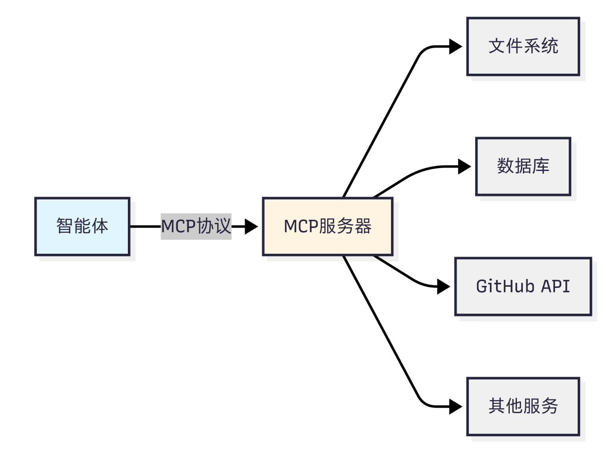
### A2A 智能体之间的对话

A2A 是由 Google 提出的智能体间通信协议，旨在解决多个智能体之间的协作与交互问题。与 MCP 侧重于智能体访问外部工具不同，A2A 关注的是智能体之间如何进行信息交换、任务协商和协同工作，使多个智能体能够像人类团队一样共同完成复杂任务。

A2A 的核心思想是**对等通信（Peer-to-Peer Communication）**。在 A2A 网络中，每个智能体既可以作为服务提供者，也可以作为服务消费者，既能够主动向其他智能体发起请求，也能够接收并处理来自其他智能体的请求。这种去中心化的通信模式避免了对单一协调中心的依赖，提高了系统的灵活性、扩展性和容错能力。


> A2A 是智能体之间协作的标准通信协议，通过对等通信机制，使多个智能体能够高效地对话、协商和协同完成任务。

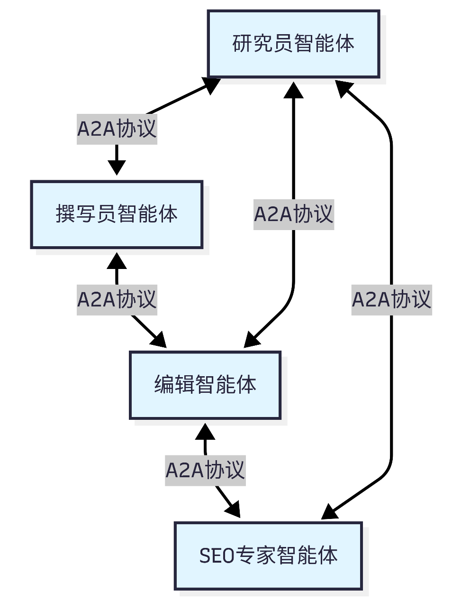
dd### ANP：智能体网络的基础设施

ANP（Agent Network Protocol）是一种面向大规模智能体网络的概念性协议框架，目前主要由开源社区推动，生态仍处于早期发展阶段。与 MCP 解决智能体访问工具的问题、A2A 解决智能体之间协作的问题不同，ANP 关注的是在庞大的智能体网络中，如何实现智能体的发现、连接与通信。

ANP 的核心思想是**去中心化服务发现（Decentralized Service Discovery）**。当网络中存在大量智能体时，智能体不可能预先知道所有其他智能体的位置和能力。为此，ANP 提供了服务注册、服务发现和路由机制，使智能体能够动态查找网络中的其他智能体或服务，并建立连接，无需手动配置复杂的连接关系。


> ANP 是面向大规模智能体网络的基础设施协议，通过服务注册、发现和路由机制，实现智能体的动态发现与连接。
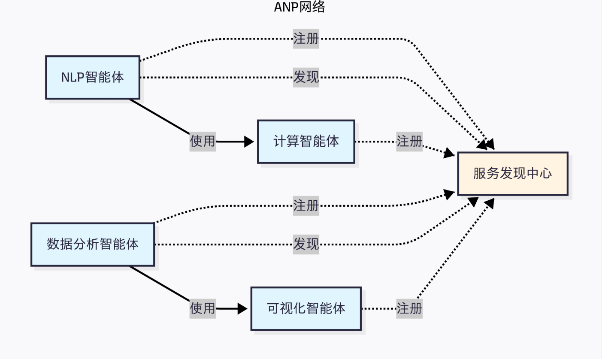

ddd### 如何选择合适的协议
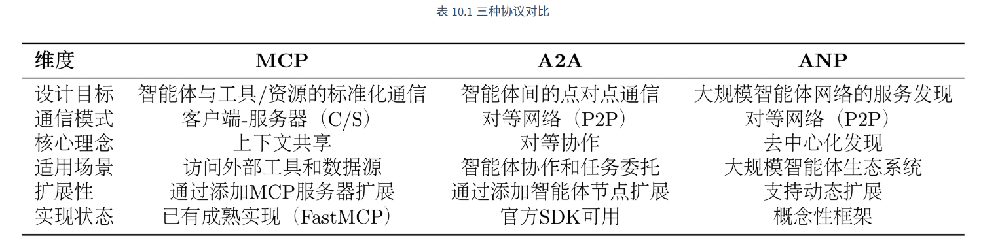

目前的协议还处于发展早期，MCP 的生态相对成熟，不过各种工具的时效性取决于维护者，更推荐选择大公司背书的 MCP 工具。

选择协议的关键在于理解你的需求：

- 如果你的智能体需要访问外部服务（文件、数据库、API），选择**MCP**
- 如果你需要多个智能体相互协作完成任务，选择**A2A**
- 如果你要构建大规模的智能体生态系统，考虑**ANP**

dda#dd# HelloAgent 的通信设计

HelloAgents 的通信协议架构采用三层设计，从底层到上层分别是：==协议实现层、工具封装层和智能体集成层。==

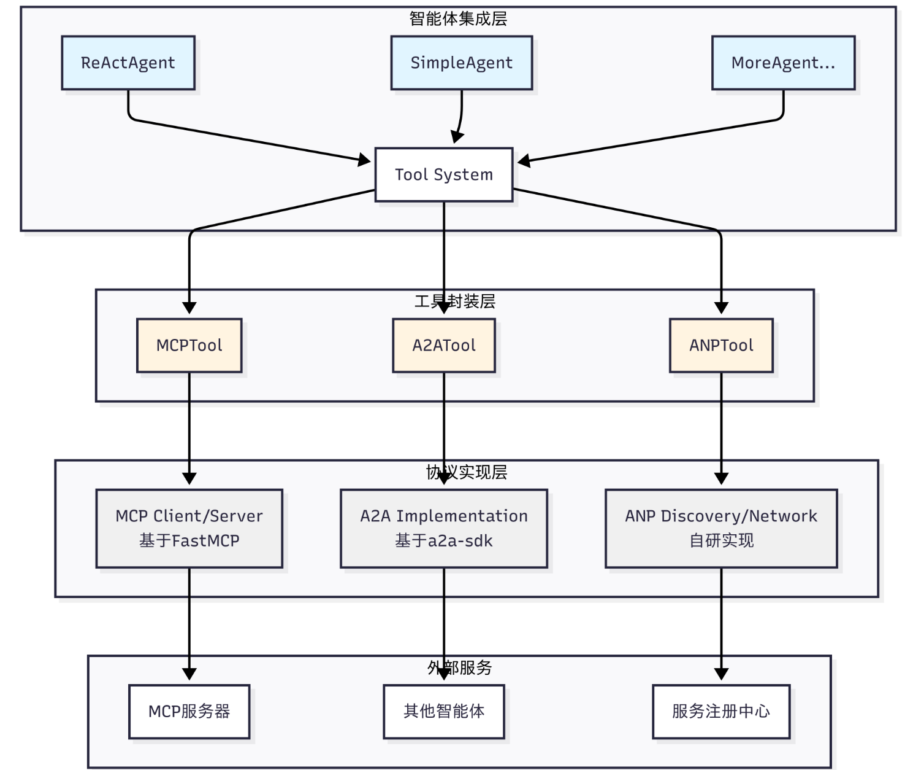

**（1）协议实现层**：这一层包含了三种协议的具体实现。MCP 基于 FastMCP 库实现，提供客户端和服务器功能；A2A 基于 Google 官方的 a2a-sdk 实现；ANP 是我们自研的轻量级实现，提供服务发现和网络管理功能，当然目前也有官方的[实现](https://github.com/agent-network-protocol/AgentConnect)，考虑到后期的迭代，因此这里只做概念的模拟。

**（2）工具封装层**：这一层将协议实现封装成统一的 Tool 接口。MCPTool、A2ATool 和 ANPTool 都继承自 BaseTool，提供一致的`run()`方法。这种设计让智能体能够以相同的方式使用不同的协议。

**（3）智能体集成层**：这一层是智能体与协议的集成点。所有的智能体（ReActAgent、SimpleAgent 等）都通过 Tool System 来使用协议工具，无需关心底层的协议细节。

## 学习内容和目标

```
hello_agents/
├── protocols/                          # 通信协议模块
│   ├── mcp/                            # MCP协议实现（Model Context Protocol）
│   │   ├── client.py                   # MCP客户端（支持5种传输方式）
│   │   ├── server.py                   # MCP服务器（FastMCP封装）
│   │   └── utils.py                    # 工具函数（create_context/parse_context）
│   ├── a2a/                            # A2A协议实现（Agent-to-Agent Protocol）
│   │   └── implementation.py           # A2A服务器/客户端（基于a2a-sdk，可选依赖）
│   └── anp/                            # ANP协议实现（Agent Network Protocol）
│       └── implementation.py           # ANP服务发现/注册（概念性实现）
└── tools/builtin/                      # 内置工具模块
    └── protocol_tools.py               # 协议工具包装器（MCPTool/A2ATool/ANPTool）
```

主要是应用为主，学习目标是能拥有在自己项目中应用协议的能力

简单演示
```py
from hello_agents.tools import MCPTool, A2ATool, ANPTool

# 1. MCP：访问工具
mcp_tool = MCPTool()
result = mcp_tool.run({
    "action": "call_tool",
    "tool_name": "add",
    "arguments": {"a": 10, "b": 20}
})
print(f"MCP计算结果: {result}")  # 输出: 30.0

# 2. ANP：服务发现
anp_tool = ANPTool()
anp_tool.run({
    "action": "register_service",
    "service_id": "calculator",
    "service_type": "math",
    "endpoint": "http://localhost:8080"
})
services = anp_tool.run({"action": "discover_services"})
print(f"发现的服务: {services}")

# 3. A2A：智能体通信
a2a_tool = A2ATool("http://localhost:5000")
print("A2A工具创建成功")
```


sds
# MCP 协议实战
## MCP 概念介绍
### 1. mcp: 智能体的"USB-C"

在传统模式下，智能体访问不同服务（如文件系统、数据库、GitHub、Slack、Google Drive）需要为每个服务手动编写适配器，处理各自的 API、认证和错误逻辑，不仅开发工作量大，而且难以维护和复用。此外，不同 LLM 平台对函数调用（function call）的实现存在差异，模型切换时往往需要重写大量代码。

**MCP（Model Context Protocol）的出现解决了这一问题：**

- **统一接口**：像 USB-C 一样，将各种外部工具和服务的访问方式标准化。
- **跨模型兼容**：支持不同 LLM（Claude、GPT 等），无需针对每个平台重新开发适配器。
- **简化开发与维护**：减少重复代码和复杂性，提高系统可扩展性。
- **上下文共享**：智能体不仅获取结果，还能访问丰富的上下文信息，使决策更智能。


> MCP 将智能体与外部工具的交互标准化，实现跨模型、跨服务的无缝访问，大幅降低开发和维护成本。


### 2. mcp架构

MCP 协议采用 ==Host、Client、Servers== 三层架构设计

假设你正在使用 Claude Desktop 询问："我桌面上有哪些文档？" 那么：
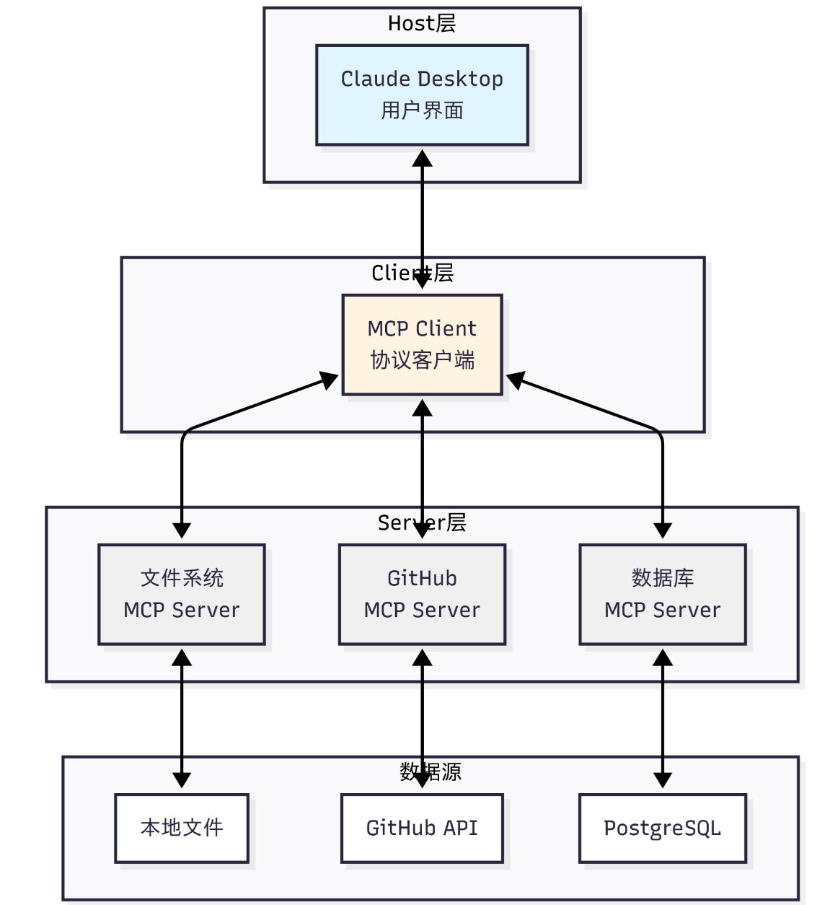

1. **Host（宿主层）**：Claude Desktop 作为 Host，负责接收用户提问并与 Claude 模型交互。Host 是用户直接交互的界面，它管理整个对话流程。
    
2. **Client（客户端层）**：当 Claude 模型决定需要访问文件系统时，Host 中内置的 MCP Client 被激活。Client 负责与适当的 MCP Server 建立连接，发送请求并接收响应。
    
3. **Server（服务器层）**：文件系统 MCP Server 被调用，执行实际的文件扫描操作，访问桌面目录，并返回找到的文档列表。
    

**完整的交互流程：** 用户问题 → Claude Desktop(Host) → Claude 模型分析 → 需要文件信息 → MCP Client 连接 → 文件系统 MCP Server → 执行操作 → 返回结果 → Claude 生成回答 → 显示在 Claude Desktop 上

这种架构设计的优势在于**关注点分离**：Host 专注于用户体验，Client 专注于协议通信，Server 专注于具体功能实现。开发者只需专注于开发对应的 MCP Server，无需关心 Host 和 Client 的实现细节。

### 3. mcp 核心能力

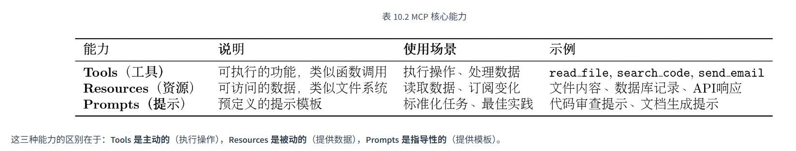

**Tools 是主动的**（执行操作），**Resources 是被动的**（提供数据），**Prompts 是指导性的**（提供模板）。

### 4. mcp 工作流程

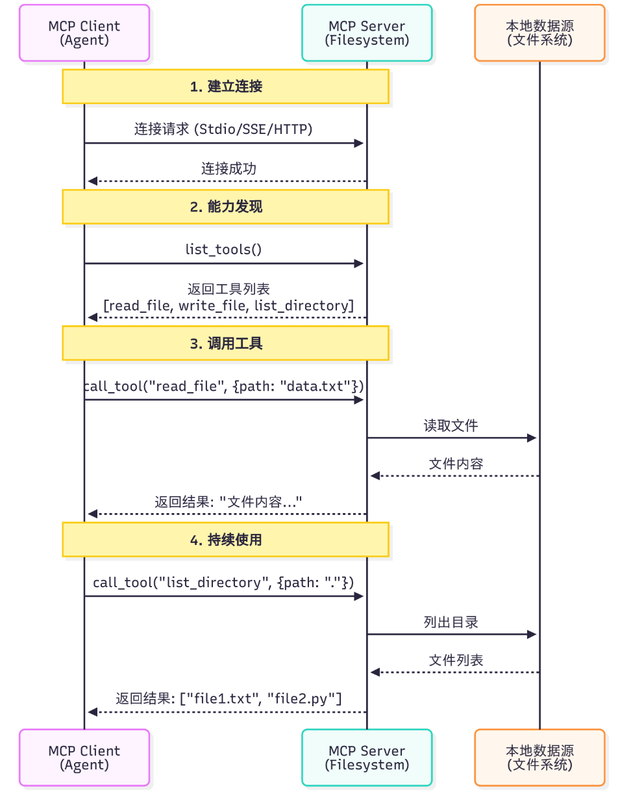

#### MCP 中 LLM 的工具选择流程
1. **工具发现（Tool Discovery）**
    - MCP Client 连接 MCP Server。
        
    - 调用 `list_tools()` 获取所有可用工具及其描述、参数信息。
        
2. **上下文构建（Context Building）**
    - Client 将工具列表转换为 LLM 可理解的格式。
        
    - 将工具信息加入系统提示词（Prompt）中。
        
3. **模型决策（Tool Selection）**
    - LLM 根据用户问题、对话上下文和工具描述。
        
    - 判断是否需要调用工具，以及选择哪个工具。
        
4. **工具执行（Tool Execution）**
    - Client 按照 LLM 的决策调用对应工具。
        
    - MCP Server 执行工具并返回结果。
        
5. **结果整合（Result Integration）**
    - 工具结果返回给 LLM。
        
    - LLM 结合结果生成最终回答。
    
---

- 工具选择过程由 LLM 自动完成。
    
- LLM 是否使用工具，主要依赖工具描述信息。
    
- 工具描述越清晰、准确，模型选择和调用效果越好。
    

> MCP 通过“发现工具 → 告知模型 → 模型决策 → 执行工具 → 整合结果”的流程，实现智能体对外部工具的自动选择与调用。


### 5. MCP vs Function Calling 
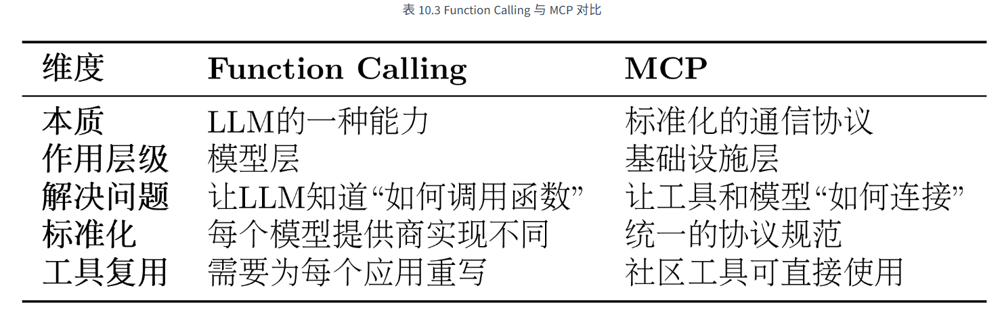


Function Calling 相当于你学会了“如何打电话”这项技能，包括何时拨号、如何与对方沟通、何时挂断。
而 MCP 则是那个全球统一的“电话通信标准”，确保了任何一部电话都能顺利地拨通另一部。

## 使用mcp客户端

### 概述

`MCPClient` 是 FastMCP 2.0 的异步客户端封装，用于连接**任何实现了 MCP 协议**的服务器。
支持 4 种连接方式：

| 方式 | 输入类型 | 示例 |
|------|---------|------|
| stdio 命令列表 | `list` | `["npx", "-y", "package", "."]` |
| HTTP/SSE URL | `str` | `"http://localhost:8000/mcp"` |
| 本地脚本路径 | `str` | `"path/to/server.py"` |
| 内存模式 | `FastMCP` | `FastMCP("server")` |

### 快速开始
#### 安装依赖

```bash
pip install fastmcp
```

#### 内存模式 — 无需网络，同进程通信
```python

import asyncio
from fastmcp import FastMCP
from hello_agents.protocols.mcp import MCPClient

  
# 1. 创建内存 MCP 服务器，注册工具
server = FastMCP("DemoServer")


@server.tool()
def add(a: int, b: int) -> int:
    """将两个数相加"""
    return a + b

@server.tool()
def greet(name: str) -> str:
    """向指定姓名打招呼"""
    return f"你好, {name}!"

# 2. 连接并调用
async with MCPClient(server) as mcp:
    tools = await mcp.list_tools()
    result = await mcp.call_tool("add", {"a": 10, "b": 20})

```

  
#### stdio 模式 — 连接 npx MCP 服务器

需要安装 [Node.js](https://nodejs.org/)，`npx` 会自动下载包：
```python
import asyncio
from hello_agents.protocols.mcp import MCPClient


async with MCPClient([
    "npx", "-y",
    "@modelcontextprotocol/server-filesystem",
    "."   # 文件系统根目录
]) as mcp:
    tools = await mcp.list_tools()
    result = await mcp.call_tool("read_file", {"path": "README.md"})
```


其他官方 MCP 服务器（[GitHub 仓库](https://github.com/modelcontextprotocol/servers)）：

| 包名 | 功能 |
|------|------|
| `@modelcontextprotocol/server-filesystem` | 文件系统操作 |
| `@modelcontextprotocol/server-github` | GitHub API |
| `@modelcontextprotocol/server-postgres` | PostgreSQL 数据库 |
| `@modelcontextprotocol/server-sqlite` | SQLite 数据库 |
| `@modelcontextprotocol/server-puppeteer` | 浏览器自动化 |


#### HTTP 模式 — 连接远程 MCP 服务器

```python
async with MCPClient("http://localhost:8000/mcp") as mcp:
    prompts = await mcp.list_prompts()
    result = await mcp.get_prompt("greeting", {"name": "MCP"})

```

  
#### 本地脚本模式

```python
async with MCPClient("path/to/mcp_server.py") as mcp:

    resources = await mcp.list_resources()

    content = await mcp.read_resource("file:///data/doc.txt")
```

  

### API 参考

#### 连接生命周期

```python
# 方式 A: 上下文管理器（推荐）
async with MCPClient(server) as mcp:
    await mcp.list_tools()

  
# 方式 B: 手动管理
mcp = MCPClient(server)
await mcp.connect()
try:
    await mcp.call_tool(...)
finally:
    await mcp.disconnect()

```

  
#### 核心方法

| 方法 | 说明 | 返回 |
|------|------|------|
| `list_tools()` | 列出所有可用工具 | `List[Tool]` |
| `call_tool(name, args)` | 调用指定工具 | `CallToolResult` |
| `list_resources()` | 列出所有可用资源 | `List[Resource]` |
| `read_resource(uri)` | 读取指定资源 | `ReadResourceResult` |
| `list_prompts()` | 列出所有提示模板 | `List[Prompt]` |
| `get_prompt(name, args)` | 获取指定提示模板 | `PromptResult` |

  

#### 结果提取

MCP 返回的结果对象，通过 `content` 字段获取文本：
```python
result = await mcp.call_tool("add", {"a": 1, "b": 2})


# 提取文本内容
content = getattr(result, "content", [])
if content:
    text = getattr(content[0], "text", str(content[0]))
    print(text)  # "3"

```
#### 错误处理

```python
try:
    async with MCPClient() as mcp:
        pass
except ValueError as e:
    print(f"未指定服务器: {e}")

  
# 未连接时调用工具会抛出 RuntimeError
mcp = MCPClient(server)
try:
    await mcp.list_tools()
except RuntimeError as e:
    print(f"请先连接: {e}")

```


### 与 MCPTool 集成

`MCPTool` 将异步的 `MCPClient` 包装为同步 Tool，供 Agent 调用：

```python
from hello_agents.tools import MCPTool


# 方式 1: 预置连接参数（惰性连接）
mcp_tool = MCPTool(connection=[
    "npx", "-y",
    "@modelcontextprotocol/server-filesystem",
    "."

])
result = mcp_tool.run({
    "action": "call_tool",
    "tool_name": "read_file",
    "arguments": {"path": "README.md"}
})

# 方式 2: 传入已连接的 MCPClient

from hello_agents.protocols import MCPClient
import asyncio

client = MCPClient(FastMCP("Demo"))
asyncio.run(client.connect())
tool = MCPTool(client=client)

  

# 方式 3: 在 run 中连接
mcp_tool = MCPTool()
mcp_tool.run({"action": "connect", "server": ["python", "server.py"]})
mcp_tool.run({"action": "list_tools"})

```

  

#### MCPTool 支持的操作

| action | 说明 | 必要参数 |
|--------|------|---------|
| `connect` | 连接 MCP 服务器 | `server` |
| `disconnect` | 断开连接 | — |
| `list_tools` | 列出可用工具 | — |
| `call_tool` | 调用工具 | `tool_name`, `arguments` |
| `list_resources` | 列出资源 | — |
| `read_resource` | 读取资源 | `uri` |
| `list_prompts` | 列出提示模板 | — |
| `get_prompt` | 获取提示 | `name`, `arguments` |

  

### 完整测试示例

见 [test/testMCP/mcpClient.py](D:\learnings\py_learning\agent_learn\Hello_Agents\codes\hello-agent-codes\7-HelloAgents构建\test\testMCP\mcpClient.py)，包含：

| 测试 | 说明 |
|------|------|
| `test_in_memory()` | 内存模式 — 建服务器→注册工具→调用 |
| `test_file_server()` | stdio 模式 — 连接 server-filesystem |
| `test_discover_tools()` | 查看工具参数 Schema |
| `test_connection_errors()` | 错误处理测试 |

  
### 架构示意
```
外部 MCP 服务器       MCPClient             MCPTool           Agent

(npx包/远程服务)  ←→  (异步客户端)  ←→  (同步包装器)  ←→  (使用工具)

                      fastmcp.Client   asyncio.run_coro_threadsafe

                      StdioTransport   专用事件循环线程
```

  

### 参考

- [MCP 协议官方文档](https://modelcontextprotocol.io/)
- [FastMCP GitHub](https://github.com/jlowin/fastmcp)
- [MCP 官方服务器集合](https://github.com/modelcontextprotocol/servers)
- [FastMCP PyPI](https://pypi.org/project/fastmcp/)

## 在智能体中使用MCP

### 架构总览

```
┌─────────────────────────────────────────────────────────┐

│                     智能体 (Agent)                       │

│  MySimpleAgent / MyFunctionAgent / ReActAgent           │

│         │                                               │

│         ▼                                               │

│  ToolRegistry.execute_tool("mcp", params)               │

│         │                                               │

│         ▼                                               │

│  MCPTool.run(parameters)        ← 同步包装器            │

│    └─ daemon 线程 + 独立事件循环                         │

│         │                                               │

│         ▼                                               │

│  MCPClient (异步)                                       │

│    ├─ connect() / disconnect()                          │

│    ├─ list_tools() / call_tool()                        │

│    ├─ list_resources() / read_resource()                │

│    └─ list_prompts() / get_prompt()                     │

│         │                                               │

│         ▼                                               │

│  传输层 (Transport)                                     │

│    ├─ StdioTransport  ← 本地子进程                      │

│    ├─ SSETransport    ← 远程 HTTP/SSE                   │

│    └─ 内存模式         ← 同进程 FastMCP 实例            │

│         │                                               │

│         ▼                                               │

│  MCP 服务器 (filesystem / database / custom ...)        │

└─────────────────────────────────────────────────────────┘

```


**核心链路**：Agent → ToolRegistry → MCPTool(同步桥) → MCPClient(异步) → Transport → MCP Server

---

  

 **核心澄清：Agent 不会"自动调用 MCPTool"**

这是一个很自然但需要澄清的疑惑。**Agent 不区分 MCPTool 和其他工具**——所有工具在 ToolRegistry 里是**平等注册、按名匹配**的。
#### 工具调用的真实流程
```
多个工具注册 → 全部描述写入 system prompt → LLM 选一个 → Agent 按名称执行
```

举例：

```python

# 三个工具注册到同一个 registry

registry.register_tool(calculator_tool)        # 名称: "calculator"

registry.register_tool(search_tool)             # 名称: "search"

registry.register_tool(MCPTool(...))            # 名称: "mcp"

```

  

Agent 在 system prompt 中看到的工具描述是：

```text
## 可用工具

- calculator: 执行数学计算，传入表达式如 '1+2*3'

- search: 搜索知识库，返回相关文档

- mcp: MCP 服务器工具，支持调用远程工具/资源/提示

```


**LLM 根据用户的问题选择工具**：

| 用户问题                | LLM 选择的工具    | 原因                       |
| ------------------- | ------------ | ------------------------ |
| "计算 1+2×3"          | `calculator` | 描述匹配数学计算                 |
| "搜索昨天的会议记录"         | `search`     | 描述匹配搜索                   |
| "读取 /etc/config 文件" | `mcp`        | 只有 MCP 能操作远程服务器          |
| "用服务器上的 add 工具计算"   | `mcp`        | 同上，且带参数 action=call_tool |

  

#### MCPTool 的特殊之处

MCPTool 不特殊在"被优先调用"，而是特殊在它是一个**门面（Facade）工具**：

| 普通工具                          | MCPTool                          |
| ----------------------------- | -------------------------------- |
| 一个工具只做一件事（如 `calculator` 只算数） | 一个工具通过 `action` 参数分发到多个子操作       |
| 参数直接是业务参数（如 `expression`）     | 参数先声明 `action`，再传业务参数            |
| 注册多个就要写多个 Tool 类              | 注册一个 MCPTool = 接入整个 MCP 服务器的所有工具 |

所以如果你的 ToolRegistry 里**只注册了 MCPTool 这一个工具**，那 LLM 自然只能选它——不是因为 Agent 偏爱它，而是**没别的可选**。


---

  

### 第一步：启动 MCP 服务器

MCP 服务器提供工具/资源/提示。常见方式：

#### 方式 A：使用现成的 npm 包
```bash
npx -y @modelcontextprotocol/server-filesystem .

npx -y @modelcontextprotocol/server-github ...

```


#### 方式 B：自建 Python 服务器

```python
from fastmcp import FastMCP

server = FastMCP("MyServer")


@server.tool()
def add(a: int, b: int) -> int:
    """将两个数相加"""
    return a + b

  
@server.tool()
def search_db(query: str) -> str:
    """搜索数据库"""
    return f"查询结果: {query}"
server.run()  # 启动 stdio 模式
```

#### 方式 C：远程 HTTP/SSE 服务器

```python
from fastmcp import FastMCP
server = FastMCP("RemoteServer")

@server.tool()
def greet(name: str) -> str:
    return f"你好, {name}!"

  
# 以 SSE 模式启动（需要 uvicorn 等 ASGI 服务器）
# uvicorn run:app --host 0.0.0.0 --port 8000

```

---


### 第二步：连接 MCP 服务器（MCPClient）


`MCPClient` 是异步客户端，支持 **5 种连接方式**：

```python
from hello_agents.protocols.mcp import MCPClient
```

#### 1. stdio 模式 — 本地子进程

```python
async with MCPClient(["npx", "-y", "@modelcontextprotocol/server-filesystem", "."]) as mcp:

    tools = await mcp.list_tools()
    result = await mcp.call_tool("read_file", {"path": "README.md"})

```


#### 2. HTTP/SSE 模式 — 远程服务器

```python
async with MCPClient("http://localhost:8000/mcp") as mcp:

    tools = await mcp.list_tools()

```

  
#### 3. SSE 自定义配置 — 带鉴权/超时

```python
from hello_agents.protocols.mcp.transports import SSEConfig

config = SSEConfig(
    url="http://localhost:8000/mcp",
    headers={"Authorization": "Bearer sk-xxx"},
    timeout=120.0,
)

async with MCPClient(config) as mcp:
    tools = await mcp.list_tools()

```

#### 4. 快捷参数

```python
async with MCPClient(
    "http://localhost:8000/mcp",
    sse_headers={"Authorization": "Bearer sk-xxx"},
    sse_timeout=120.0,
) as mcp:
    tools = await mcp.list_tools()

```

#### 5. 内存模式 — 同进程通信（测试/开发用）

```python
from fastmcp import FastMCP

server = FastMCP("Demo")
@server.tool()
def add(a: int, b: int) -> int:
    return a + b

async with MCPClient(server) as mcp:
    result = await mcp.call_tool("add", {"a": 1, "b": 2})
```


#### MCPClient 核心方法


| 方法                           | 说明       |
| ---------------------------- | -------- |
| `connect()` / `disconnect()` | 手动连接管理   |
| `list_tools()`               | 列出所有可用工具 |
| `call_tool(name, args)`      | 调用工具     |
| `list_resources()`           | 列出资源     |
| `read_resource(uri)`         | 读取资源     |
| `list_prompts()`             | 列出提示模板   |
| `get_prompt(name, args)`     | 获取提示内容   |

  

---

  

### 第三步：桥接同步层（MCPTool）


智能体运行在同步环境中，`MCPTool` 是连接异步 `MCPClient` 与同步 `Agent` 的桥梁。
它使用 **daemon 线程 + 独立事件循环** 模式，将异步调用转为同步等待（最长 60s 超时）。

```python

from hello_agents.tools import MCPTool, create_mcp_tool

```


#### 创建 MCPTool

```python
# 方式 A：传入连接参数（惰性连接，首次 run() 时自动连接）
tool = MCPTool(connection=["python", "my_server.py"])


# 方式 B：传入已连接的 MCPClient
import asyncio
client = MCPClient(FastMCP("Demo"))
asyncio.run(client.connect())
tool = MCPTool(client=client)

# 方式 C：使用工厂函数
tool = create_mcp_tool(connection=["npx", "-y", "server-filesystem", "."])

```

  
#### MCPTool 的 action 分发

所有操作通过 `run({"action": "...", ...})` 入口：

```python
# 手动连接
tool.run({"action": "connect", "server": ["python", "server.py"]})

  
# 列出工具
tool.run({"action": "list_tools"})

  
# 调用工具
tool.run({"action": "call_tool", "tool_name": "add", "arguments": {"a": 1, "b": 2}})

  
# 读取资源
tool.run({"action": "read_resource", "uri": "file:///data/doc.txt"})

  
# 断开连接
tool.run({"action": "disconnect"})

```


#### 常见参数速查

  

| action | 必填参数 | 可选参数 |
|--------|---------|---------|
| `connect` | — | `server`（连接目标） |
| `disconnect` | — | — |
| `list_tools` | — | — |
| `call_tool` | `tool_name`, `arguments` | — |
| `list_resources` | — | — |
| `read_resource` | `uri` | — |
| `list_prompts` | — | — |
| `get_prompt` | `name` | `arguments` |

  
---


### 第四步：注册到智能体（Agent）

#### 在所有支持工具的智能体中使用


目前 **3 种智能体** 支持 MCP 工具集成：
#### MySimpleAgent

```python
from hello_agents.agents import MySimpleAgent
from hello_agents.tools import MCPTool

agent = MySimpleAgent(name="助手", llm=llm)

# 注册 MCP 工具（内部自动创建 ToolRegistry）
mcp_tool = MCPTool(connection=["python", "math_server.py"])
agent.add_tool(mcp_tool)

  
# 智能体会在对话中自动调用 MCP 工具
# LLM 输出 [TOOL_CALL:tool_name:params] → 解析执行 → 返回结果
agent.run("请计算 12345 + 67890")

```


#### MyFunctionAgent

```python

from hello_agents.agents import MyFunctionAgent
from hello_agents.tools import MCPTool, ToolRegistry

# 创建 ToolRegistry 并注册 MCPTool
registry = ToolRegistry()
registry.register_tool(MCPTool(connection=["python", "math_server.py"]))

# 传入智能体
agent = MyFunctionAgent(name="助手", llm=llm, tool_registry=registry)

# 或动态添加
agent.add_tool(MCPTool(connection=["python", "math_server.py"]))


# 智能体会在对话中调用工具
# LLM 输出 tool_name({"key": "value"}) → 解析执行 → 返回结果
agent.run("计算 1 + 2 = ?")

```


#### ReActAgent

```python
from hello_agents.agents import ReActAgent
from hello_agents.tools import MCPTool

agent = ReActAgent(name="助手", llm=llm)

# 直接操作 tool_registry
agent.tool_registry.register_tool(MCPTool(connection=["python", "math_server.py"]))

# ReAct 循环: Thought → Action → Observation → Finish
agent.run("查询文件系统根目录有哪些文件")

```

  
---


### 完整示例：从零到智能体调用 MCP 工具

  

```python

"""演示：智能体通过 MCP 连接远程工具"""
import asyncio
from fastmcp import FastMCP
from hello_agents.llm import HelloAgentsLLM
from hello_agents.agents import MySimpleAgent
from hello_agents.tools import MCPTool

  
# 1. 创建MCP 服务器（内存模式）
server = FastMCP("MathServer")

@server.tool()
def add(a: int, b: int) -> int:
    """将两个数相加"""
    return a + b

  

@server.tool()
def multiply(a: int, b: int) -> int:
    """将两个数相乘"""
    return a * b

  

# 2. 连接并创建 MCPTool
async def setup():
    client = MCPClient(server)
    await client.connect()
    return MCPTool(client=client)


mcp_tool = asyncio.run(setup())

  

# 3. 创建智能体并注册工具
llm = HelloAgentsLLM(api_key="...", model="gpt-4")
agent = MySimpleAgent(name="计算助手", llm=llm)
agent.add_tool(mcp_tool)
  

# 4. 运行智能体
response = agent.run("请计算 (5 + 3) * 2 的结果")
print(response)
```

  
---


### 常见场景

  
#### 场景 1：文件系统操作

```python
# 连接文件系统 MCP 服务器
tool = MCPTool(connection=[
    "npx", "-y", "@modelcontextprotocol/server-filesystem", "/workspace"
])

agent.add_tool(tool)
# 智能体可以：读取文件、写入文件、列出目录...
```

  

#### 场景 2：数据库查询
```python
# 连接数据库 MCP 服务器
tool = MCPTool(connection=["python", "db_server.py"])
agent.add_tool(tool)
# 智能体可以：执行 SQL、查询表结构、获取数据...
```

  

#### 场景 3：远程 API 网关

```python

# 连接远程 HTTP MCP 服务器
from hello_agents.protocols.mcp.transports import SSEConfig


config = SSEConfig(
    url="https://api.example.com/mcp",
    headers={"Authorization": f"Bearer {API_KEY}"},
    timeout=30,

)
tool = MCPTool(connection=config)
agent.add_tool(tool)
# 智能体可以：调用远程 API、获取数据...

```

  
---

  
### 注意事项

#### 连接生命周期

- `MCPTool` 默认**惰性连接**：首次 `run()` 时才建立连接
- 如果 MCP 服务器未启动，首次调用会超时（最长 60s）
- 建议在智能体启动前确保服务器可用

  

#### 线程安全

- `MCPTool` 使用专用 daemon 线程运行事件循环
- 支持在 Jupyter、FastAPI 等已有事件循环的环境中使用
- 每个 `MCPTool` 实例拥有独立的事件循环

  

#### 错误处理

```python
try:
    result = tool.run({"action": "call_tool", "tool_name": "add", "arguments": {"a": 1, "b": 2}})
except TimeoutError:
    print("MCP 服务器无响应")
except ConnectionError:
    print("无法连接到 MCP 服务器")
except RuntimeError as e:
    print(f"调用失败: {e}")

```

#### 性能建议

- 一个 `MCPTool` 实例对应一个 MCP 服务器连接
- 多个智能体可以共享同一个 `MCPTool` 实例
- 不需要时调用 `tool.run({"action": "disconnect"})` 释放资源

---

  

### 相关文件索引


| 文件 | 作用 |
|------|------|
| `protocols/mcp/client.py` | MCPClient 异步客户端 |
| `protocols/mcp/transports/sse.py` | SSE 传输实现 |
| `protocols/mcp/transports/__init__.py` | 传输层导出 |
| `tools/builtin/protocol_tools.py` | MCPTool 同步包装器 |
| `tools/registry.py` | ToolRegistry 工具注册中心 |
| `core/agent.py` | Agent 基类 |
| `agents/my_simple_agent.py` | 支持工具的智能体（标记解析） |
| `agents/my_function_agent.py` | 支持工具的智能体（函数调用） |
| `agents/react_agent.py` | 支持工具的智能体（ReAct 循环） |

# A2A 协议实战

A2A（Agent-to-Agent）是一种支持智能体之间直接通信与协作的协议。

## 设计动机


**A2A（Agent-to-Agent）协议**专门解决多个智能体之间的协作问题，而 **MCP（Model Context Protocol）** 主要解决智能体与外部工具之间的交互问题。

在传统的多智能体系统中，通常采用**中央协调器（星型拓扑）**模式，但存在三大缺陷：
- **单点故障**：协调器失效会导致整个系统停止工作。
    
- **性能瓶颈**：所有消息都需经过中心节点，影响并发能力。
    
- **扩展性差**：新增或调整智能体时，需要修改协调器逻辑。
    

为此，A2A 采用**点对点（P2P）网状拓扑**架构，使智能体能够直接通信、任务委托、能力协商和状态同步，从而提升系统的可靠性、性能和扩展性。


> **MCP 让 Agent 能调用外部世界的工具，A2A 让多个 Agent 能像团队成员一样直接协作完成复杂任务。**

 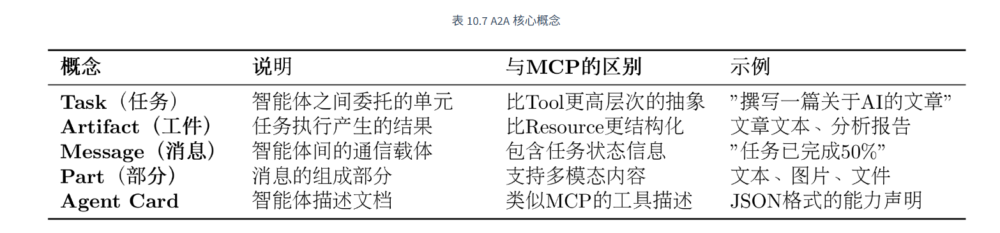


为实现对协作过程的管理，A2A 为任务定义了标准化的生命周期，包括==创建、协商、代理、执行中、完成、失败==等状态

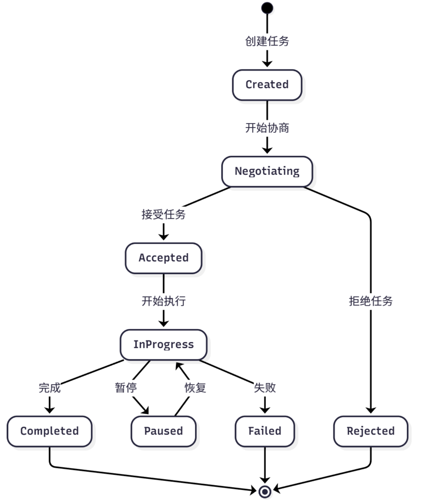


A2A 请求生命周期是一个序列，详细说明了请求遵循的四个主要步骤：==代理发现、身份验证、发送消息 API 和发送消息流 API==。
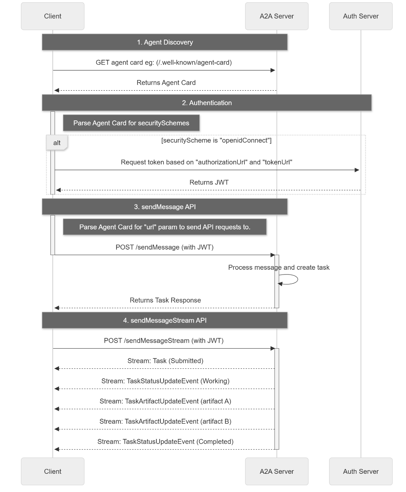

## 使用a2a协议
