[[参考Qdrant基础课程 向量数据库](https://qdrant.org.cn/course/essentials/)]

# 0-设置和开始
通过官方视频可以知道 如何创建一个==cluster和了解图形化界面==


## 实现基本向量搜索

通过python客户端来连接测试 Qdrant

在此之前需要下载所需依赖==**`!pip install qdrant-client`**== 

### 连接

```py
from qdrant_client import QdrantClient
import os
import dotenv
  
dotenv.load_dotenv()

qdrant_client = QdrantClient(
    url=os.getenv("QDRANT_CLUSTER_ENDPOINT"),
    api_key=os.getenv("QDRANT_API_KEY"),

)

print(qdrant_client.get_collections())
----------
----------
collections=[]
```
### 创建第一个集合
Qdrant 中的 [集合](https://qdrant.org.cn/documentation/manage-data/collections/) 类似于关系数据库中的表，是用于存储向量及其元数据的容器。创建集合时，请指定：

- **名称**：集合的唯一标识符
- **向量配置**:
    - **大小 (Size)**：向量的维度
    - **距离度量 (Distance Metric)**：衡量向量间相似度的方法

```py
# Define the collection name
collection_name = "my_first_collection"

# Create the collection with specified vector parameters
client.create_collection(
    collection_name=collection_name,
    vectors_config=models.VectorParams(
        size=4,  # Dimensionality of the vectors
        distance=models.Distance.COSINE  # Distance metric for similarity search
    )
)
```
预期输出：`True`（表示创建成功）

**距离度量详解** ([了解更多](https://qdrant.org.cn/documentation/manage-data/collections/#distance-metrics))

- **欧几里得距离 (Euclidean)**：测量空间中点与点之间的直线距离
- **余弦相似度 (Cosine)**：测量向量之间的角度，侧重于方向而非量级
- **点积 (Dot)**：测量向量的点积，同时捕捉量级和方向

### 向集合中插入点

[点 (Points)](https://qdrant.org.cn/documentation/manage-data/points/) 是 Qdrant 中的核心数据实体。每个点包含：

- **ID**：唯一标识符
- **向量数据**：代表向量空间中数据点的数值数组
- **负载 (Payload，可选)**：附加的元数据
```python
# Define the vectors to be inserted
points = [
    models.PointStruct(
        id=1,
        vector=[0.1, 0.2, 0.3, 0.4],  # 4D vector
        payload={"category": "example"}  # Metadata (optional)
    ),
    models.PointStruct(
        id=2,
        vector=[0.2, 0.3, 0.4, 0.5],
        payload={"category": "demo"}
    )
]

# Insert vectors into the collection
client.upsert(
    collection_name=collection_name,
    points=points
)
```
预期输出：`UpdateResult(operation_id=2, status=<UpdateStatus.COMPLETED: 'completed'>)`

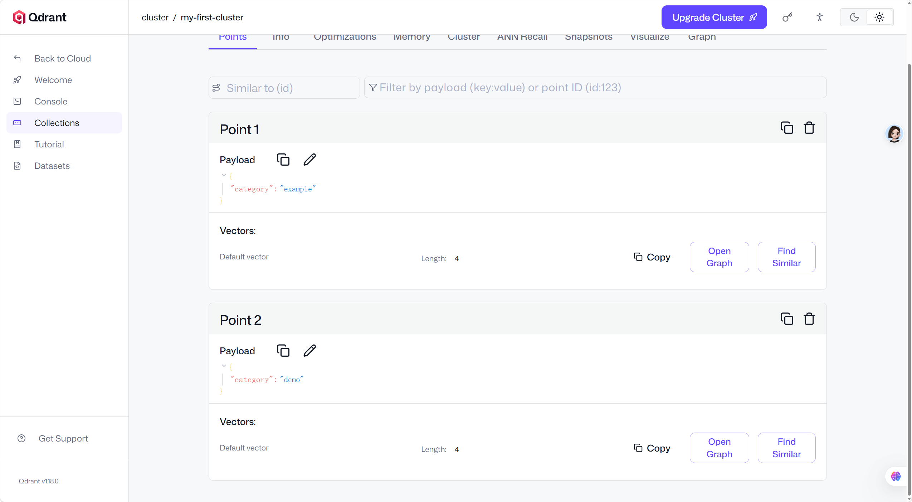

### 相似度搜索
使用 Qdrant 的搜索功能查找与给定查询最相似的向量

**相似度搜索的工作原理**

- Qdrant 会搜索集合以找到与您的查询向量最接近的向量。
- 结果按相似度分数排序，最佳匹配项会显示在最前面。
```python
query_vector = [0.08, 0.14, 0.33, 0.28]

search_results = client.query_points(
    collection_name=collection_name,
    query=query_vector,
    limit=1  # Return the top 1 most similar vector
)

print("Search results:", search_results)
```

查询结果 和id为1的相匹配
`Search results: points=[ScoredPoint(id=1, version=4, score=0.97642946, payload={'category': 'example'}, vector=None, shard_key=None, order_value=None)]`

自此学习简单使用如何创建集合 和插入点 并简单实现相似度搜索

# 1-向量搜索基础
## 点，向量，负载
### 点(Points):核心实体
点是 Qdrant 操作的核心实体。一个点是由三个部分组成的记录：
- **唯一 ID**（64 位无符号整数或 UUID）
- **向量**（稠密向量、稀疏向量或多向量）
- **可选载荷**（元数据）

### 向量类型
#### 稠密向量
每个向量的核心都是一组数字，它们共同构成了数据在多维空间中的表示。

稠密向量（Dense vectors）是向量搜索中最常用的向量表示，由大多数嵌入模型生成，用于捕捉数据中的本质模式或关系。这就是为什么在引用这些模型的输出时，术语“嵌入”（embedding）常与“向量”互换使用。

嵌入是由神经网络生成的，旨在捕捉数据中复杂的语义和关系。这些嵌入以高维空间中的向量形式表示，随后可以高效地存储在向量搜索引擎中并进行检索。

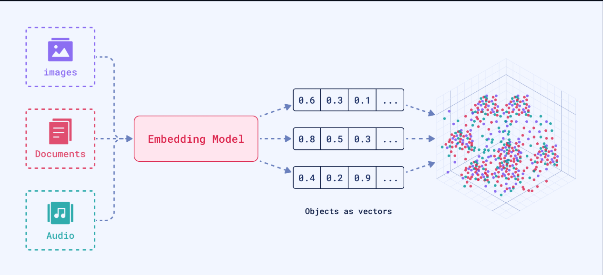

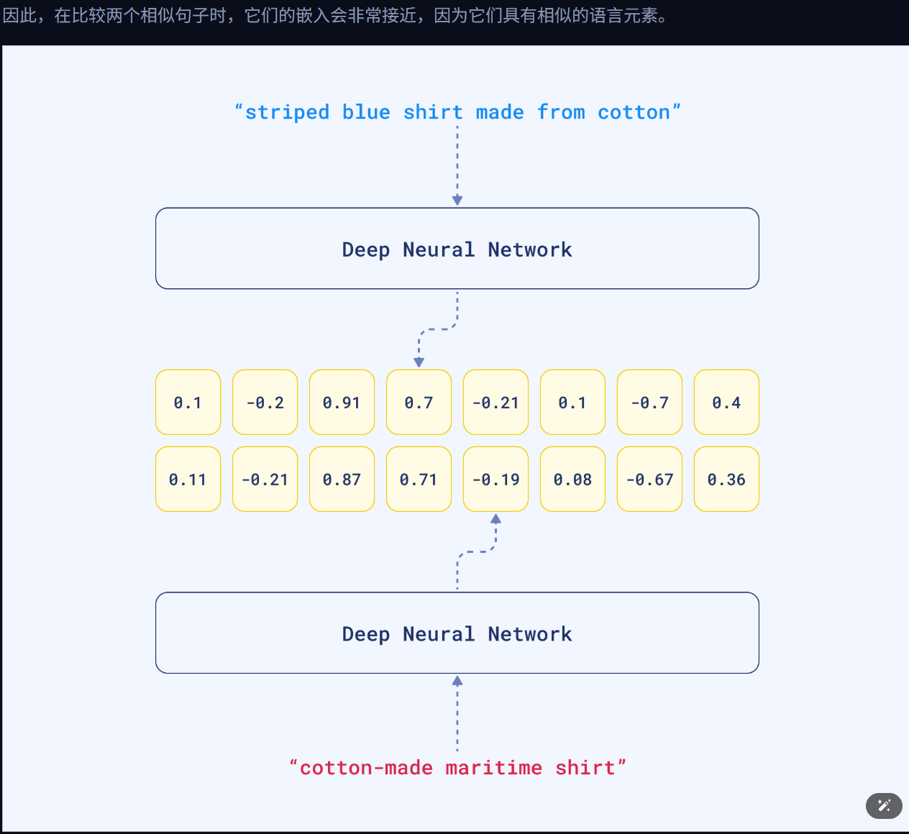
#### 稀疏向量
在数学上与稠密向量相同，但包含许多零。它们使用优化的存储表示，且形状与稠密向量不同。

**表示法：** 稀疏向量表示为 (索引, 值) 对的列表

- **index（索引）**：非零值的位置（整数）
- **value（值）**：浮点数
```python
# Dense vector: [0.0, 0.0, 0.0, 0.0, 0.0, 0.0, 1.0, 2.0, 0.0, 0.0]
# Sparse representation: [(6, 1.0), (7, 2.0)]

# Qdrant JSON format:
{
 "indices": [6, 7],
 "values": [1.0, 2.0]
}
```
`indices`（索引）数组和 `values`（值）数组必须长度相同，且所有 `indices` 必须是唯一的。

#### 多向量
- 每个集合的可变数量向量（多向量行）
- 每个独立向量的固定大小（多向量列）
```python
"vector": [
   [-0.013,  0.020, -0.007, -0.111],
   [-0.030, -0.055,  0.001,  0.072],
   [-0.041,  0.014, -0.032, -0.062],
   # ...
]
```
有点类似相同列数的矩阵

### 载荷 (元数据)
|类型|描述|示例|
|---|---|---|
|**`关键字 (Keyword)`**|用于精确字符串匹配（例如：标签、类别、ID）。|`category: "electronics"`|
|**`Integer（整数）`**|用于数值过滤的 64 位有符号整数。|`stock_count: 120`|
|**`Float（浮点数）`**|用于价格、评分等的 64 位浮点数。|`price: 19.99`|
|**`Bool（布尔值）`**|真/假值。|`in_stock: true`|
|**`地理位置`**|用于地理位置查询的经纬度对。|`location: { "lon": 13.4050, "lat": 52.5200 }`|
|**`Datetime（日期时间）`**|RFC 3339 格式的时间戳，用于基于时间的过滤。|`created_at: "2024-03-10T12:00:00Z"`|
|**`UUID`**|一种用于存储和匹配 UUID 的内存高效类型。|`user_id: "550e8400-e29b-41d4-a716-446655440000"`|
上述任何类型都可以存储在更复杂的结构中

- **数组：** 字段可以包含多个相同类型的值。如果数组中_至少有一个_值满足条件，则过滤器判定为成功。
    
    - _示例：_ `tags: ["vegan", "organic", "gluten-free"]`
- **嵌套对象：** 载荷可以是任意 JSON 对象，允许你存储结构化数据。你可以使用点符号对嵌套字段进行过滤（例如：`user.address.city`）。
    
    - _示例：_ `user: {"id": 123, "name": "Alice"}`

#### 过滤逻辑
**逻辑子句**

- **must**：所有条件都必须满足（AND 逻辑）
- **should**：至少有一个条件必须满足（OR 逻辑）
- **must_not**：所有条件都不应满足（NOT 逻辑）

这些子句可以组合以表达复杂需求。例如，查找“200 美元以下的电子产品 OR 4 星以上好评的书籍”，其逻辑如下：

```python
models.Filter(
    should=[
        models.Filter(must=[
            models.FieldCondition(key="category", match=models.MatchValue(value="electronics")),
            models.FieldCondition(key="price", range=models.Range(lt=200))
        ]),
        models.Filter(must=[
            models.FieldCondition(key="category", match=models.MatchValue(value="books")),
            models.FieldCondition(key="rating", range=models.Range(gte=4.0))
        ])
    ]
)
```
也支持其他过滤逻辑

|过滤类型|描述|示例查询|
|---|---|---|
|**匹配 (Match)**|精确值|`"match": {"value": "electronics"}`|
|**匹配任意 (Match Any)**|OR 条件|`"match": {"any": ["red", "blue"]}`|
|**匹配排除 (Match Except)**|NOT IN 条件|`"match": {"except": ["banned"]}`|
|**范围**|数值范围|`"range": {"gte": 50, "lte": 200}`|
|**日期时间范围 (Datetime Range)**|基于时间的过滤|`"range": {"gt": "2023-01-01T00:00:00Z"}`|
|**全文检索（Full Text）**|子串匹配|`"match": {"text": "amazing service"}`|
|**地理空间**|基于位置|`"geo_radius": {"center": {...}, "radius": 10000}`|
|**嵌套（Nested）**|数组对象过滤|`"nested": {"key": "reviews", "filter": {...}}`|
|**包含 ID**|特定 ID|`"has_id": [1, 5, 10]`|
|**是否为空 (Is Empty)**|空字段|`"is_empty": {"key": "discount"}`|
|**是否为 Null (Is Null)**|Null 值|`"is_null": {"key": "field"}`|
|**值计数**|数组长度|`"values_count": {"gt": 2}`|
py操作
```py
#! 添加索引
#? 检查索引是否存在
if("category" not in [i.field_name for i in qdrant_client.get_payload_indices(collection_name)]):
    qdrant_client.create_payload_index(
    
    collection_name=collection_name,
    field_name="category",
    field_type=models.PayloadSchemaType.KEYWORD,    # 关键词索引
    )

#! 过滤查询
filter = models.Filter(
    should=[
        models.FieldCondition(
            key="category",
            match=models.MatchValue(value="example"),
        )
    ]
)

filter_results = qdrant_client.query_points(
    collection_name=collection_name,
    limit=1,
    query_filter=filter,
)

print("Filter results:", filter_results)
```
## 距离度量

在现代机器学习和数据检索中，向量存储和距离度量的选择对性能和结果的影响至关重要。本文将详细探讨如何利用向量存储的空间属性执行最近邻搜索，以及不同距离度量的适用场景和计算方法。

向量的空间属性

向量在嵌入空间中的位置反映了嵌入模型所学习到的编码含义。通过计算向量之间的距离，可以根据它们在空间中的接近程度检索语义相似的项目。距离的定义由模型及其训练目标决定。

### 距离度量的选择

对于大多数用户而言，设计距离度量的最佳实践是使用第三方嵌入模型（如 OpenAI、Cohere、Hugging Face 等）所推荐的距离度量。通常情况下，推荐使用余弦相似度或点积。若文档未明确说明，建议在 Qdrant 中选择余弦相似度（Cosine），因为 Qdrant 会自动对该集合中的向量进行 L2 归一化。

#### 余弦相似度 (Cosine Similarity)

常见用途：自然语言处理（NLP）嵌入、语义搜索、文档检索。
重点：方向（朝向），忽略幅度（模长）。
计算方法：通过计算两个向量之间的角度相似性来衡量。公式为：
$[$
$\text{Cosine Similarity} = \frac{A \cdot B}{||A|| \cdot ||B||}$
$]$
其中 (A \cdot B) 是向量 A 和 B 的点积，(||A||) 和 (||B||) 是它们的幅度（范数）。
示例代码：
```py
from qdrant_client.models import Distance, VectorParams

vectors_config = VectorParams(
    size=384,
    distance=Distance.COSINE
)
```


#### 点积相似度 (Dot Product Similarity)

常见用途：推荐系统、矩阵分解、排序。
重点：同时考虑幅度和方向。
计算方法：通过将两个向量中的对应值相乘并求和来计算。公式为：
$[$
$\text{Dot Product} = A \cdot B$
$]$
关键细节：对于受控范数的向量（如单位长度），点积与余弦相似度相等。
示例代码：

```py
vectors_config = VectorParams(`
    `size=512,`
    `distance=Distance.DOT`
)
```

#### 欧几里得距离 (L2 Distance)

常见用途：空间数据、异常检测、聚类。
重点：点之间的绝对距离。
计算方法：计算多维空间中两点之间的直线距离。公式为：
$[$
$\text{Euclidean Distance} = \sqrt{\sum (x_i - y_i)^2}$
$]$
关键细节：对尺度敏感，通常需要对特征进行标准化或归一化处理。
示例代码：

```py
vectors_config = VectorParams(
    size=2048,
    distance=Distance.EUCLID
)
```


#### 曼哈顿距离 (Manhattan Distance)

常见用途：稀疏数据、鲁棒性异常值处理。
重点：基于网格的距离（绝对差之和）。
计算方法：计算沿着网格线的距离。公式为：
$[$
$\text{Manhattan Distance} = \sum |x_i - y_i|$
$]$
关键细节：对单维度中的极端异常值不敏感。
示例代码：

```py
vectors_config = VectorParams(
    size=128,
    distance=Distance.MANHATTAN
)
```


|指标|常见应用|原因？|
|---|---|---|
|**余弦相似度 (Cosine Similarity)**|NLP, 语义搜索|忽略幅度；专注于语义含义（方向）。|
|**点积**|推荐、排序|同时捕获方向和幅度（重要性/流行度）。|
|**欧几里得距离**|空间数据、异常检测|测量绝对的物理或数值距离。|
|**曼哈顿距离 (Manhattan Distance)**|稀疏/表格数据|相比欧几里得距离对异常值更具鲁棒性。|

## 文本分块
世界中的大多数数据都是杂乱的：

- 文本文档很长
- 产品描述长度不一
- 用户画像具有嵌套属性

我们需要一种将这些数据分解为可管理块的方法。

**数据预处理，特别是分块和[嵌入（embedding）](https://qdrant.org.cn/articles/what-are-embeddings/)，决定了 Qdrant 所处理的数据质量。** 

### 整个文档作为向量的问题

每个模型都有一次可处理的最大 Token（标记）数量。例如，许多流行的 `sentence-transformer` 模型限制为 512 个 Token，而 OpenAI 的 `text-embedding-3-small` 限制为 8,191 个 Token。如果文档超过此最大 Token 数，超出限制的部分信息会被直接舍弃，导致大量数据丢失。

==分块的目标==是使数据块：

1. 足够小，能够被嵌入模型有效处理，而不会被截断。
2. 足够大，能够包含有意义且连贯的上下文。

通过将文档拆分为聚焦的块，每个块都会获得一个准确代表特定概念的向量。这使得搜索更加精确。

与其将文档视为整体块，不如将其分解为段落、标题和子部分。每个块都有自己的向量，与特定的想法或主题相关联。您可以为每个块添加元数据，如章节标题、页码、原始来源文档和标签。

这实现了：

- **过滤检索** - “仅显示来自本节的结果”
- **上下文感知片段** - 对特定查询的精确回答
- **高效处理** - 不会在无关内容上浪费 Token

### 分块策略
#### 1. 固定大小分块（Fixed-Size Chunking）
**方法：** 定义每个块的 Token 数量（例如 200），并设置一个小的重叠缓冲区以保持上下文。
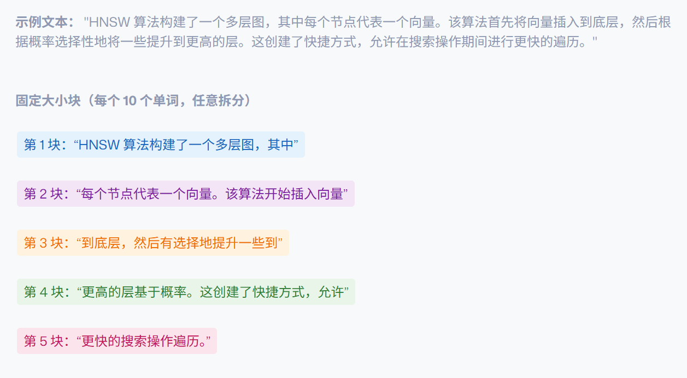
**优点**
- 易于实现
- 块大小一致
- 处理过程可预测

**缺点**
- 忽略自然语言边界
- 可能在句子中间或思想中间拆分
- 缺乏语义感知
**最适合：** 缺乏一致格式的文档、初步原型开发
```python
def fixed_size_chunk(text, chunk_size=200, overlap=50):
    words = text.split()
    chunks = []
    for i in range(0, len(words), chunk_size - overlap):
        chunk = " ".join(words[i:i + chunk_size])
        chunks.append(chunk)
    return chunks
```
#### 2.基于句子的分块（Sentence-Based Chunking）
**方法：** 使用分词器将文档分解为句子，然后将句子组合成指定字数以下的块。
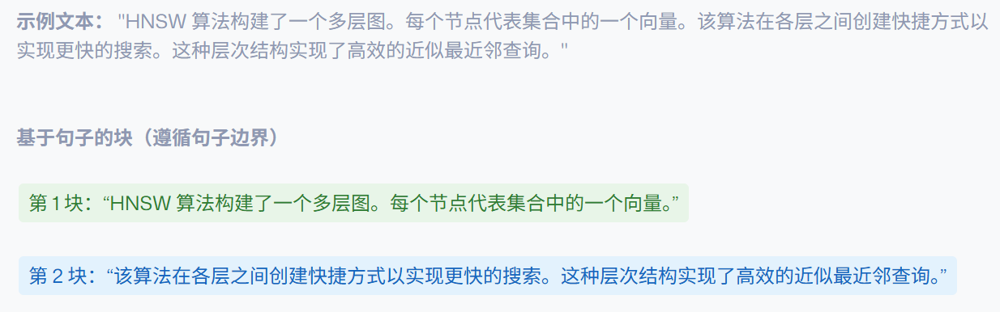
```python
# ! pip install nltk
from nltk.tokenize import sent_tokenize


def sentence_chunk(text, max_words=150):
    sentences = sent_tokenize(text)
    chunks, buffer, length = [], [], 0

    for sent in sentences:
        count = len(sent.split())
        if length + count > max_words:
            chunks.append(" ".join(buffer))
            buffer, length = [], 0
        buffer.append(sent)
        length += count

    if buffer:
        chunks.append(" ".join(buffer))
    return chunks
```
运行效果
```plaintext
[nltk_data] Downloading package punkt_tab to
[nltk_data]     C:\Users\attached\AppData\Roaming\nltk_data...
[nltk_data]   Unzipping tokenizers\punkt_tab.zip.
['\n    这是一个测试句子。它包含多个句子。\n    这是第二个句子。\n    这是第三个句子。\n    这是第四个句子。\n    这是第五个句子。']
```

**优点：**
- 保留完整的思想
- 遵循自然语言边界
- 良好的语义连贯性

**缺点**
- 块长度不规则
- 句子长度差异很大
- 可能无法遵循主题边界

**最适合：** RAG 系统、问答应用、通用文本处理

#### 3. 基于段落的分块（Paragraph-Based Chunking）
```python
def paragraph_chunk(text):
    return [p.strip() for p in text.split("\n\n") if p.strip()]
```
**优点**
- 与自然主题边界对齐
- 默认具有丰富的语义
- 尊重作者的组织结构

**缺点**
- 不可预测的大小（从单行到整个页面）
- 可能需要 Token 限制或后备拆分
- 取决于干净的文档结构

**最适合：** 文章、博客、文档、书籍、电子邮件

#### 4.滑动窗口分块（Sliding Window Chunking）
**方法：** 创建重叠块以保持上下文连续性。
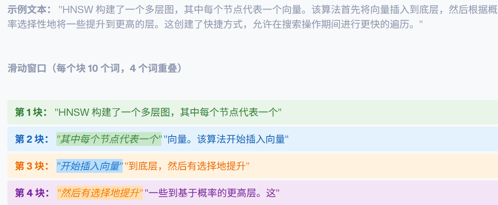
```python
def sliding_window(text, window=200, stride=100):
    words = text.split()
    chunks = []
    for i in range(0, len(words) - window + 1, stride):
        chunk = " ".join(words[i:i + window])
        chunks.append(chunk)
    return chunks
```
**优点**
- 在边界处保持上下文
- 更高的召回潜力
- 减少信息丢失

**缺点**
- 存储冗余（通常有 20-50% 的开销）
- 增加处理成本
- 可能会返回重复信息

**最适合：** 丢失信息代价高昂的关键应用、重排序系统

####  5. 递归分块（Recursive Chunking）
**方法：** 当数据不遵循可预测的结构时，使用备选的分隔符层次结构。

递归拆分使用后备层次的分隔符。您首先尝试在大块上进行拆分——如标题或段落中断。如果一个块仍然太长，它会退回到更小的分隔符，如行或句子。如果仍然不合适，最后会使用单词或字符作为最后的手段。
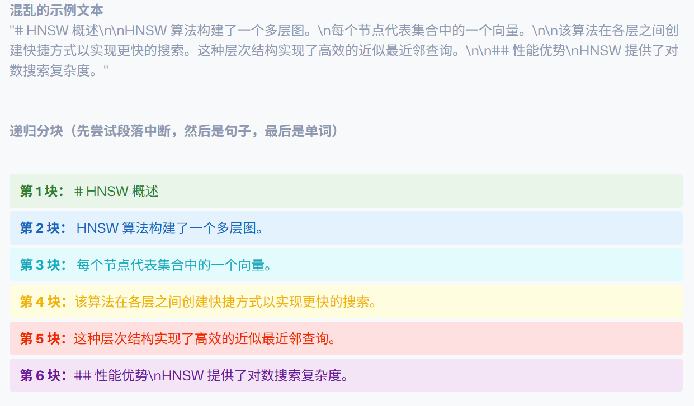


```python
# ! pip install langchain
from langchain.text_splitter import RecursiveCharacterTextSplitter

splitter = RecursiveCharacterTextSplitter(
    chunk_size=512, chunk_overlap=100, separators=["\n\n", "\n", ". ", " ", ""]
)

text = """
Hello, world! More text here. another line.
Hello, world! More text here. another line......
"""
chunks = splitter.split_text(text)
```
递归分块可以有很多选择 这里采用langchain实现

**优点**
- 适应杂乱或不一致的输入
- 尽可能保持语义连贯性
- 处理各种文档格式

**缺点**
- 基于启发式，结果可能不一致
- 逻辑复杂
- 可能无法完美适用于所有内容类型

**最适合：** 抓取的网页内容、混合格式、CMS 导出


#### 6.语义感知分块（Semantic-Aware Chunking）
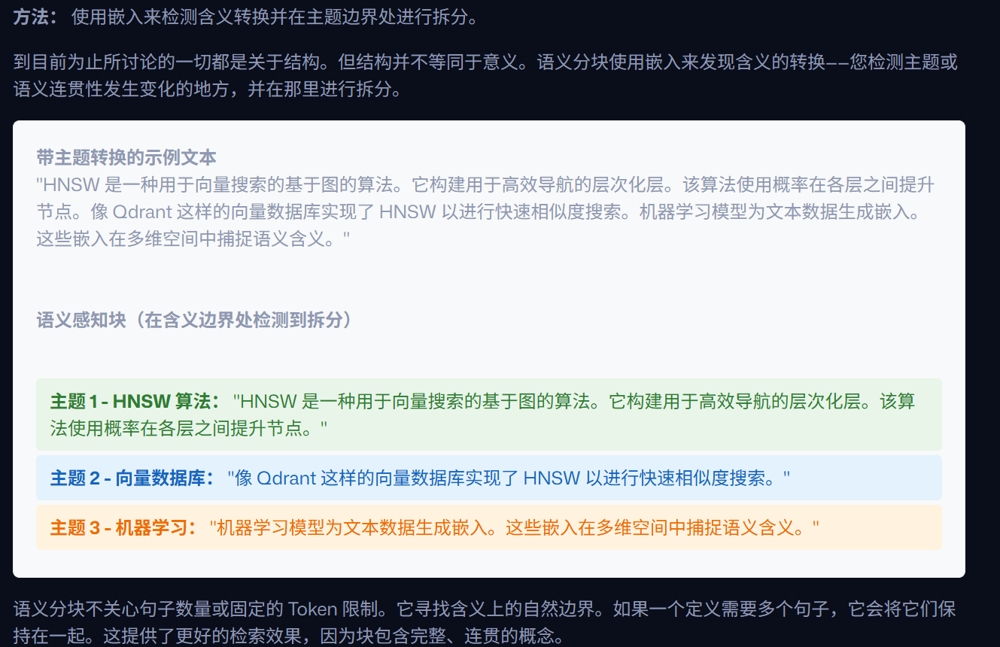

```python
from sentence_transformers import SentenceTransformer
import numpy as np

def semantic_chunking(text, similarity_threshold=0.5):
    model = SentenceTransformer('all-MiniLM-L6-v2')
    sentences = text.split('.')
    embeddings = model.encode(sentences)
    
    chunks = []
    current_chunk = [sentences[0]]
    
    for i in range(1, len(sentences)):
        # Calculate cosine similarity between consecutive sentences
        similarity = np.dot(embeddings[i-1], embeddings[i]) / (
            np.linalg.norm(embeddings[i-1]) * np.linalg.norm(embeddings[i])
        )
        
        if similarity < similarity_threshold:
            chunks.append('. '.join(current_chunk))
            current_chunk = [sentences[i]]
        else:
            current_chunk.append(sentences[i])
    
    chunks.append('. '.join(current_chunk))
    return chunks
```
**优点**
- 高语义精度
- 每个块都携带连贯的想法
- 复杂文档的最佳选择

**缺点**
- 计算成本高（需要嵌入整个文档）
- 需要额外的模型推理
- 处理流水线较慢

**最适合：** 法律文件、研究论文、需要高精度的关键应用


### 策略比较
|方法|优势|权衡|最适合|
|---|---|---|---|
|**固定大小**|简单，块可预测|忽略结构，破坏含义|原始或非结构化文本|
|**基于句子**|保留完整的思想|块大小不一致|RAG, 问答系统|
|**基于段落**|与语义单元对齐|长度差异大|文档、手册、教学内容|
|**滑动窗口**|保持完整上下文|冗余，计算量大|重排序，高召回检索|
|**递归**|灵活，处理混乱输入|启发式，有时易碎|抓取网页，混合来源|
|**语义**|高质量，语义感知|较慢，资源密集型|法律、研究、关键问答|
### 元数据增加含义
**免责声明**：出于性能原因，可过滤字段必须使用 [Payload Index](https://qdrant.org.cn/documentation/manage-data/indexing/#payload-index) 进行索引。

**1. 过滤搜索（精确匹配）** 您可以根据精确的元数据值过滤结果，这对于分类数据非常理想。

```python
from qdrant_client import models

# Only show results from a specific article
filter = models.Filter(
    must=[
        models.FieldCondition(
            key="document_id", match=models.MatchValue(value="collection-config-guide")
        )
    ]
)
```

**2. 带有文本过滤的混合搜索（全文搜索）** 为了实现更强大的文本过滤，您可以将向量搜索与传统关键字搜索相结合。这需要在有效载荷字段上设置 [全文索引](https://qdrant.org.cn/documentation/manage-data/indexing/#full-text-index)。

```python
# Find vectors that also contain the keyword "HNSW" in their content
filter = models.Filter(
    must=[
        models.FieldCondition(
            key="content", # The field with the full-text index
            match=models.MatchText(text="HNSW algorithm")
        )
    ]
)
```

**3. 分组结果**

```python
# Top result per document - get the most relevant chunk from each source
group_by = "document_id"
```

您可以 [在此处](https://qdrant.org.cn/documentation/search/hybrid-queries/?q=grouping#grouping) 阅读更多关于分组的内容。

## demo 语义电影搜索引擎
在进行向量嵌入之前 先下载好句子分词器等
`pip install -U sentence-transformers transformers qdrant-client llama-index-core llama-index-embeddings-huggingface -q`

### 概述

当你询问搜索引擎：_“给我推荐关于质疑现实和存在本质的电影”_，并得到了_《黑客帝国》_、_《盗梦空间》_和_《机械姬》_。这不是因为这些标题中包含了搜索词，而是因为系统真正理解了这些电影的主题。

一个能够实现以下功能的语义搜索引擎：

- **理解含义**：搜索“时间旅行与家庭关系”，即可找到_《星际穿越》_
- **比较分块策略**：了解固定大小分块、基于句子的分块和语义分块如何影响搜索质量
- **智能过滤**：将语义搜索与元数据过滤（年份、类型、评分）相结合
- **处理限制**：处理超过嵌入模型 Token 限制的长电影描述
- **结果分组**：当多个块与查询匹配时，避免重复列出同一部电影
### 一：理解挑战
数据集包含 13 部科幻电影，并配有详细的文学性描述。挑战在于：每段描述包含 240-460 个 Token，但我们的嵌入模型 (all-MiniLM-L6-v2) 只能嵌入 256 个或更少的 Token。

**这就是分块变得至关重要的原因。**

```python
# Example: A movie description that's too long for our embedding model
movie_example = {
    "name": "Ex Machina",
    "year": 2014,
    "description": """Alex Garland's Ex Machina is a cerebral, slow-burning psychological 
    thriller that delves into the ethics and consequences of artificial intelligence. 
    The story begins with Caleb, a young programmer at a tech conglomerate, who wins 
    a contest to spend a week at the secluded estate of Nathan, the reclusive CEO..."""
    # This continues for 386 tokens - too long for optimal embedding!
}
```
**完整数据集**（包括_《黑客帝国》_、_《星际穿越》_、_《降临》_、_《湮灭》_等）可在 [完整 Notebook](https://colab.research.google.com/github/qdrant/examples/blob/master/course/day_1/Semantic_Recommendation_System_for_Science_Fiction_Movies.ipynb) 中获取。


### 二：三向量

在一个集合中创建三个不同的向量空间，其开销几乎等同于每个向量空间使用一个集合。
```python
from sentence_transformers import SentenceTransformer
from qdrant_client import QdrantClient, models

# Initialize components
encoder = SentenceTransformer("all-MiniLM-L6-v2")

# In-memory for demo: NO HNSW built -> queries are a full scan.
client = QdrantClient(":memory:")

# For ANN/HNSW:
# client = QdrantClient(url="https://:6333")

# Create collection with three named vectors
client.create_collection(
    collection_name='movie_search',
    vectors_config={
        'fixed': models.VectorParams(size=384, distance=models.Distance.COSINE),
        'sentence': models.VectorParams(size=384, distance=models.Distance.COSINE),
        'semantic': models.VectorParams(size=384, distance=models.Distance.COSINE),
    },
)
```

### 三：实现分块
```python
from transformers import AutoTokenizer
from llama_index.core.node_parser import SentenceSplitter, SemanticSplitterNodeParser
from llama_index.embeddings.huggingface import HuggingFaceEmbedding

tokenizer = AutoTokenizer.from_pretrained("sentence-transformers/all-MiniLM-L6-v2")
MAX_TOKENS = 40

def fixed_size_chunks(text, size=MAX_TOKENS):
    """Fixed-size chunking: splits at exact token boundaries"""
    tokens = tokenizer.encode(text, add_special_tokens=False)
    return [
        tokenizer.decode(tokens[i:i+size], skip_special_tokens=True)
        for i in range(0, len(tokens), size)
    ]

def sentence_chunks(text):
    """Sentence-aware chunking: respects sentence boundaries"""
    splitter = SentenceSplitter(chunk_size=MAX_TOKENS, chunk_overlap=10)
    return splitter.split_text(text)

def semantic_chunks(text):
    """Semantic chunking: uses embedding similarity to find natural breaks.
    Note: still constrained by the embed model's context window (same as retrievers)."""
    from llama_index.core import Document
    
    semantic_splitter = SemanticSplitterNodeParser(
        buffer_size=1,
        breakpoint_percentile_threshold=95,
        embed_model=HuggingFaceEmbedding(model_name="sentence-transformers/all-MiniLM-L6-v2")
    )
    nodes = semantic_splitter.get_nodes_from_documents([Document(text=text)])
    return [node.text for node in nodes]
```

### 四：处理数据和上传
对于每一部电影描述，我们应用全部三种分块策略，对生成的块进行嵌入，并将它们连同各自的向量名称一起存储。

```python
points = []
idx = 0

for movie in movies_data:  # Process each movie
    # Fixed-size chunks
    for chunk in fixed_size_chunks(movie["description"]):
        points.append(models.PointStruct(
            id=idx,
            vector={"fixed": encoder.encode(chunk).tolist()},
            payload={**movie, "chunk": chunk, "chunking": "fixed"}
        ))
        idx += 1

    # Sentence-aware chunks  
    for chunk in sentence_chunks(movie["description"]):
        points.append(models.PointStruct(
            id=idx,
            vector={"sentence": encoder.encode(chunk).tolist()},
            payload={**movie, "chunk": chunk, "chunking": "sentence"}
        ))
        idx += 1

    # Semantic chunks
    for chunk in semantic_chunks(movie["description"]):
        points.append(models.PointStruct(
            id=idx,
            vector={"semantic": encoder.encode(chunk).tolist()},
            payload={**movie, "chunk": chunk, "chunking": "semantic"}
        ))
        idx += 1

client.upload_points(collection_name='movie_search', points=points)
print(f"Uploaded {idx} vectors across three chunking strategies")
```

### 五：比较搜索结果
```python
def search_and_compare(query, k=3):
    """Compare search results across all three chunking strategies"""
    print(f"Query: '{query}'\n")
    
    for strategy in ['fixed', 'sentence', 'semantic']:
        results = client.query_points(
            collection_name='movie_search',
            query=encoder.encode(query).tolist(),
            using=strategy,
            limit=k,
        )
        
        print(f"--- {strategy.upper()} CHUNKING ---")
        for i, point in enumerate(results.points, 1):
            payload = point.payload
            print(f"{i}. {payload['name']} ({payload['year']}) | Score: {point.score:.3f}")
            print(f"   Chunk: {payload['chunk'][:100]}...")
        print()

# Test with different queries
search_and_compare("alien invasion")
search_and_compare("questioning reality and existence")
```
[运行结果](D:\learnings\py_learning\agent_learn\Hello_Agents\codes\hello-agent-codes\ex-1-Qdrant\1-向量搜索基础\demo_output.md)

自此完成了一个简单的搜索引擎

### 时间线：分词 → 嵌入 → 向量化

#### 1. **分词阶段 (Tokenization & Chunking)**

**时间点**：程序运行时，处理每部电影描述的时候

**对应代码**：
```python
for movie in movie_datas:  # Process each movie
    # Fixed-size chunks
    for chunk in fixed_size_chunks(movie["description"]):  # ← 分词在这里发生
    
    # Sentence-aware chunks  
    for chunk in sentence_chunks(movie["description"]):    # ← 分词在这里发生
    
    # Semantic chunks
    for chunk in semantic_chunks(movie["description"]):   # ← 分词在这里发生
```

**涉及的包**：
- `transformers` (提供AutoTokenizer，用于固定长度分词)
- `llama_index.core.node_parser` (提供SentenceSplitter和SemanticSplitterNodeParser，用于句子感知和语义分词)

**具体操作**：
- **固定长度分词**：`tokenizer.encode(text, add_special_tokens=False)` → 将文本转为tokens → 按固定长度切分
- **句子感知分词**：`SentenceSplitter.split_text(text)` → 按句子边界智能切分
- **语义分词**：`SemanticSplitterNodeParser.get_nodes_from_documents()` → 基于语义相似度切分

#### 2. **嵌入阶段 (Embedding)**

**时间点**：在分词完成后，准备上传到向量数据库之前

**对应代码**：
```python
vector={"fixed": encoder.encode(chunk).tolist()}     # ← 嵌入在这里发生
vector={"sentence": encoder.encode(chunk).tolist()}  # ← 嵌入在这里发生  
vector={"semantic": encoder.encode(chunk).tolist()}  # ← 嵌入在这里发生
```

**涉及的包**：
- `sentence_transformers` (提供SentenceTransformer类和encode方法)

**具体操作**：
- `encoder.encode(chunk)` → 将文本块转换为384维的密集向量
- 每个文本块都被转换为一个数值向量表示
- 相似的语义内容会有相近的向量值

#### 3. **向量化阶段 (Vectorization & Storage)**

**时间点**：创建PointStruct对象时，准备上传到Qdrant数据库

**对应代码**：
```python
points.append(models.PointStruct(
    id=idx,
    vector={"fixed": encoder.encode(chunk).tolist()},     # ← 向量化完成，准备存储
    payload={**movie, "chunk": chunk, "chunking": "fixed"}
))
```

**涉及的包**：
- `qdrant_client.models` (提供PointStruct类，用于创建向量数据点)
- `sentence_transformers` (提供向量值)

**具体操作**：
- 将384维向量转换为list格式 `.tolist()`
- 创建PointStruct对象，包含向量数据和元数据
- 向量数据存储在指定的向量空间中（'fixed', 'sentence', 'semantic'）

#### 4. **查询阶段的向量化 (Query Vectorization)**

**时间点**：用户搜索时，`search_and_compare` 函数执行时

**对应代码**：
```python
def search_and_compare(query, k=3):
    query_vector = encoder.encode(query).tolist()  # ← 查询文本向量化
    results = client.query_points(
        collection_name='movie_search',
        query=query_vector,  # ← 使用向量进行相似度搜索
        using=strategy,
        limit=k,
    )
```

**涉及的包**：
- `sentence_transformers` (提供查询向量化)
- `qdrant_client` (提供向量相似度搜索)

**具体操作**：
- 用户输入的查询文本 → `encoder.encode(query)` → 转换为向量
- 在向量空间中查找最相似的向量
- 返回相似度最高的结果

#### 完整流程总结：

```
原始文本 → [transformers/llama_index] → 分词 → [sentence_transformers] → 嵌入 → [qdrant_client] → 向量化存储
查询文本 → [sentence_transformers] → 向量化 → [qdrant_client] → 向量相似度搜索 → 返回结果
```

**各包职责**：
- `transformers`：提供基础的tokenization功能
- `llama_index`：提供高级的分词策略（句子感知、语义分词）
- `sentence_transformers`：提供文本到向量的嵌入转换
- `qdrant_client`：提供向量存储和相似度搜索功能


# 2-索引和性能
掌握 [HNSW](https://qdrant.org.cn/articles/filterable-hnsw/) 索引及其实际调优，以实现快速检索

## HNSW索引基础
### 为什么向量需要索引
Qdrant 是否在每次查询时都要计算集合中每一个向量的距离。这种被称为“暴力搜索”（brute force search）的方法在技术上是可行的，但在处理数百万甚至数十亿个向量时，每次查询的速度会非常慢。

Qdrant 通过 **[HNSW — 分层可导航小世界（Hierarchical Navigable Small Worlds）](https://qdrant.org.cn/articles/filterable-hnsw/)** 加速了这一过程。

### HNSW工作原理
#### 图结构
它构建了一个多层图，其中每个向量都是一个节点。其思想是图具有分层结构：顶层包含少量联系广泛的节点，而每一层下层包含更多节点，连接也日益具体。

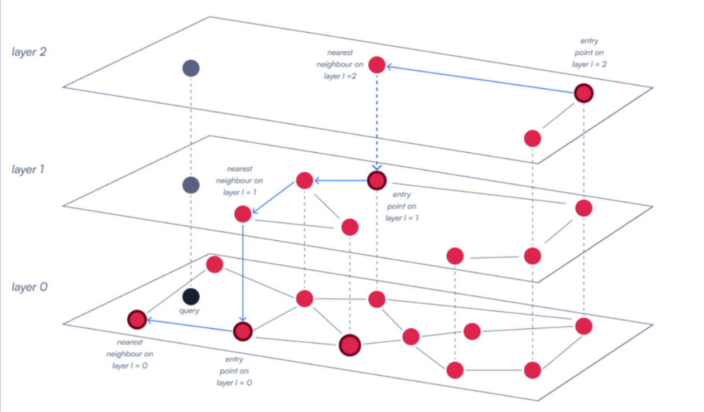


#### 搜索过程
执行查询时，HNSW 从顶层的入口点开始，在图中向下导航，逐渐从广泛的连接转向更精确的连接。

在每一层，算法都会探索当前节点的最近邻居，以确定最佳的前进路径。它持续这一过程，在下沉通过各层的同时不断优化搜索，直到到达最底层，选出最终的最近邻居。


### 配置HNSW

Qdrant 允许你通过三个关键参数控制 HNSW 索引的行为：`m`、`hnsw_ef` 和 `ef_construct`。

#### 图连通性 m
`m` 参数控制图中每个节点的最大连接数。

- `m` 值越大：生成的图越密集，每个向量连接的邻居更多，这提高了搜索准确性，因为图有更多路径可供遍历，不太可能遗漏相关向量。然而，这也增加了内存占用和索引时间，因为需要维护更多的连接。
- `m` 值越小：图越稀疏，减少了内存占用并加快了插入速度。但由于遍历路径减少，搜索准确性可能会下降。
- 典型值：8 到 64 之间

```python
from qdrant_client.models import HnswConfig

# Example m values
fast_config = HnswConfig(m=8, ef_construct=100, full_scan_threshold=10000)      # Lower recall, less memory, faster build
balanced_config = HnswConfig(m=16, ef_construct=100, full_scan_threshold=10000) # Default - good balance
accurate_config = HnswConfig(m=32, ef_construct=100, full_scan_threshold=10000) # Better recall, more memory, slower build
```


#### 构建彻底性：`ef_construct`
`ef_construct` 参数控制在插入新向量时检查多少个候选者。

- `ef_construct` 值越高：意味着评估的邻居越多，生成的图更全面、准确。但这也使索引过程变慢，计算需求更高。
- `ef_construct` 值越低：加快了插入过程，但图的连接可能不够优化，会影响搜索准确性。
- 常用范围：100 到 500 之间。复杂数据可能需要更高的值以维持可靠的连接。

####  搜索彻底性：`hnsw_ef`
`hnsw_ef` 参数决定搜索查询期间评估的候选数量。

- `hnsw_ef` 值越高：搜索结果越准确，因为算法探索了更大的邻域。但查询时间也会增加，因为处理的节点更多。
- `hnsw_ef` 值越低：搜索速度更快，但准确性可能降低，因为考虑的候选向量较少。
- 典型范围：50–200+，具体取决于延迟目标。


| 参数               | 目的        | 影响                   |
| ---------------- | --------- | -------------------- |
| **m**            | 每个节点的连接数  | 调高可改善召回率；使用更多内存和构建时间 |
| **ef_construct** | 插入时检查的候选数 | 调高可改善图质量；减慢索引速度      |
| **hnsw_ef**      | 搜索时检查的候选数 | 调高可改善召回率；减慢查询速度      |

###  针对不同工作负载进行优化

- **高速检索：** 调低 `m` 和 `hnsw_ef`；将 `ef_construct` 设置得刚好能满足可接受的召回率即可。
- **最大召回率：** 调高 `m`、`hnsw_ef` 和 `ef_construct`，并接受更慢的查询和构建时间。
- **内存受限：** 减小 `m`；保持 `ef_construct` 足够高以避免不良连接。

##  结合向量搜索和过滤
但在现实应用中，您通常需要使用过滤器来约束搜索范围。这为图遍历带来了独特的挑战

### 过滤器会破坏图的连通性
假设您要从在线商店的藏品中检索商品，且只想展示价格低于 1,000 美元的笔记本电脑。该价格信息以及“笔记本电脑”这一类别并不包含在向量中，而是存在于 [payload（载荷）](https://qdrant.org.cn/documentation/manage-data/payload/)中。


`price < 1000` 的过滤器时，本质上是在搜索过程中限制了哪些点是符合条件的。这给图遍历带来了挑战，因为 HNSW 依赖短程和长程边来高效探索向量空间。它要求图中的任何点都是可达的。但如果过滤操作移除了大部分点，搜索路径可能会中断。

### 解决方法
#### 朴素方法
##### 后过滤
一种方法是最初忽略过滤器：在整个数据集上进行搜索，获取前 K 个最相似的向量，然后应用过滤器。

**问题：** 您可能会丢弃大部分前 K 个结果。如果满足过滤器的最佳匹配项不在前 K 个结果中，您将无法检索到它。这不仅浪费计算资源，还会因为相关点从未被检索到而导致召回率下降。

##### 预过滤
另一种方法是先进行过滤，然后在过滤后的集合中搜索。

**问题：** 当过滤条件过于严格时，它们会使 HNSW 图碎片化，破坏连通性，导致遍历效率低下或无法进行。

#### Qdrant解决方法：可过滤的 HNSW (Filterable HNSW)

我们通过创建==额外的边==来维持过滤条件下的连通性，从而保证 HNSW 图始终保持连接。Qdrant 为每个 payload 值构建子图，然后将其合并回完整图。

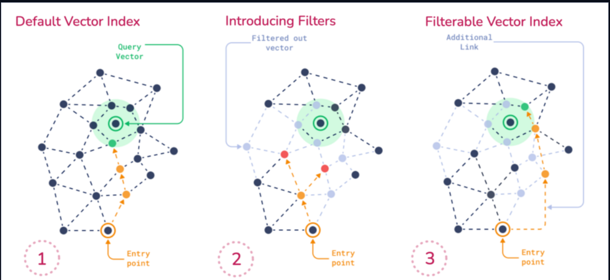


### playload 索引

我们通过创建额外的边来维持过滤条件下的连通性，从而保证 HNSW 图始终保持连接。Qdrant 为每个 payload 值构建子图，然后将其合并回完整图。

#### 创建playload索引 并添加数据

```python
from qdrant_client import QdrantClient, models
import os

client = QdrantClient(url=os.getenv("QDRANT_URL"), api_key=os.getenv("QDRANT_API_KEY"))

# For Colab:
# from google.colab import userdata
# client = QdrantClient(url=userdata.get("QDRANT_URL"), api_key=userdata.get("QDRANT_API_KEY"))

collection_name = "store"
vector_size = 768

if client.collection_exists(collection_name=collection_name):
    client.delete_collection(collection_name=collection_name)

client.create_collection(
    collection_name=collection_name,
    vectors_config=models.VectorParams(
        size=vector_size,
        distance=models.Distance.COSINE,
    ),
    optimizers_config=models.OptimizersConfigDiff(
        indexing_threshold=100,
    ),
)

# Index frequently filtered fields
client.create_payload_index(
    collection_name=collection_name,
    field_name="category",
    field_schema=models.PayloadSchemaType.KEYWORD,
)

client.create_payload_index(
    collection_name=collection_name,
    field_name="price",
    field_schema=models.PayloadSchemaType.FLOAT,
)

client.create_payload_index(
    collection_name=collection_name,
    field_name="brand",
    field_schema=models.PayloadSchemaType.KEYWORD,
)
```

添加示例数据
```python
# Upload data
import random

points = []
for i in range(1000):
    points.append(
        models.PointStruct(
            id=i,
            vector=[random.random() for _ in range(vector_size)],
            payload={
                "category": random.choice(["laptop", "phone", "tablet"]),
                "price": random.randint(0, 1000),
                "brand": random.choice(
                    ["Apple", "Dell", "HP", "Lenovo", "Asus", "Acer", "Samsung"]
                ),
            },
        )
    )
client.upload_points(
    collection_name=collection_name,
    points=points,
)
```


#### 过滤实现

```python
# Create filter combining multiple conditions
filter_conditions = models.Filter(
    must=[
        models.FieldCondition(key="category", match=models.MatchValue(value="laptop")),
        models.FieldCondition(key="price", range=models.Range(lte=1000)),
        models.FieldCondition(key="brand", match=models.MatchAny(any=["Apple", "Dell", "HP"])),
    ]
)

query_vector = [random.random() for _ in range(vector_size)]

# Execute filtered search
results = client.query_points(
    collection_name=collection_name,
    query=query_vector,
    query_filter=filter_conditions,
    limit=10,
    search_params=models.SearchParams(hnsw_ef=128),
)
```

我将搜索数据格式为之后

```txt
格式化的搜索结果：
--------------------------------------------------------------------------------
 1. ID: 200, Score: 0.7821311, Brand: HP   , Category: laptop, Price: $68
 2. ID:  16, Score: 0.7778473, Brand: Apple, Category: laptop, Price: $887
 3. ID: 704, Score: 0.77727115, Brand: Apple, Category: laptop, Price: $787
 4. ID: 119, Score: 0.7743927, Brand: HP   , Category: laptop, Price: $283
 5. ID: 750, Score: 0.77277416, Brand: Apple, Category: laptop, Price: $287
 6. ID: 915, Score: 0.7712535, Brand: Apple, Category: laptop, Price: $417
 7. ID: 802, Score: 0.77115667, Brand: HP   , Category: laptop, Price: $122
 8. ID: 868, Score: 0.7697011, Brand: Apple, Category: laptop, Price: $303
 9. ID: 564, Score: 0.7694508, Brand: Apple, Category: laptop, Price: $447
10. ID: 178, Score: 0.76935077, Brand: Apple, Category: laptop, Price: $199
--------------------------------------------------------------------------------
总共找到 10 个搜索结果
```

优化建议：
1. **尽早索引：** 在构建 HNSW 之前创建 payload 索引。
2. **索引正确字段：** 为所有过滤字段创建 payload 索引。如果内存有限，优先选择高选择性的字段。
3. **测试过滤组合：** 复杂的组合字段过滤能从正确的索引中获得最大收益。
4. **调整阈值**：根据数据分布和查询模式调整 `full_scan_threshold`。
5. **衡量真实性能**：使用您的实际数据和查询模式进行基准测试，以验证规划器的决策。

# 3-混合搜索
结合稠密（Dense）和稀疏（Sparse）信号，以实现更高的精确度和召回率。

## 稀疏向量和倒排索引

稀疏向量是高维向量，除少数维度外，其余维度均为零。稀疏向量的每个维度都指向特定的对象，其值则代表该对象在这一稀疏表示中的权重（角色）
### 稀疏向量的表示
#### 索引-值
存储成千上万个不提供任何信息的零值是极其浪费的。  
因此，稀疏向量可以紧凑地存储为其非零项的 **(索引, 值)** 对。
```text
[0, 0, 0, 0, 0, 0, 1.0, 2.0, 0, 0]
 0  1  2  3  4  5   6    7   8  9

→ [(6, 1.0), (7, 2.0)]
```
### 倒排索引
这个和ElasticResearch的倒排索引类似 不在赘述

搜索相似的稀疏向量，归根结底就是找出那些与查询向量共享非零维度的向量，并将对应的数值相乘。

维护一个从维度索引到（具有非零维度权重的）向量的映射。在查询时：

1. 对于查询向量的每个非零维度，检查映射项以收集匹配的向量。
2. 仅针对这些候选对象，通过重叠的非零索引计算==**点积**来评分==。

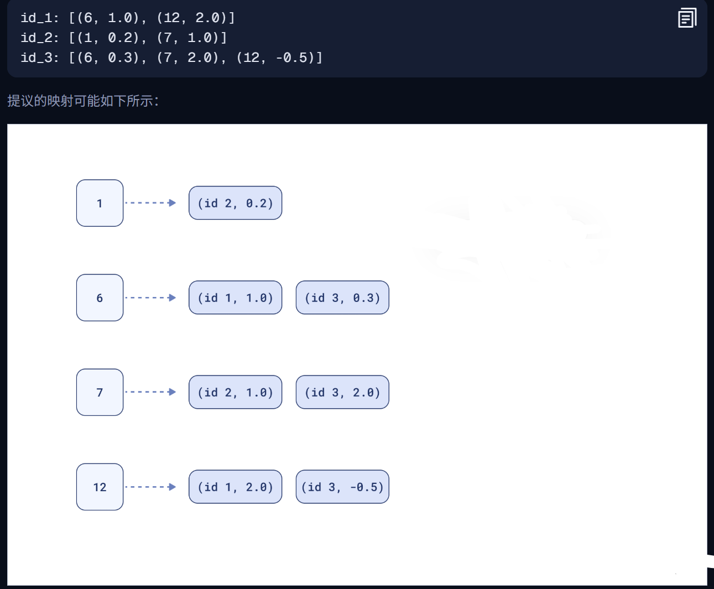

### Qdrant中创建稀疏向量

#### 创建包含稀疏的集合
```python
# Create collection with a named sparse vector
client.create_collection(
    collection_name=<COLLECTION_NAME>,
    sparse_vectors_config={
        <SPARSE_VECTOR_NAME>: models.SparseVectorParams()
    },
)
```

##### 可选参数
默认设置已经过优化；请仅在了解权衡后果的情况下进行调整！

**参数**

- `full_scan_threshold` _(int)_ – 当向量数量小于此阈值时，在比较过程中**不会**使用倒排索引（但索引**仍会被构建**）。
- `on_disk` _(bool)_ – 将倒排索引存储在磁盘上 (`True`) 或内存中 (`False`，默认)。
- `datatype` – **存储在索引内部**的值的精度：`uint8` | `float16` | `float32` (默认)。
    - 无论 `datatype` 的值如何，**原始值仍会存储在磁盘上**。
```python
client.create_collection(
    collection_name=<COLLECTION_NAME>,
    sparse_vectors_config={
        <SPARSE_VECTOR_NAME>: models.SparseVectorParams(
            index=models.SparseIndexParams(
                full_scan_threshold=0,          # compare directly below this size (index still built)
                on_disk=False,                  # keep index in RAM (default False)
                datatype=models.VectorStorageDatatype("float32")  # precision inside the index
            )
        )
    },
)
```


#### 存储稀疏向量
Qdrant 中的稀疏向量由以下部分表示：

- `indices` – 非零维度的索引（存储为 `uint32`，范围可从 0 到 4,294,967,295）。
    - `indices` 在单个向量内必须是**唯一**的。
- `values` – 这些非零维度的值（存储为浮点数）。
    - `len(indices) == len(values)`.

```python
client.upsert(
    collection_name=<COLLECTION_NAME>,
    points=[
        models.PointStruct(
            id=1,
            vector={<SPARSE_VECTOR_NAME>: models.SparseVector(
                indices=[1,2,3], 
                values=[0.2,-0.2,0.2]
            )}
        ),
        ...
    ],
)
```

#### 对稀疏向量进行相似度搜索
```python
client.query_points(
    collection_name="sparse_vectors_collection",
    using=<SPARSE_VECTOR_NAME>,
    query=models.SparseVector(indices=[1,3], values=[1,1]),
    ...
)
```
```txt
points=[
  ScoredPoint(id=1, version=4, score=0.4, payload={}, vector=None, shard_key=None, order_value=None), 
  ScoredPoint(d=2, version=4, score=0.2, payload={}, vector=None, shard_key=None, order_value=None)
  ]
```


### 选取建议
1. 当大多数特征缺失（为零）且需要**精确、特征对齐的匹配**时，请选择稀疏向量。  
    它们不仅存储高效，而且在未来的**混合搜索**设置中也能与稠密向量很好地协同工作。
2. 相似度 = 点积。Qdrant 中的稀疏向量相似度始终通过**点积**来衡量。
3. 稀疏向量组织在**倒排索引**中（这与用于稠密向量的 **HNSW** 是不同的数据结构）。

##  混合搜索和通用查询API

- 了解何时使用稠密向量，何时使用稀疏向量
- 使用 Qdrant 的通用查询 API 构建混合搜索管道
- 应用倒数排名融合（RRF）来合并结果

### 不同的搜索需求

#### 稠密向量：语义理解
稠密向量由神经编码器生成，这些编码器以关联输入含义的方式进行训练。无论您是要找 **elevator**（电梯）还是 **lift**（电梯），您的意图都是到达另一层楼，即使单词不同。甚至扶梯（escalator）或楼梯也不应该相差太远，因为它们服务于相同的目的！

某些模型甚至可以在您使用以下语言时找到您需要的内容：

- 西班牙语：**ascensor**
- 波兰语：**winda**
- 德语：**der Aufzug**

或者任何其他语言，因为这些模型可能经过训练，可以同时支持多种语言。

#### 稀疏向量：精确匹配
另一方面，稀疏向量更适合需要精确匹配的场景。它们通常被称为基于关键词或词汇的搜索。

想象一下您知道要查找的物品标识符。例如，您拥有特定的智能手机型号，因此在购买配件时，您不想看到针对不同设备的所有可能的充电器，而只想看到您能用的那些。这时，词汇搜索比稠密向量搜索更合适！


**想象一个法律搜索系统：**

- **律师**通常会知道他们想要查找的法律条文的段落、章节，甚至是某一点。
- **其他人**更倾向于描述他们遇到的非常具体的案例。
- **混合案例**：也许有人知道具体的法律条文，但不记得段落？

您不需要只选择一种方法或构建单独的管道来服务这两类用户！**混合搜索**可能是您正在寻找的解决方案！

### 混合搜索和通用查询api
当一个特定的管道结合了至少两种不同的搜索方法时，我们可以称之为混合。

它可以是稠密和稀疏向量的链式组合，在这种情况下您：

1. **预取（Prefetch）**：通过稠密向量搜索获取一些候选结果。
2. **重排序（Rerank）**：使用稀疏向量对它们进行重新排序。

或者反之：使用稀疏进行检索，使用稠密进行重排序。因此，我们有了**检索器（retrievers）** 和**重排序器（rerankers）**。


#### 模式一：稠密检索 → 稀疏重排序


```python
from qdrant_client import QdrantClient, models

client = QdrantClient(...)
client.query_points(
    collection_name="my_collection",
    prefetch=[
        models.Prefetch(
            query=models.Document(
                text=query,
                model="sentence-transformers/all-MiniLM-L6-v2",
            ),
            using="dense",
            limit=20,
        ),
    ],
    query=models.Document(
        text=query,
        model="Qdrant/bm25",
    ),
    using="sparse",
    limit=20,
)
```

在此示例中：

1. **预取**：使用稠密向量搜索获取二十个结果。
2. **重排序**：然后使用**稀疏向量**根据稀疏相关性评分定义的顺序重新排列它们。

#### 模式 2：稀疏检索 → 稠密重排序
```python
from qdrant_client import QdrantClient, models

client = QdrantClient(...)
client.query_points(
    collection_name="my_collection",
    prefetch=[
        models.Prefetch(
            query=models.Document(
                text=query,
                model="Qdrant/bm25",
            ),
            using="sparse",
            limit=20,
        ),
    ],
    query=models.Document(
        text=query,
        model="sentence-transformers/all-MiniLM-L6-v2",
    ),
    using="dense",
    limit=20,
)
```

连续使用多种搜索方法并不总是最佳途径。考虑我们之前的示例：

1. 使用稠密向量检索文档，然后用稀疏方法重排序，或者
2. 使用稀疏方法检索，然后用稠密方法重排序。

**这两种方法可能会产生完全不同的结果。** 初始检索方法实际上比重排序步骤更关键，因为重排序只能处理检索器已经选出的结果。

###  倒数排名融合（RRF）
**评分问题**

- 您的稠密检索产生的余弦相似度可能永远不会超过 1。
- BM25 评分实际上是无界的。
- 您如何判断 0.9 的余弦相似度是否优于 10.7 的 BM25 评分？

融合算法旨在解决这个问题。**倒数排名融合（RRF）** 是最常见的技术之一，

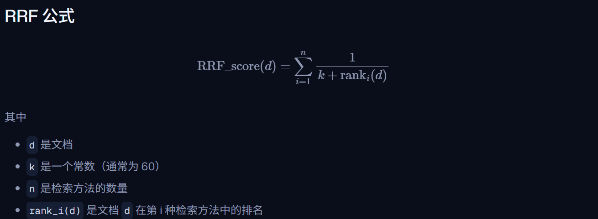


|文档|稠密排名|稠密 RRF|稀疏排名|稀疏 RRF|总 RRF|最终排名|
|---|---|---|---|---|---|---|
|D1|1|1/(60+1) = 0.0164|3|1/(60+3) = 0.0159|0.0323|**1**|
|D2|2|1/(60+2) = 0.0161|4|1/(60+4) = 0.0156|0.0317|3|
|D3|3|1/(60+3) = 0.0159|2|1/(60+2) = 0.0161|0.0320|2|
|D4|4|1/(60+4) = 0.0156|-|0|0.0156|5|
|D5|-|0|1|1/(60+1) = 0.0164|0.0164|4|


##### 在Qdrant实现RRF
```python
from qdrant_client import QdrantClient, models

client = QdrantClient(...)
client.query_points(
    collection_name="my_collection",
    prefetch=[
        models.Prefetch(
            query=models.Document(
                text=query,
                model="sentence-transformers/all-MiniLM-L6-v2",
            ),
            using="dense",
            limit=20,
        ),
        models.Prefetch(
            query=models.Document(
                text=query,
                model="Qdrant/bm25",
            ),
            using="sparse",
            limit=20,
        ),
    ],
    query=models.FusionQuery(fusion=models.Fusion.RRF),
    limit=10,
)
```


只需要指定query为RRF模式即可
## demo： 实现混合搜索系统

### step1 环境设置

安装嵌入模型 这里就用官方的了 
==pip install -q qdrant-client[fastembed]==

连接
```python
from qdrant_client import QdrantClient
from google.colab import userdata

client = QdrantClient(
    location="https://your-cluster-url.cloud.qdrant.io:6333",
    api_key=userdata.get("api-key")
)
```

### step2：使用命名向量创建集合
```python
from qdrant_client import models

# Define the collection name
collection_name = "hybrid_search_demo"

# Create our collection with both sparse (bm25) and dense vectors
client.create_collection(
    collection_name=collection_name,
    vectors_config={
        "dense": models.VectorParams(
            distance=models.Distance.COSINE,
            size=384,
        ),
    },
    sparse_vectors_config={
        "sparse": models.SparseVectorParams(
            modifier=models.Modifier.IDF
        )
    }
)
```

- **命名向量**：`"dense"` 和 `"sparse"` 用于标识每种向量类型
- **稠密配置**：384 维（匹配 sentence-transformers/all-MiniLM-L6-v2）
- **余弦距离**：语义相似度的典型选择
- **IDF 修饰符**：用于 BM25 稀疏向量的逆文档频率加权
- **同一集合**：为了实现混合搜索，两种向量都存在于同一点上

### step3：上传数据
```python
documents = [
    "Aged Gouda develops a crystalline texture and nutty flavor profile after 18 months of maturation.",
    "Mature Gouda cheese becomes grainy and develops a rich, buttery taste with extended aging.",
    "Brie cheese features a soft, creamy interior surrounded by an edible white rind.",
    "This French cheese has a flowing, buttery center encased in a bloomy white crust.",
    "Fresh mozzarella pairs beautifully with ripe tomatoes and basil leaves.",
    "Classic Margherita pizza topped with tomato sauce, mozzarella, and fresh basil.",
    "Parmesan requires at least 12 months of cave aging to develop its signature sharp taste.",
    "Parmigiano-Reggiano's distinctive piquant flavor comes from extended maturation in controlled environments.",
    "Grilled cheese sandwiches are the ultimate American comfort food for cold winter days.",
    "Croque Monsieur combines ham and Gruyère in France's answer to the toasted cheese sandwich.",
]
```


```python
import uuid

client.upsert(
    collection_name=collection_name,
    points=[
        models.PointStruct(
            id=uuid.uuid4().hex,
            vector={
                "dense": models.Document(
                    text=doc,
                    model="sentence-transformers/all-MiniLM-L6-v2",
                ),
                "sparse": models.Document(
                    text=doc,
                    model="Qdrant/bm25",
                ),
            },
            payload={"text": doc},
        )
        for doc in documents
    ]
)
```

- **文档模型**：使用指定模型自动生成嵌入
- **双重嵌入**：每个点同时获得稠密和稀疏表示
- **小型数据集**：10 个文档非常适合观察搜索行为的差异
- **无需分批**：对于处理大型数据集的生产环境，请实现分批和重试逻辑

### step4： 比较稠密与稀疏搜索
创建辅助比较搜索函数

```python
def dense_search(query: str) -> list[models.ScoredPoint]:
    response = client.query_points(
        collection_name=collection_name,
        query=models.Document(
            text=query,
            model="sentence-transformers/all-MiniLM-L6-v2",
        ),
        using="dense",
        limit=3,
    )
    return response.points

```


```python
def sparse_search(query: str) -> list[models.ScoredPoint]:
    response = client.query_points(
        collection_name=collection_name,
        query=models.Document(
            text=query,
            model="Qdrant/bm25",
        ),
        using="sparse",
        limit=3,
    )
    return response.points
```


比较两种搜索模式
```python
queries = [
    "nutty aged cheese",
    "soft French cheese",
    "pizza ingredients",
    "a good lunch",
]

for query in queries:
    print("Query:", query)

    dense_results = dense_search(query)
    print("Dense Results:")
    for result in dense_results:
        print("\t-", result.payload["text"], result.score)

    sparse_results = sparse_search(query)
    print("Sparse Results:")
    for result in sparse_results:
        print("\t-", result.payload["text"], result.score)
    print()
```


1. **稠密和稀疏产生不同的排名**：对于“nutty aged cheese”（坚果味陈年奶酪），稀疏搜索正确地将完全匹配项排在第一位，而稠密搜索则将语义相似的文档排在前面
2. **有时排名一致**：对于“soft French cheese”（软质法国奶酪），两种方法对顶部结果达成一致，但置信度得分不同
3. **稠密搜索总是返回预期结果**：稠密搜索总是返回 3 个结果，因为任何两个向量都有某种相似性，即使非常微弱
4. **稀疏搜索可能返回较少结果**：对于“pizza ingredients”（披萨配料），稀疏搜索仅返回 1 个结果。对于“a good lunch”（一顿好午餐），由于词汇不匹配，稀疏搜索返回 0 个结果
5. **词汇不匹配问题**：当查询术语未出现在文档中时，稀疏搜索会彻底失败，而稠密搜索可以理解语义意图

### step5： 使用倒数排名融合 (RRF) 进行混合搜索

```python
def rrf_search(query: str) -> list[models.ScoredPoint]:
    response = client.query_points(
        collection_name=collection_name,
        prefetch=[
            models.Prefetch(
                query=models.Document(
                    text=query,
                    model="Qdrant/bm25",
                ),
                using="sparse",
                limit=3,
            ),
            models.Prefetch(
                query=models.Document(
                    text=query,
                    model="sentence-transformers/all-MiniLM-L6-v2",
                ),
                using="dense",
                limit=3,
            )
        ],
        query=models.FusionQuery(fusion=models.Fusion.RRF),
        limit=3,
    )
    return response.points
    
    
    
for query in queries:
    print("Query:", query)

    rrf_results = rrf_search(query)
    print("RRF Results:")
    for result in rrf_results:
        print("\t-", result.payload["text"], result.score)
    print()
```  


**RRF 在此代码中是如何工作的**

- **从两者预取**：从稀疏和稠密搜索中分别检索前 3 名
- **FusionQuery**：应用 RRF 算法来合并排名
- **单次 API 调用**：整个混合流水线在一次请求中执行
- **结果**：在两种方法中表现良好的文档排名更高


### step6：基于分布的评分融合 (DBSF)
```python
def dbsf_search(query: str) -> list[models.ScoredPoint]:
    response = client.query_points(
        collection_name=collection_name,
        prefetch=[
            models.Prefetch(
                query=models.Document(
                    text=query,
                    model="Qdrant/bm25",
                ),
                using="sparse",
                limit=3,
            ),
            models.Prefetch(
                query=models.Document(
                    text=query,
                    model="sentence-transformers/all-MiniLM-L6-v2",
                ),
                using="dense",
                limit=3,
            )
        ],
        query=models.FusionQuery(fusion=models.Fusion.DBSF),
        limit=3,
    )
    return response.points
```


运行结果我放在相应文件下 可以知道 不同的搜索模式 对应不同的情况

入门学习就到这里 有需要再学习 现在 你已经掌握了基本的向量存储相关知识