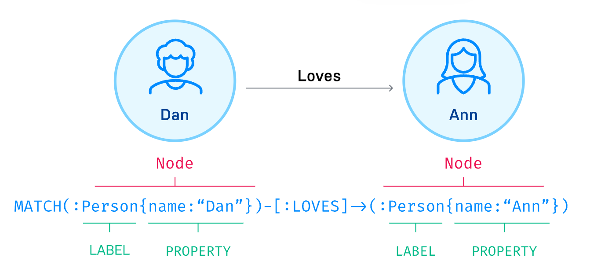
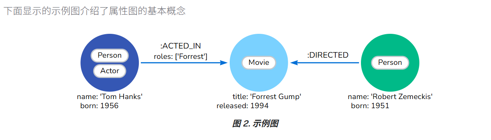
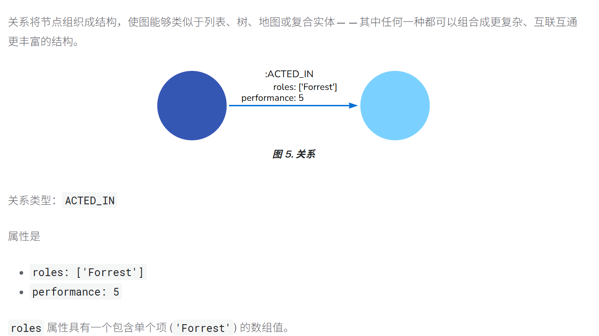
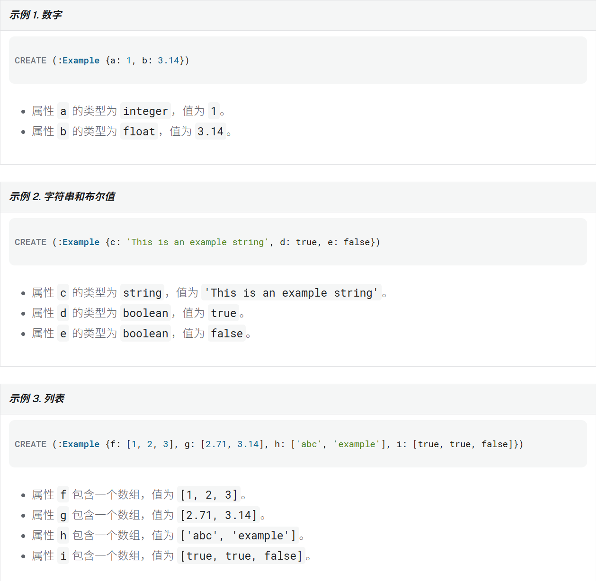

# 入门

## 什么是 Neo4j

Neo4j 是一个「==图数据库==（Graph Database）」。

它不是传统的关系型数据库（MySQL、PostgreSQL 那种表结构），而是专门用来存储“关系”的数据库。

传统数据库：

- 数据存在“表”里
- 通过 `JOIN` 查询关系

Neo4j：

- 数据天然就是“点和线”
- 查询关系特别快、特别直观

你可以把它理解成：

> Neo4j = 专门处理“人与人、物与物之间关系”的数据库。


## 什么是图数据库

Neo4j 图数据库将数据存储为==节点、关系和属性==，而不是以表格或文档形式。

类似这种形式

(你) --朋友--> (A)
(你) --同学--> (B)
(B) --喜欢--> (电影)





### 工作原理

图数据库通过节点和关系进行结构化。

**节点**是图中的实体，它们可以
- 用标签标记，表示它们在领域中的不同角色（例如，`Person`）。
    
- 持有任意数量的[键值对](http://neo4j.com.cn/public/docs/cypher-manual/current/values-and-types/index.html)作为属性（例如，`name`）。
    
- 被索引并受约束。


**关系**提供两个节点之间的命名连接（例如，_Person_ - `LOVES` - _Person_），它们
- 必须始终具有起始节点、结束节点和恰好一个类型。
    
- 必须有方向。
    
- 可以像节点一样拥有属性。
    
- 节点可以拥有多种类型的多个关系，而不会牺牲性能。


总而言之，节点和关系是一种高效灵活的数据存储方式，因为它们允许您
- 在大图中创建深度和广度遍历。
    
- 将数据库扩展到数十亿个节点。
    
- 设计可以随时间演变的灵活属性图数据模型。

### 为什么使用

Neo4j 很适合：

- GraphRAG
- Knowledge Graph
- Multi-Agent Memory
- 企业知识网络


### 图数据库概念


#### 节点

节点用于表示领域中的==*实体*（离散对象）。==


图数据库 使用Cypher 进行类似sql 的功能执行

```Cypher
CREATE (:Person:Actor {name: 'Tom Hanks', born: 1956})
```


##### 节点标签

就是  ==字段== ：值

标签通过将节点分组（分类）成集合来塑造领域，其中所有具有特定标签的节点都属于同一个集合。

例如，所有表示用户的节点都可以用标签 `User` 进行标记。有了这个，您就可以要求 Neo4j 只对您的用户节点执行操作，例如查找所有具有给定名称的用户。


一个节点可以有零个或多个标签。

#### 关系

关系描述了*源节点*和*目标节点*之间的连接如何相关。一个节点可以与自身建立关系。

一个关系
- 连接*源节点*和*目标节点*。
    
- 具有方向（==单向）==。
    
- 必须具有一个**类型**（单一类型）来定义（分类）它是什么类型的关系。
    
- 可以具有属性（键值对），这些属性进一步描述关系。



```Cypher
CREATE ()-[:ACTED_IN {roles: ['Forrest'], performance: 5}]->()
```

注意：
==一个关系必须只有一个关系类型。==

#### 属性

属性是用于在节点和关系上存储数据的==键值对==。



### 从传统数据库到 图数据库
##### 从关系型数据库过渡到图数据库

- 传统关系型数据库（RDBMS）
    
- 图数据库（Graph Database，例如 Neo4j）


> ==关系型数据库擅长“存数据”，而图数据库擅长“处理关系”。==

---

像 MySQL、PostgreSQL 这种数据库，会把数据放在“表”里，通过主键、外键来建立联系。  
如果你想查询复杂关系，比如：

```text
员工属于哪些部门
朋友的朋友是谁
用户喜欢什么电影
```

SQL 往往需要大量 `JOIN`。

而 `JOIN` 本质上是：
- 在多张表中不断查找
- 匹配 ID
- 再拼接结果

当关系越来越复杂时：
- 查询会越来越难写
- 性能开销也会越来越大

尤其是“多对多关系”，还需要额外建立中间表。 ([Neo4j 文档](https://neo4j.ac.cn/docs/getting-started/appendix/graphdb-concepts/graphdb-vs-rdbms/?utm_source=chatgpt.com "关系型数据库与图数据库的比较 - 入门指南 - Neo4j 文档"))

---

而 Neo4j 的思路完全不同。

它不是“表连接表”，而是：

```text
节点(Node) —— 关系(Relationship) —— 节点(Node)
```

例如：

```text
(Alice)-[:BELONGS_TO]->(Department)
```

关系本身直接存储在数据库里。

所以查询时：

不需要再通过 JOIN 推导关系，  
而是直接“沿着关系走”。

这也是图数据库最大的特点：

> 关系不是计算出来的，而是天然存在的。 ([Neo4j 文档](https://neo4j.ac.cn/docs/getting-started/appendix/graphdb-concepts/graphdb-vs-rdbms/?utm_source=chatgpt.com "关系型数据库与图数据库的比较 - 入门指南 - Neo4j 文档"))

---


如果要查 Alice 属于哪些部门：

在关系型数据库里：
1. 先查Alice 的 ID
2. 再查中间表
3. 再查部门表
4. 最后才能拼出结果

但在 Neo4j 里：

只需要找到 Alice 节点，顺着 `BELONGS_TO` 关系遍历即可。 ([Neo4j 文档](https://neo4j.ac.cn/docs/getting-started/appendix/graphdb-concepts/graphdb-vs-rdbms/?utm_source=chatgpt.com "关系型数据库与图数据库的比较 - 入门指南 - Neo4j 文档"))

---

所以 Neo4j 很适合：
- 社交网络
- 推荐系统
- 知识图谱
- 风控
- AI Agent / GraphRAG

而传统关系型数据库更适合：
- 后台管理系统
- ERP
- 订单系统
- 财务系统

这种结构化很强的业务。 ([Neo4j 文档](https://neo4j.ac.cn/docs/getting-started/appendix/graphdb-concepts/graphdb-vs-rdbms/?utm_source=chatgpt.com "关系型数据库与图数据库的比较 - 入门指南 - Neo4j 文档"))


##### 从 NoSQL 到图数据库

> 图数据库和其他 NoSQL 数据库到底有什么区别。


NoSQL 并不是一种数据库，  
而是一大类“非传统关系型数据库”的统称。  
里面包括：
- Key-Value 数据库
    
- Document 文档数据库
    
- Column 列式数据库
    
- Graph 图数据库


但它和 MongoDB、Redis 这类 NoSQL 的思路完全不同。 ([Graph Database & Analytics](https://neo4j.com/developer/graph-db-vs-nosql/?utm_source=chatgpt.com "Transition from NoSQL to graph database - Getting Started"))

---


大多数 NoSQL 数据库，本质上还是在“存数据块（aggregate）”。

例如：
- Redis 存 key-value
    
- MongoDB 存 document
    
- Cassandra 存列数据

它们更关注：如何快速存取一条数据

而不是：数据之间如何连接

所以如果数据之间存在大量复杂关系：

```text
用户 -> 朋友 -> 公司 -> 商品
```

传统 NoSQL 往往会：
- 手动存 ID
    
- 应用层自己关联
    
- 自己维护关系
    

这其实变相又回到了“JOIN”的问题。 ([Graph Database & Analytics](https://neo4j.com/developer/graph-db-vs-nosql/?utm_source=chatgpt.com "Transition from NoSQL to graph database - Getting Started"))

---

Neo4j 的不同点在于：

它把“关系”本身作为核心数据结构。

不是：

```text
存一个用户ID引用另一个用户
```

而是：

```text
直接建立关系边(Relationship)
```

因此查询时：

数据库可以直接沿着关系遍历。

这特别适合“高度连接的数据（Connected Data）”。 ([Graph Database & Analytics](https://neo4j.com/developer/graph-db-vs-nosql/?utm_source=chatgpt.com "Transition from NoSQL to graph database - Getting Started"))

---

 **Key-Value 数据库**
特点：
- 非常快
- 适合缓存
- 适合简单查询
但它看不到数据之间的关系。


**Document 数据库**
像 MongoDB：
适合：
```text
JSON结构
层级结构
```
但它更像“树结构”。
如果不同文档之间出现复杂引用：
系统会越来越难维护。 ([Graph Database & Analytics](https://neo4j.com/developer/graph-db-vs-nosql/?utm_source=chatgpt.com "Transition from NoSQL to graph database - Getting Started"))

---

而 **Graph Database：**

天然适合：

```text
多跳关系
路径分析
关系推理
```

例如：
- 社交网络
- 推荐系统
- 知识图谱
- 欺诈检测

因为它最擅长的不是“存对象”，而是：==分析对象之间的连接==


|数据库类型|最适合|
|---|---|
|Redis|缓存|
|MongoDB|文档数据|
|Cassandra|海量分布式数据|
|Neo4j|复杂关系网络|

所以 Neo4j 并不是替代所有 NoSQL，  
而是专门解决：**“==关系”成为核心问题时**==


